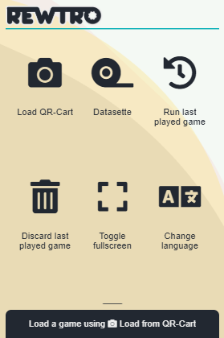
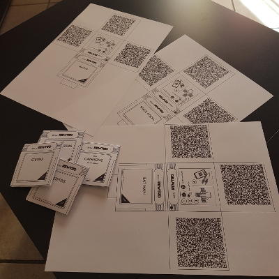
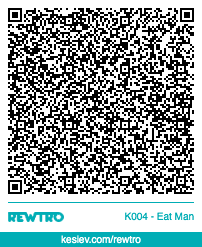
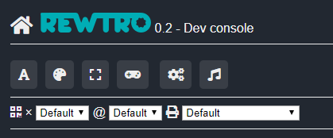
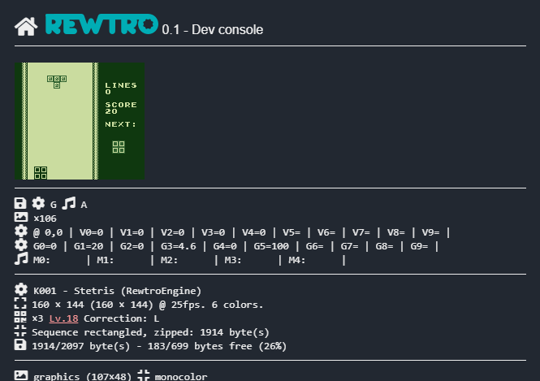

# Rewtro

    

---

    <a href="markdown/game-k001-stetris.pdf">Print the launch title cartridge</a> | <a href="https://www.kesiev.com/rewtro/">Load the game using your mobile</a>

---

**Rewtro** is a weird retro game engine inspired by fantasy consoles and [code golfing](https://en.wikipedia.org/wiki/Code_golf) that runs games encoded in a very small amount of data (2kb/3kb). This way is possible to share games using exoteric and usually data inefficient ways: i.e. sticking some PWA magic and a QR-Code reader to [the engine](https://www.kesiev.com/rewtro/) I've made a fake gaming console...

    

...that works offline and loads games from [origami game cartridges](markdown/game-k001-stetris.pdf)...

    

... or animated GIFs you can _slowly load_ (~4sec) simply framing them...

    

All the game data (graphic, sound, music, and code) is encoded _into the QR-Codes_ and no data is stored online - and the same goes for the game console code too, once installed - so scrap the paper cartridge and the game is _gone_. But hey... you can produce _your game cartridges_ using just a plain printer and you can _still pirate games_ using a copy machine like we used to do with cassette duplicator in the 80s. I hope it will bring back that retro vibes.

## The game engine

The game engine implements:

  * A super simple physics engine
  * A sprites renderer that supports rotation and scaling
  * A text renderer based on pixel fonts
  * A simple event manager
  * A scene loader and manager
  * A sound synthesizer and basic music sequencer
  * Some commands for doing the math and basic logic
  * Some tilemap handling commands
  * Several custom graphics encoder/decoders
  * Some data packers, from zipping for to custom algorithms suited for small data

And that's all. No game-specific code has been coded inside the engine. Making an actual game with these few things it's up to you.

## The development tools

Games are coded using JSON structures and I've built some (pretty raw) tools you can use to code your games - together with some sample games. You can find them in the <tt>carts/</tt> subfolder: there is a viewer for built-in color palettes, screen resolutions, controls and fonts you can use in your games.

    

To avoid cheating or being _influenced_ by specific games, all presets are based on actual gaming systems form the past (Gameboy, ZX-Spectrum and Commodore 64) and most of them can be overridden by custom ones encoding them into your game code. You can also find a noise generator you can use to create sound effects that feature a pretty simple piano keyboard for sketching some music for your games.

But what you are going to use the most is the game debugger...

    

...and the game compiler and packager, that generates a foldable cartridge in SVG format to be customized and printed or an animated GIF you can show anywhere you want. Sorry for the _thin_ toolchain: I survived with that but I'm going to improve it if there is some kind of interest.

## Why?

It's Christmas time, I needed some greeting cards and decided to make some original ones this year. I liked the idea of hiding the actual greetings at the end of a customized videogame but implementing a browser game lacked the _perishability_ of a greeting card: you want to keep them because it contains _the whole experience_, that is the stock message _and_ the handwritten message. Moreover, the game itself _is part of the message_ so why keeping that _outside the greeting card_?

Moreover, building physical retro games for specific persons and hiding messages in them gives you that [Petscop's Rainer](https://en.wikipedia.org/wiki/Creepypasta#Petscop) chill that's both cool and frightening.

You can also use these paper cartridges as hints in treasure hunts, put them in [geocaches](https://en.wikipedia.org/wiki/Geocaching), spread its parts as collectible stickers, on video advertising, for fancy business cards, etc.

Rewtro QR-Carts are cheap to print and contains the _whole_ game data, are _physically shareable_, fun to copy and can be easily unique. Take the best of that.

## FAQs

*Q: Can I run a QR-Cart on a desktop computer?*

A: While it's quite hard to frame a tiny QR-Code printed on paper or on a mobile display with a desktop cam, I managed to load a game easily running the Datasette on a tablet displaying the code full screen (hit the buttons on top of the Datasette screen).

*Q: I've created an SVG cartridge but it looks like I'm missing a font...*

A: I've used the [Jost](https://indestructibletype.com/Jost.html) free font (Jost-500-Medium.otf). Download, install, restart your favorite vector editor and open the SVG again.

*Q: Are you going to release other games?*

A: Yes, probably. Most of the games I've built are Christmas greeting cards and are a surprise for friends and parents... so I can't release them publicly before Christmas. Feel free to contact me if you want me to share one of my games before that _deadline_.

## Disclaimer

Consider Rewtro in beta _right now_. I've not so much time to work on pet projects but I'll try to evolve the game engine a little more without breaking it. There is some kind of engine version tracking in the Rewtro code and encoded in cartridges but, If you want to be extra cautious, make a snapshot of the engine and host it elsewhere - there is no URL encoded in game cartridges so you're safe.

## Credits

Rewtro exists thanks to these techs:

  * [Font Awesome]("https://fontawesome.com/)
  * [Jost Font](https://indestructibletype.com/Jost.html)
  * [JSZip](https://stuk.github.io/jszip/)
  * [Instascan](https://github.com/schmich/instascan)
  * [QR-Code generator]("https://github.com/kazuhikoarase/qrcode-generator)
  * [Gif.js](https://github.com/jnordberg/gif.js)
  * [Color Hunt](https://colorhunt.co/palette/276)

...and the great support of these people:

  * [Bianca](http://www.linearkey.net/)
  * [Frulla](https://www.instagram.com/mogliagiovanni/)
  * Stefano Caroli
  * Rosy/Damiano