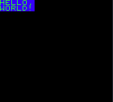
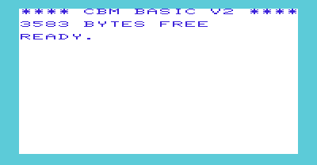

# Rewtro Cartridges

_NOTE: I'm writing this manual in random slices of spare time and it's far from being complete right now. Anyway, I hope you'll find this useful in the meanwhile._

## Introduction

Rewtro can be scripted using a monolithic or multi-part JSON file that describes the virtual machine configuration, your music, sound effects, graphics, and the game code. When distributed this JSON is assembled, converted to binary data, compressed, and then split and enveloped in simple protocols depending on the distribution format. Right now Rewtro supports papercraft cartridges and animated GIFs that use QR-Codes to store and load data. In this case, the binarized and compressed JSON is split into parts, one for each QR-Code, each part is labeled with an ID, a progressive number and the total number of parts and then converted to QR-Codes.

When Rewtro loads a game, it repeats the process in reverse: the data is loaded from QR-Codes, sorted using the progressive ID, converted to a compressed binary, unpacked and then converted back to your original JSON file and run.

I'm not going to dwell into this nerdy protocol part: what I'd like you to know is that to make a Rewtro game you're going to put together a JSON file and that very file _is run mainly as-is by the Rewtro engine_. The compile, compress, encode part is up to the Rewtro compiler and is done just for the sake of data transfer, so you're not going to fiddle with bit and bytes. _Probably._

## The JSON backbone

Let's start making an _empty cartridge_.

  * Rewtro supports multiple _versions_ which are a combination of a game engine and its configuration. Right now the latest version of Rewtro is `0.2`, which uses the custom `RewtroEngine` with extended commands set.
  * Then there is a `metadata` section, which includes several extra details of your game. This part is never encoded in cartridges data but is useful to configure text printed on QR-Carts and more. The only mandatory key of `metadata` is your game name, which is used as file name in exports and displayed by the debugger.
  * There is a `data` section, which holds all your game contents grouped in [data blocks](datablocks.md). Unsurprisingly enough, it's a mandatory section too. Since we're creating a minimal cartridge, let's keep that empty.

That's all. Our minimal cartridge is this one:

```
{
   "systemVersion":"0.2",
   "metadata":{
     "title":"My first game"
   },
   "data":[]
}
```

Which displays a boring blank screen and a controller with a single button.

## Hello, World!

First of all, we need mandatory unexplained _Hello World!_ every manual feature:

```
{
   "systemVersion":"0.2",
   "metadata":{
     "title":"My first game"
   },
   "data":[{
      "id":"A",
      "sprites":[{"id":"A","text":"HELLO,~WORLD!","textColor":3,"backgroundColor":2,"width":50,"height":16}],
      "tilemaps":[{"map":["A"]}]
   }]
}
```

This cartridge displays just this:

<div align="center" style="margin:60px 0">
    <p></p>
</div>

Even if it's quite straightforward what's going on, I'll explain what's happening in that [data block](datablocks.md) later but, for now, let's accept this _Hello, World!_ as it is.

Rewtro system can be configured to have different default fonts, screen resolution, and more. I'd like to explain to you how to do that changing this _Hello, World!_ a little. I promise to add a few screenshots, okay?

## System configuration

You can configure the Rewtro adding a `systemConfiguration` to your JSON root, like this.

```
{
   "systemVersion":"0.2",
   "metadata":{
     "title":"My first game"
   },
   "systemConfiguration":[{
      <your configuration here>
   }],
   "data":[]
}
```

In our working blank cartridge, this key wasn't there. All of the system configurations have nice defaults, so you don't have to worry about that. But if you want to personalize your game system a bit, you can do it here.

### Screen resolution

Rewtro virtual screen has a _screen resolution_ which is the usual screen size that's used to place stuff on the screen and a _render resolution_ which stretches the _screen resolution_ to any other size when rendered. This way you can use larger and smaller resolutions for your games and, with some creativity, you can easily recreate some _resolution weirdness_ from systems of the past.

  * `screenWidth` and `screenHeight` change the _screen resolution_. You can set any value from 0 to 2047.
  * `renderWidth` and `renderHeight` change the _render resolution_. You can set any value from 0 to 2047.

If you want an unstretched screen just remember to set the same values for the _screen resolution_ and the _render resolution_.

Example time! Let's try emulating the [VIC-20](https://en.wikipedia.org/wiki/Commodore_VIC-20) screen resolution. Wikipedia says that _"At startup the screen showed 176×184 pixels, with a fixed-color border to the edges of the screen. Since a PAL or NTSC screen has a 4:3 width-to-height ratio, each VIC pixel was much wider than it was high."_ So, we can double the _render resolution width_ to obtain a similar effect:

```
{
   "systemVersion":"0.2",
   "metadata":{
     "title":"My first game"
   },
   "systemConfiguration":[{
      "screenWidth":176,
      "screenHeight":184,
      "renderWidth":352,
      "renderHeight":184
   }],
   "data":[{
      "id":"A",
      "sprites":[{"id":"A","text":"HELLO,~WORLD!","textColor":3,"backgroundColor":2,"width":50,"height":16}],
      "tilemaps":[{"map":["A"]}]
   }]
}
```

This cartridge displays:

<div align="center" style="margin:60px 0">
    <p></p>
</div>

It looks a little like the original VIC-20 screen, right?

<div align="center" style="margin:60px 0">
    <p></p>
</div>

Rewtro also supports up to 127 standard resolutions, inspired to classic systems, that you can select just using the single `resolutionModel` key. Only a few of them are available right now: you can see the complete list from the SDK home screen, hitting the _corners_ button.

```
{
   "systemVersion":"0.2",
   "metadata":{
     "title":"My first game"
   },
   "systemConfiguration":[{
      "resolutionModel":2
   }],
   "data":[{
      "id":"A",
      "sprites":[{"id":"A","text":"HELLO,~WORLD!","textColor":3,"backgroundColor":2,"width":50,"height":16}],
      "tilemaps":[{"map":["A"]}]
   }]
}
```

This cartridge uses the 320x200 resolution of my beloved [Commodore 64](https://en.wikipedia.org/wiki/Commodore_64#Graphics). I don't think you need a screenshot here.