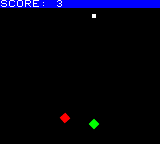
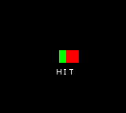
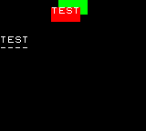
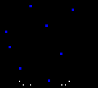
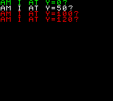

# Code commands

In order to make a _working game_, you'll need to write some `code` soon enough. Code is used to define your game _logic and rules_: heroes have to follow the button presses, enemies have to fire bullets and, well... the player may have to win or lose.

All of your code is stored in `code` [data blocks](datablocks.md) and it's a sequence of objects containing a `then` key that collects the [statements](codestatements.md) you want to execute, a facultative `when` key with a [condition](conditions.md) that rules the `then` command, and an `else` key that works like the `then` command but it's triggered when the conditions in `when` are _not_ met.

```
{
   "systemVersion":"0.2",
   "metadata":{
      "title":"My first game"
   },
   "data":[{
      "id":"A",
      "sounds":[
         {"id":"A","wave":"whitenoise"},
         {"id":"B","wave":"saw","attack":2,"sustain":10,"decay":17,"release":127,"pitch":57}
      ],
      "sprites":[
         {"id":"A","x":72,"y":120,"backgroundColor":3,"rotate":45},
         {"id":"B","speedY":3,"backgroundColor":5,"y":150},
         {"id":"C","x":0,"y":0,"width":160,"backgroundColor":2},
         {"id":"D","width":4,"height":4,"backgroundColor":8,"speedY":-4,"zIndex":2}
      ],
      "tilemaps":[{"map":["ABC"]}],
      "code":[
         {
            "when":[{"as":"keyboard","attribute":"left","if":[{"is":"down"}]}],
            "then":[{"id":"A","subtract":[{"x":[{"smallNumber":3}]}]}]
         },
         {
            "when":[{"as":"keyboard","attribute":"right","if":[{"is":"down"}]}],
            "then":[{"id":"A","sum":[{"x":[{"smallNumber":3}]}]}]
         },
         {
            "when":[{"as":"keyboard","attribute":"buttonA","if":[{"is":"hit"}]}],
            "then":[{"playAudio":[{"character":"B"}],"id":"A","spawn":[{"ids":[{"character":"D"}]}]}]
         },
         {
            "when":[{"id":"D"}],
            "then":[{"code":[
               {
                  "when":[{"if":[{"itsAttribute":"y","is":"<","smallNumber":0}]}],
                  "then":[{"remove":true}]
               },{
                  "when":[{"if":[{"is":"collidingWith","id":"B"}]}],
                  "then":[
                     {"playAudio":[{"character":"A"}],"remove":true},
                     {"id":"B","set":[{"x":[{"list":[0,144],"randomNumber":true}],"y":[{"smallNumber":0}]}]},
                     {"id":"C","sum":[{"value0":[{"smallNumber":1}]}]}
                  ]
               }
            ]}]
         },{
            "when":[{"id":"A","if":[{"is":"collidingWith","id":"B"}]}],
            "then":[{"remove":true,"playAudio":[{"character":"A"}]}]
         },{
            "when":[{"id":"B","if":[{"itsAttribute":"y","is":">","number":160}]}],
            "then":[{"set":[{"x":[{"list":[0,144],"randomNumber":true}],"y":[{"smallNumber":0}]}]}]
         },{
            "then":[
               {"id":"C","set":[{"text":[{"attribute":"value0","prefix":"SCORE: "}]}]},
               {"id":"B","sum":[{"rotate":[{"smallNumber":10}]}]}
            ]
         }
      ]
   }]
}
```

This cartridge is a very basic shooter game! Move the green diamond left and right and use the A button to fire a bullet. Shoot the red square to earn a point but get hit and you lose.

<div align="center" style="margin:60px 0">
    <p></p>
</div>

The loaded `code` blocks are executed _before_ updating the screen so, since the [default frame rate](rewtrocartridge.md) is 25 frames per second, the following actions will _keep happening_ 25 times per second.

The first three lines of `code` handle the player controller, moving the ship sprite `A` when the player holds down `left` and `right`, and firing the bullet sprite `D` from the ship when the `buttonA` is `hit`.

Then an iterator executes the same `code` block on the player bullets `D`: it removes them when off-screen and handles the collision with the `B` enemy.

The following line kills the `A` player when is hit by the `B` enemy. Then the `B enemy is respawned in a random position to the top when it's out of the screen.

The last line doesn't have any `when` condition so it will _always_ run its code: the player score is printed on the screen and the `B` enemy sprite is rotated.

### Every line is a getter

In Rewtro [getters](getters.md) are the most important part of its programming language. Getters are used to _pick_ a game object or its [attributes](spriteattributes.md) in order to check or manipulate it.

And getters are _so important_ that _every line of code is a getter_. Let's have a look at a slice of our tiny shooter game code:

```
{
   "when":[{"id":"A","if":[{"is":"collidingWith","id":"B"}]}],
   "then":[{"playAudio":[{"character":"A"}],"remove":true}]
}
```

That's how the `when` part...

```
"when":[{"id":"A","if":[{"is":"collidingWith","id":"B"}]}],
```

....works this way:

  * The [getter](getters.md) picks all of the spawned sprites having `A` `id`, which is just the player spaceship
  * We're going to describe some logic that rules this picked object and to do that we need an `if` key:
    * The [getter](getters.md) picks all of the spawned sprites having `B` `id`, which is the enemy
    * The `is` [condition](conditions.md) is true when the first picked objects (the player spaceship) is `collidingWith` the locally picked object (the enemy)

Long story short, this `when` command is checking if the spaceship is hitting the enemy. Keys order doesn't matter in Rewtro so you can mix getters, conditions, and statements the way you like the most. These `when` commands all do the same thing:

```
"when":[{"id":"A","if":[{"is":"collidingWith","id":"B"}]}]

"when":[{"if":[{"id":"B","is":"collidingWith"}],"id":"A"}]

"when":[{"if":[{"is":"collidingWith","id":"B"}],"id":"A"}]
```

Code is more readable if you try to arrange it in a _natural way_:

```
"when":[{"id":"A","if":[{"is":"collidingWith","id":"B"}]}]
```

This line can be easily read as: `when` the `id` `A` `is` `collidingWith` the `id` `B`.

The same goes for the `then` command, even if it's a little harder to guess. When a `when` command is true the picked objects of the condition are the _default objects_ of the `then` command statements. Moreover, if no getter is defined the _default objects_ are the picked objects. So...

```
"then":[{"remove":true,"playAudio":[{"character":"A"}]}]
```

...works this way:

  * The previous `when` conditions set the `A` sprites as the _default objects_, that is the player spaceship
  * There is no [getter](getters.md) here, so the picked objects are the _default_ ones, so the player spaceship
  * The `remove` [statement](codestatements.md) will remove the current line picked objects from the game scene, that's the player spaceship
  * The `playAudio` [statement](codestatements.md) accepts another getter and plays the sound with its picked `id`:
    * It picks the single `character` `A`
  * So `playAudio` will play the `A` sound, that's the explosion sound.

That's a nerdy way to say: remove the player spaceship and play the explosion sound. The keys order doesn't matter on `then` lines too:

```
"then":[{"remove":true,"playAudio":[{"character":"A"}]}]

"then":[{"playAudio":[{"character":"A"}],"remove":true}]
```

These do the same thing in the same order. If you want to know more about the execution order have a look at its paragraph of the [code statements](codestatements.md) chapter.

Joining the `when` and `when` short versions we have:

  * `when` the player spaceship `A` hits the enemy `B`...
  * `then` remove it and play the `A` explosion sound.

That's why the player spaceship explodes and disappears when hit by the enemy. See? _Every line is a getter_. Keep it in mind and let's move on.

## When

The `when` command is the way you're going to create:

  * Rules: executes the `then` commands only `if` a condition on the picked objects is verified.
  * Iterators: executes the `then` commands on every single picked object.

In our shooter example, we've used `when` in both ways. If you want to create a rule add the `if` key with an `is` [condition](conditions.md):

```
{
   "when":[{"id":"A","if":[{"is":"collidingWith","id":"B"}]}],
   "then":[{"remove":true,"playAudio":[{"character":"A"}]}]
}
```

You can read this line this way: `when` the sprite with `id` `A` `is` `collidingWith` the sprite with `id` `B` `then` `remove` it and play the sound `A`.

If you want to use `when` as iterator you've just to omit the `if` part.

```
 {
   "when":[{"id":"D"}],
   "then":[...]
}
```

This time you can read this line this way: for every single sprite with `id` `B` execute this `then` code.

### Multiple conditions

You can specify multiple lines in a `when` command. All the [conditions](conditions.md) have to be true to trigger the relative `then` command. It will run with the _last picked object_ as the _default object_.

```
{
   "systemVersion":"0.2",
   "metadata":{
      "title":"My first game"
   },
   "data":[{
      "id":"A",
      "sprites":[
         {"id":"A","textAlignment":"center","x":75,"y":64,"width":16,"height":16,"backgroundColor":3},
         {"id":"B","y":64,"width":16,"height":16,"backgroundColor":5}
      ],
      "tilemaps":[{"map":["AB"]}],
      "code":[
         {
            "when":[
               {"as":"keyboard","attribute":"buttonA","if":[{"is":"down"}]},
               {"id":"A","if":[{"is":"collidingWith","id":"B"}]}
            ],
            "then":[{"set":[{"text":[{"string":"~~~HIT"}]}]}],
            "else":[{"id":"A","set":[{"text":[{"string":""}]}]}]
         },
         {
            "then":[
               {
                  "id":"B",
                  "set":[{"x":[{"attribute":"timer"}]}],
                  "multiply":[{"x":[{"smallNumber":3}]}],
                  "module":[{"x":[{"number":160}]}]
               }
            ]
         }
      ]
   }]
}
```

This cartridge shows a red square moving right and warping. It eventually pass over a green one waiting in the middle of the screen. Holding down the A button the `HIT` message will appear when the two squares collides.

<div align="center" style="margin:60px 0">
    <p></p>
</div>

The first line of `code` has a `when` command with two [conditions](conditions.md): the first one checks if the `keyboard` `buttonA` is `down` and the second one checks `if` the `A` green square sprite `is` `collidingWith` the `A` red moving square. They have to be _both true_ to trigger the `then` command and that's why the `HIT` message will appear just when the two square touches _and_ the A button is held down.

Notice that the `set` command will work on the _default object_ and that's the last picked object by the `when` command. Since it was the `A` sprite the text will appear under the green square.

### Negate

You can negate a condition setting the `not` key to `true` in `when` lines.

```
{
   "systemVersion":"0.2",
   "metadata":{
      "title":"My first game"
   },
   "data":[{
      "id":"A",
      "sprites":[
         {"id":"A","x":64,"width":32,"height":16,"backgroundColor":3},
         {"id":"B","width":32,"height":16,"backgroundColor":5,"y":8,"speedX":1,"text":"TEST"},
         {"id":"C","x":0,"y":40},
         {"id":"D","x":0,"y":48}
      ],
      "tilemaps":[{"map":["ABCD"]}],
      "code":[
         {
            "when":[{"id":"B","if":[{"is":"collidingWith","id":"A"}]}],
            "then":[{"id":"C","set":[{"text":[{"as":"that","attribute":"text"}]}]}],
            "else":[{"id":"C","set":[{"text":[{"string":"----"}]}]}]
         },
         {
            "when":[{"id":"B","not":true,"if":[{"is":"collidingWith","id":"A"}]}],
            "then":[{"id":"D","set":[{"text":[{"as":"that","attribute":"text"}]}]}],
            "else":[{"id":"D","set":[{"text":[{"string":"----"}]}]}]
         }
      ]
   }]
}
```

This cartridge shows a `B` red moving rectangle with the word `TEXT` on it and a `A` green one in the middle of the screen. A label labels displays the same while another one displays `----`. When the two rectangles touches the two labels content is reversed.

<div align="center" style="margin:60px 0">
    <p></p>
</div>

The two lines of code are checking if the `B` and `A` sprites are colliding with each other and printing the colliding sprite text on a label or a strip of `-` otherwise.

The first line prints the text on the `C` sprite and the second one on the `D` sprite so you can see both of them on the screen. Since the second line has a `not` key set to `true` the two lines logic will work in _reverse_ and that's why when the two sprites collide the two labels the _look_ reversed: when the first condition is true the second one is false and vice versa.

### Events

Rewtro features a tiny event system. Events are identified by a name and can be triggered on a sprite by its life cycle, the physics engine or by you using the `triggerEvent` [statement](codestatements.md). You can read more about triggering events in the [code statements](codestatements.md) chapter.

When an event is triggered on one or more sprites all of the loaded `code` blocks are executed from the beginning but some lines are executed:

  * They must be on your `code` root, so no sub-code
  * They must have a `when` command
  * Its condition must target the specified sprite
  * Its condition must have an `event` key matching the event name

Lines with conditions having the `event` set key are never executed by your game except when a matching event is triggered.

```
{
   "systemVersion":"0.2",
   "metadata":{
      "title":"My first game"
   },
   "data":[{
      "id":"A",
      "sprites":[
         {"id":"A","width":4,"height":4,"backgroundColor":2},
         {"id":"B","width":2,"height":2,"backgroundColor":8,"gravityY":1}
      ],
      "tilemaps":[{"map":["AAAAAAAA"]}],
      "code":[
         {
            "when":[{"id":"A","event":"isSpawn"}],
            "then":[{
               "randomize":true,
               "set":[{
                  "y":[{"smallInteger":-4}],
                  "speedX":[{"list":[-4,4],"randomNumber":true}],
                  "speedY":[{"list":[1,4],"randomNumber":true}]
               }]
            }]
         },
         {
            "when":[{"id":"A","event":"event0"}],
            "then":[{"code":[{
               "times":[{"smallNumber":5}],
               "then":[{"spawn":[{"ids":[{"character":"B"}]}]}]
            }]}]
         },
         {
            "when":[{"id":"B","event":"isSpawn"}],
            "then":[{
               "randomize":true,
               "set":[{
                  "speedX":[{"list":[-2,2],"randomNumber":true}],
                  "speedY":[{"list":[-2,-6],"randomNumber":true}]
               }]
            }]
         },
         {
            "when":[{
               "id":"A",
               "event":"hitWall",
               "bounds":[{
                  "modeLeft":"warp",
                  "modeRight":"warp",
                  "modeBottom":"bound",
                  "x":[{"smallInteger":-4}],
                  "y":[{"smallInteger":-4}],
                  "width":[{"number":168}],
                  "height":[{"number":148}]
               }]
            }],
            "then":[
               { "triggerEvent":"event0" },
               { "triggerEvent":"isSpawn" }
            ]
         },
         {
            "when":[{"id":"B"}],
            "then":[{"code":[
               {
                  "when":[{"if":[{"itsAttribute":"y","is":">","number":144}]}],
                  "then":[{"remove":true}]
               }
            ]}]
         }
      ]
   }]
}
```

This cartridge shows a rainy scene. Some blue squares are falling like drops from the top of the screen and makes a little splash of white squares when hitting the bottom of the screen.

<div align="center" style="margin:60px 0">
    <p></p>
</div>

This time we'll talk about this example in the following paragraphs.

#### Sprite lifecycle events

The `isSpawn` and `isRemoved` events are triggered when a sprite is added to the scene and when it's removed.

In our rain example, the 8 drops sprites `A` are spawned by `tilemaps` at game start and the event `isSpawn` is immediately triggered on each of them. A `when` command _catches_ this event in order and places them on the top of the screen and gives them a random direction.

```
{
  "when":[{"id":"A","event":"isSpawn"}],
  "then":[{
     "randomize":true,
     "set":[{
        "y":[{"smallInteger":-4}],
        "speedX":[{"list":[-4,4],"randomNumber":true}],
        "speedY":[{"list":[1,4],"randomNumber":true}]
     }]
  }]
}
```

`when` the `isSpawn` event is triggered on sprites with `id` `A` (which are the blue squares) `then` place it on the top of the screen and randomly change its speed. But that's not all: when a drop falls on the bottom of the screen _it's not removed_ as you may think...

```
{ "triggerEvent":"isSpawn" }
```

The life cycle event `isSpawn` is _manually_ called again on that drop, placing it again to the top and giving the drop another direction. So it looks like that new drops are falling but they are _recycled_ instead: we're seeing the same 8 drops falling and going back to the top.

Why you should do that? This way you'll be sure that you'll never have more than 8 drops on the screen_ even if some of them are taking more time than the others to fall. That means that your scene will never be crowded by rain and that keeps your game performances predictable and stable.

#### Physics events

The `hitWall` event is triggered when a sprite is hitting the edges of a defined rectangular area. You can define that area adding a `bounds` key containing an object with these keys:

  * `x` and `y` are [getters](getters.md) to the top-left coordinates of the area. If omitted the `scene` [special object](specialobjects.md) `x` and `y` will be used instead.
  * `width` and `height` are [getters](getters.md) to the area width and height. If omitted the `scene` [special object](specialobjects.md) `width` and `height` will be used instead.
  * `modeTop`, `modeBottom`, `modeLeft`, and `modeRight` defines how each edge works:
    * `warp` will move the sprite from that edge to the opposite one. The `hitWall` event _is not triggered_ in this case.
    * `bound` will stop the sprite on that edge as it collided to a wall. The `hitWall` event _is triggered_ in this case.
    * If the key is not defined that edge is ignored and won't trigger any event.

In our rainy scene cartridge `bounds` are used to both warp the blue drops from the left side of the screen to the right and vice versa and to make them splash on the bottom of the screen.

```
{
  "when":[{
     "id":"A",
     "event":"hitWall",
     "bounds":[{
        "modeLeft":"warp",
        "modeRight":"warp",
        "modeBottom":"bound",
        "x":[{"smallInteger":-4}],
        "y":[{"smallInteger":-4}],
        "width":[{"number":168}],
        "height":[{"number":148}]
     }]
  }],
  "then":[
     { "triggerEvent":"event0" },
     { "triggerEvent":"isSpawn" }
  ]
}
```

`when` the blue drop sprites `A` are receiving the `hitWall` event for hitting the edges of an area that's slightly bigger than the screen the `triggerEvent` [statements](codestatements.md) are executed. But not all of the edges are generating the `hitWall` event:

  * the left and right sides are set to `warp` so no event is triggered but the sprites will warp from a side to the other one.
  * the bottom side is `bound` so it will trigger the `hitWall` event. That's why the drops are _stopped_ when trying to go outside the bottom of the screen.
  * the top side is ignored since no `modeTop` key is defined.

#### Custom events

As we've previously seen, the `triggerEvent` [statement](codestatements.md) can be used to trigger any of the system events, like `onSpawn`. In addition to system events, there are 5 of them, named from `event0` to `event4`, that are never triggered by the Rewtro system and you can use to create custom events.

In our rain example we used `event0` to make the `A` drops spawn the white squares `B` when are popped.

```
{
  "when":[{"id":"A","event":"event0"}],
  "then":[{"code":[{
     "times":[{"smallNumber":5}],
     "then":[{"spawn":[{"ids":[{"character":"B"}]}]}]
  }]}]
},
```

`when` the event `event0` is triggered on sprites with `id` `A` then spawn 5 white squares. This event is triggered when the `hitWall` event is triggered on the drop sprites.

```
{
  "when":[{
     "id":"A",
     "event":"hitWall",
     ...
  }],
  "then":[
     { "triggerEvent":"event0" },
     { "triggerEvent":"isSpawn" }
  ]
}
```

We have an _event chain_ here: when an `A` sprite falls to the bottom of the screen the `hitWall` event is triggered by Rewtro and caught by `code`. The `then` condition triggers the custom event `event0`, so a white splash is spawned, and then the `isSpawn` event is triggered, so the drop is displaced to the top of the screen and randomly tilted to fall to the bottom again.

#### Avoiding events

Events are handy and they can make your code tidy and readable... but sadly they weren't created for this purpose.

They may take a lot of space in your Rewtro cartridge so you should use them _just when you need them_. When the _right moment_ for an event is? You probably need to wrap some [code statements](codestatements.md) or sub-code in an _event_ if you've to execute them _on multiple conditions you can't standardize_.

In our rain example, the white splashes are removed from the scene when they go outside the screen but no `event` nor `bounds` were used this time:

```
{
  "when":[{"id":"B"}],
  "then":[{"code":[
     {
        "when":[{"if":[{"itsAttribute":"y","is":">","number":144}]}],
        "then":[{"remove":true}]
     }
  ]}]
}
```

Instead of using an `event`, we used the `when` command as in iterator on all of the white splashes `B` and once its vertical position surpasses the bottom of the screen it's `remove`d from the scene. Avoiding events we've made our code more compact, sparing a lot of precious space from our cartridge.

## Then and Else

The `then` and `else` commands are structured in a very similar way: they both collect a sequence of [code statements](codestatements.md) lines. The main differences are:

  * `then` commands are executed on true `when` command conditions or no `when` command. The _default object_ of its code will be the _picked object_ of the last condition in `when`.
  * `else` commands are executed on false `when` command conditions only. The _default object_ of its code is the current `code` block _picked object_. On `code` root the `else` picked object is `undefined`.

```
{
   "systemVersion":"0.2",
   "metadata":{
      "title":"My first game"
   },
   "data":[{
      "id":"A",
      "sprites":[
         {"id":"A","text":"AM I AT Y=0?"},
         {"id":"B","text":"AM I AT Y=50?","x":0,"y":8},
         {"id":"C","text":"AM I AT Y=100?","x":0,"y":16},
         {"id":"D","text":"AM I AT Y=120?","x":0,"y":24}
      ],
      "tilemaps":[{"map":["ABCD"]}],
      "code":[
         {
            "when":[{"id":"A","if":[{"itsAttribute":"y","is":"==","smallNumber":0}]}],
            "then":[{"set":[{"textColor":[{"smallNumber":3}]}]}],
            "else":[{"set":[{"textColor":[{"smallNumber":5}]}]}]
         },
         {
            "when":[{"id":"B","if":[{"itsAttribute":"y","is":"==","smallNumber":50}]}],
            "then":[{"set":[{"textColor":[{"smallNumber":3}]}]}],
            "else":[{"set":[{"textColor":[{"smallNumber":5}]}]}]
         },
         {
            "when":[{"id":"C","if":[{"itsAttribute":"y","is":"==","smallNumber":100}]}],
            "then":[{"set":[{"textColor":[{"smallNumber":3}]}]}],
            "else":[{"id":"C","set":[{"textColor":[{"smallNumber":5}]}]}]
         },
         {
            "when":[{"id":"D"}],
            "then":[{"code":[
               {
                  "when":[{"id":"D","if":[{"itsAttribute":"y","is":"==","smallNumber":120}]}],
                  "then":[{"set":[{"textColor":[{"smallNumber":3}]}]}],
                  "else":[{"set":[{"textColor":[{"smallNumber":5}]}]}]
               }
            ]}]
         }
      ]
   }]
}
```

This cartridge shows four questions answered by `code` conditions: when the condition is true the sentence is colored to green else to red. But it looks like that the middle one is broken...

<div align="center" style="margin:60px 0">
    <p></p>
</div>

The first `when` command [condition](conditions.md) picks the `A` sprite and checks if its `y` coordinate is `0` and, since it's on the top of the screen, that's true. This means that the `then` command will be executed and the `else` command will be ignored.

The condition picked object is the `A` sprite so the `then` command _default object_ will be that sprite. The `textColor` statement has no [getter](getters.md) instructions so the _default object_ will be picked (the `A` sprite) and its color will be changed.

The second `when` command does the same on the `B` sprite but its condition is false: the `B` sprite `y` coordinate is not `50` but `8`. The root `else` command _default object_ is `undefined` so the `textColor` change won't have any effect and the `B` sprite text will remain white.

The third `when` command works on the `C` sprite and it's a _fixed version_ of the previous line. This time the `else` command picks the `C` sprite again so the sprite `textColor` is changed as expected.

The fourth `when` command works on the `D` sprite, it's very similar to the _broken_ code we've used before but this time it works. Since the `else` command is _inside_ a `code` block and its line picked the `D` sprite it will use that picked sprite as _default object_ so the `textColor` statement will work as expected.

You can see examples and more about `then` and `else` at the beginning of the [conditions](conditions.md) chapter.
