# Code statements

In Rewtro _code statements_ are used to manipulate objects and their keys to change their behavior. Since _any line of code is a getter_ the subject of this processing is given by current line [getter](getters.md) with very few exceptions.

```
{
   "systemVersion":"0.2",
   "metadata":{
      "title":"My first game"
   },
   "data":[{
      "id":"A",
      "sprites":[
         {"id":"A","backgroundColor":5,"x":76,"y":16},
         {"id":"B","backgroundColor":4}
      ],
      "tilemaps":[{"map":["A"]}],
      "code":[
         {
            "when":[{"as":"scene","if":[{"itsAttribute":"timer","is":"%%","smallNumber":25}]}],
            "then":[
               {"id":"A","set":[{"backgroundColor":[{"list":[2,8],"randomNumber":true}]}]},
               {
                  "id":"A",
                  "spawn":[{"ids":[{"character":"B"}],"at":[{"as":"this"}]}],
                  "set":[{"speedY":[{"smallNumber":3}]}]
               }
            ]            
         }
      ]
   }]
}
```

This cartridge shows a square that changes color every second and drops a cyan square.

<div align="center" style="margin:60px 0">
    <p>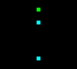</p>
</div>

Every 25 frames of the `scene` object (that's every second for a game running at the default speed of 25 frames per second) the `A` sprite is picked by the [getter](getters.md) and its `backgroundColor` is set to a `randomNumber` from `2` to `8`.

Then the next line picks the `A` sprite again, becoming the local `this`. A brand new `B` sprite is `spawn`ed at the same position of the `this` object - which is the said `A` sprite - but `spawn` is a _special statement_ that changes the current line picked object to the just spawn sprite. That's why the `set` statement will work on `B`, changing its `speedY` and making it fall, instead of the `A` sprite.

## Changings variables

The most powerful and yet the simplest statement in Rewtro is `set`: it accepts a list of keys and getters and it sets the current picked object keys to the getter values. Used together with [getters](getters.md) and subgetters you can change sprites direction, text, colors, and more.

```
{
   "systemVersion":"0.2",
   "metadata":{
      "title":"My first game"
   },
   "data":[{
      "id":"A",
      "sprites":[
         {"id":"A","x":0,"y":68,"width":160,"textAlignment":"center"},
         {"id":"B","backgroundColor":3,"x":76,"y":68}
      ],
      "tilemaps":[{"map":["AB"]}],
      "code":[
         {
            "when":[{"as":"scene","if":[{"itsAttribute":"timer","is":"%%","smallNumber":25}]}],
            "then":[
               {
                  "id":"A","set":[{
                     "text":[{"string":"BLINKING TEXT"}],
                     "backgroundColor":[{"smallNumber":6}]
                  }]
               },
               {
                  "randomize":true,
                  "id":"B","set":[{
                     "speedX":[{"list":[-2,2],"randomNumber":true}],
                     "speedY":[{"list":[-2,2],"randomNumber":true}]
                  }]
               }
            ]
         },
         {
            "when":[{"as":"scene","if":[{"itsAttribute":"timer","is":"%%","smallNumber":50}]}],
            "then":[{
               "id":"A","set":[{
                  "text":[{"string":"IS SO RETRO!"}],
                  "backgroundColor":[{"smallNumber":5}]
               }]
            }]
         }
      ]
   }]
}
```

This cartridge show a blinking text in the middle of the screen and a green square randomly roaming around.

<div align="center" style="margin:60px 0">
    <p>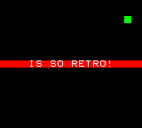</p>
</div>

Every second the `A` sprite is picked and its `backgroundColor` and `text` are `set`. The `B` sprite is picked and it's given a random `speedX` and `speedY`, making it moving around.

Every 2 seconds the `A` sprite is picked again but its `backgroundColor` and `text` are `set` to other values, overwriting the previous changes and making it look like blinking.

There are other code statements to change variables. Let's quickly see all of them.

### Math and logic

Like the `set` statement these math and logic statements accept a list of keys and getters but values are processed instead of being just set.

  * `sum` sums the specified key values for the picked object.
  * `subtract` subtracts the specified key values for the picked object.
  * `multiply` multiplies the specified key values for the picked object.
  * `divide` divides the specified key values for the picked object.
  * `module` applies the module operator the specified key values for the picked object. It's roughly the rest of the division (i.e. 5 module 2 equals 1)
  * `invert` just invert the specified key values for the picked object. The statement key value is just ignored.

```
{
   "systemVersion":"0.2",
   "metadata":{
      "title":"My first game"
   },
   "data":[{
      "id":"A",
      "sprites":[
         {"id":"A","backgroundColor":3,"x":0,"y":68,"width":160,"textAlignment":"center","text":"I'M BLINKING TOO!"}
      ],
      "tilemaps":[{"map":["A"]}],
      "code":[
         {
            "when":[{"as":"scene","if":[{"itsAttribute":"timer","is":"%%","smallNumber":15}]}],
            "then":[
               {
                  "id":"A",
                  "invert":[{"visible":[{"smallNumber":1}]}],
                  "sum":[{
                     "backgroundColor":[{"smallNumber":1}],
                     "textColor":[{"smallNumber":1}]
                  }],
                  "module":[{
                     "backgroundColor":[{"smallNumber":16}],
                     "textColor":[{"smallNumber":15}]
                  }]
               }
            ]
         }
      ]
   }]
}
```

This cartridge show a blinking text in the middle of the screen that keep changing colors.

<div align="center" style="margin:60px 0">
    <p>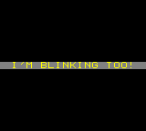</p>
</div>

Every 15 frames the `A` sprite is picked, its `visible` key is inverted, making it blinking, and its `backgroundColor` and `textColor` are increased and then _looped_ inside a range by the `module` statement.

### Lists

The `push` statement appends the key value to a picked list.

```
{
   "systemVersion":"0.2",
   "metadata":{
      "title":"My first game"
   },
   "data":[{
      "id":"A",
      "sprites":[
         {"id":"A"}
      ],
      "tilemaps":[{"map":["A"]}],
      "code":[
         {
            "when":[{"as":"scene","if":[{"itsAttribute":"timer","is":"==","smallNumber":0}]}],
            "then":[
               {"id":"A","set":[{"value0":[{"emptyList":true}]}]}
            ]
         },
         {
            "when":[{"as":"keyboard","attribute":"up","if":[{"is":"hit"}]}],
            "then":[{"id":"A","push":[{"value0":[{"string":"UP"}]}]}]
         },
         {
            "when":[{"as":"keyboard","attribute":"down","if":[{"is":"hit"}]}],
            "then":[{"id":"A","push":[{"value0":[{"string":"DOWN"}]}]}]
         },
         {
            "then":[{"id":"A","set":[{"text":[{"attribute":"value0"}]}]}]
         }
      ]
   }]
}
```

This cartridge show an empty screen. Hitting the up and down buttons of your controller will display the sequence.

<div align="center" style="margin:60px 0">
    <p>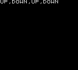</p>
</div>

When the game starts the `A` sprite `value0` key is set to an `emptyList`. Then, hitting `up` or `down` the `string` `UP` or `DOWN` is added to that list by `push`. Finally, the `value0` of the `A` sprite is copied to its `text` key, making it appear on the screen.

## Sprites life cycle

Statements can spawn sprites, remove, and move them around.

  * `remove` removes the currently picked sprites from the scene. Just set the key to `true` when you need it.
  * `spawn` spawns one or more sprites on the scene. It accepts an object with two values:
    * `ids` which are the sprite IDs you want to spawn. It may be a `character` for a single sprite or a `string` for multiple sprites.
    * `at` that decides the position. It may be:
      * A getter to a `list` with two numbers. That's the horizontal and vertical position of the sprites.
      * A getter to another sprite. The spawned sprites will be centered on it.
  * `placeAt` moves the currently picked sprite to another position. It accepts the same values of `spawn`'s `at`.

The `spawn` statement is one of those _special statements_ that change the current `code` line picked object: once the sprites are spawn, they became the current picked object so they can be manipulated (`set`, `sum`, and so on) on the same line.

```
{
   "systemVersion":"0.2",
   "metadata":{
      "title":"My first game"
   },
   "data":[{
      "id":"A",
      "sprites":[
         {"id":"A","x":76,"y":112,"backgroundColor":4},
         {"id":"B","text":"I","x":76,"y":112,"speedY":-4},
         {"id":"C","x":0,"y":0,"backgroundColor":3,"speedX":2},
         {"id":"D","text":"*","speedY":1}
      ],
      "tilemaps":[{"map":["ABC"]}],
      "code":[
         {
            "when":[{"as":"keyboard","attribute":"buttonA","if":[{"is":"hit"}]}],
            "then":[{"id":"B","placeAt":[{"id":"A"}]}]
         },         
         {
            "when":[{"id":"C","if":[{"itsAttribute":"x","is":">","number":160}]}],
            "then":[{"id":"C","placeAt":[{"list":[0,0]}]}]
         },
         {
            "when":[{"as":"scene","if":[{"itsAttribute":"timer","is":"%%","smallNumber":25}]}],
            "then":[
               {"spawn":[{"ids":[{"character":"D"}],"at":[{"id":"C"}]}]},
               {
                  "spawn":[{"ids":[{"character":"D"}],"at":[{"list":[0,0]}]}],
                  "set":[{"text":[{"character":"#"}],"textColor":[{"smallNumber":5}]}]
               },
               {
                  "spawn":[{"ids":[{"character":"D"}],"at":[{"list":[152,0]}]}],
                  "set":[{"text":[{"character":"#"}],"textColor":[{"smallNumber":7}]}]
               }
            ]
         },
         {
            "when":[{"id":"D"}],
            "then":[{
               "code":[{
                  "when":[{"if":[{"itsAttribute":"y","is":">","number":144}]}],
                  "then":[{"remove":true}]
               }]
            }]
         }
      ]
   }]
}
```

This cartridge show a moving green square shooting an asterisk every second, a cyan square that fires an `I` letter back when pressing the A button and some yellow and red scrolling `#` on the sides of the screen.

<div align="center" style="margin:60px 0">
    <p>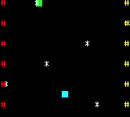</p>
</div>

Notice that even if there are a lot of sprite spawning the scene sprites counter on the debugger status never surpass the ~21 sprites threshold.

<div align="center" style="margin:60px 0">
    <p>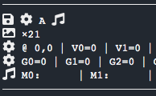</p>
</div>

The first `code` line moves the `B` sprite back to the `A` position when the A button is hit and that's why the `I` projectile restarts from the cyan bottom every time. The sprite is not removed or spawned: is just moved back and that's why it can fire just _a bullet_.

The second line makes sure that the `C` sprite, that's the green square, is moved to the top left corner of the screen when it goes outside the right side of the screen.

The third line does three things every second:

  * `spawn` a new falling asterisk `D` at the green square `C` position
  * `spawn` a red `#` on the top left corner of the screen. Notice that the `spawn` statement spawns an asterisk `C` but the `set` statement changes its `text` and `textColor`.
  * `spawn` a yellow `#` on the top right corner of the screen in the same way

The last line iterates all the `D` objects and, `when` they go outside the bottom side of the screen, it will `remove` them. And that's why the sprites count of the scene is kept stable.

## Areas

Rewtro supports several statements to manipulate _areas of sprites_. They work together with the mandatory `inArea` [getter](getters.md) and let you copy, flip, and spawn a large number of sprites at once - often _tilemaps_.

There are two methods to spawn maps of sprites that both of them accepts a map identical to [data blocks](datablocks.md) `tilemaps` as key value:

  * `fillAreaWithPattern` fills the `inArea` rectangle with the specified tilemap repeating it horizontally and vertically.
  * `outlineAreaWithPattern` just spawn a border inside the `inArea` rectangle using the specified tilemap.

Then you can copy an area of already spawned sprites using `areaCopy`. The sprites to be copied must be _already picked_ by the current `code` line [getter](getters.md) so make sure to specify the `id`, `ids`, or `tags` of the sprites you want to copy along with the `inArea` key. The `areaCopy` key accepts multiple instances of objects structured this way:

  * `x` and `y` are two getters to the copy destination
  * `fromIds` and `toIds` are two strings that define which sprite `id` (`toIds`) must be spawned for every sprite `id` to copy (`toIds`). For example `"fromIds":"AB","toIds":"DE"` instructs `areaCopy` to copy every sprite with `id` `A` using a sprite with `id` `D` and every sprite with `id` `B` using a sprite with `id` `E`.

`fillAreaWithPattern`, `outlineAreaWithPattern`, and `areaCopy` are special statements that change the current picked objects to the already spawned sprites so you can manipulate them in the same code line.

Finally, you can manipulate the picked sprites in the given area instead of spawning new ones this way:

  * `areaFlipX` and `areaFlipY` flip the specified `inArea` sprites horizontally or vertically. Just set these keys to `true`.
  * `areaRotate` accepts a getter to the number of times the sprites `inArea` must be rotated clockwise. If you want to rotate the area sprites the opposite way just add the `areaCounterclockwise` key set to `true`.

Only sprite coordinates are rotated or flipped. The sprites rotation and flip (sprite attributes)[spriteattributes.md] will remain untouched.

```
{
   "systemVersion":"0.2",
   "metadata":{
      "title":"My first game"
   },
   "data":[{
      "id":"A",
      "sprites":[
         {"id":"A","backgroundColor":3},
         {"id":"B","backgroundColor":5},
         {"id":"C","backgroundColor":11}
      ],
      "code":[
         {
            "when":[{"as":"scene","if":[{"itsAttribute":"timer","is":"==","smallNumber":0}]}],
            "then":[
               {
                  "inArea":[{
                     "x":[{"smallNumber":8}],"y":[{"smallNumber":8}],
                     "width":[{"smallNumber":56}],"height":[{"smallNumber":56}]
                  }],
                  "outlineAreaWithPattern":[
                     "AA",
                     "BA"
                  ]
               },
               {
                  "inArea":[{
                     "x":[{"smallNumber":16}],"y":[{"smallNumber":16}],
                     "width":[{"smallNumber":40}],"height":[{"smallNumber":40}]
                  }],
                  "fillAreaWithPattern":[
                     "CC",
                     "C ",
                     "CC",
                     " C"
                  ],
                  "set":[{"text":[{"character":"*"}]}]
               },
               {
                  "ids":"AC",
                  "inArea":[{
                     "x":[{"smallNumber":8}],"y":[{"smallNumber":8}],
                     "width":[{"smallNumber":56}],"height":[{"smallNumber":56}]
                  }],
                  "areaCopy":[
                     {
                        "x":[{"smallNumber":8}],"y":[{"smallNumber":72}],
                        "fromIds":"AC","toIds":"BA"
                     },
                     {
                        "x":[{"smallNumber":72}],"y":[{"smallNumber":8}],
                        "fromIds":"AC","toIds":"BA"
                     },
                     {
                        "x":[{"smallNumber":72}],"y":[{"smallNumber":72}],
                        "fromIds":"AC","toIds":"BA"
                     }
                  ],
                  "set":[{"text":[{"character":"R"}]}]
               },
               {
                  "id":"B",
                  "inArea":[{
                     "x":[{"smallNumber":72}],"y":[{"smallNumber":8}],
                     "width":[{"smallNumber":56}],"height":[{"smallNumber":56}]
                  }],
                  "areaRotate":[{"smallNumber":1}]
               },
               {
                  "id":"A",
                  "inArea":[{
                     "x":[{"smallNumber":72}],"y":[{"smallNumber":72}],
                     "width":[{"smallNumber":56}],"height":[{"smallNumber":56}]
                  }],
                  "areaFlipY":true
               }
            ]
         }
      ]
   }]
}
```

This cartridge spawn a large tilemap but no `tilemaps` data block is there.

<div align="center" style="margin:60px 0">
    <p>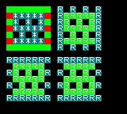</p>
</div>

Another scarily large chunk of code, huh? Don't worry: there are just 5 statements here that are executed at the game start. The first two lines build the top left square:

  * The first line uses `outlineAreaWithPattern` creates the border. The specified pattern will create straight green lines to the top and the bottom and dotted red/green lines to the sides.
  * The second line fills the center with `fillAreaWithPattern` and using a pattern of cyan sprites. Since the current line picked objects are now the spawned sprites `set`ting the `text` property to `*` will make an asterisk appear in the center of the square.

Then the area is copied 3 times by `areaCopy`. But there are three details here:

  * The current line getter just picks `A` and `C` sprites, which are the green and cyan ones. The red `B` sprites are ignored and not copied.
  * `fromIds` and `toIds` are swapping the `A` sprites with `C` sprites and that's why the copies are green inside and cyan outside.
  * Finally, `areaCopy` sets the picked objects to the spawned sprites so the `set` statement will make an `R` appear in all of the sprites.

The `areaRotate` line rotates the top right square _border_ by 90 degrees clockwise. Why just the border? Because the line getter is just getting the `C` sprites that are the cyan ones.

Finally the bottom right `A` sprites are flipped vertically. The `R` letter inside the sprites of flipped and rotated areas is still readable: these area statements just manipulate sprite positions and not their appearance.

## Moving sprites

In most of the examples, we've moved sprites around setting their `speedX`, `speedY`, `gravityY`, etc. keys and let the basic Rewtro physics engine do all the work. We talked about the physics engine a little more in the [sprites attributes](spriteattributes.md) chapter.

While it's strongly suggested to use it in your games some genres may need a _less realistic_ movement logic like in puzzle games. For example, using the `sum` or `subtract` statement to manually change the `x` or `y` sprite keys of a cursor and then checking the `isCollidingWith` [condition](conditions.md) to get the selected item may be a better way to implement a menu than using a physics engine.

There are a few helper statements for non-physics manipulations: `pan` smoothly changes any key value to a destination value and `moveTo` applies multiple movement vectors to a sprite without invoking the physics engine.

  * `pan` accepts an object with two keys:
    * `to` which is a list of keys and getters to the destination values.
    * `speed` is a getter to the value panning speed
  * `moveTo` accepts a list of objects with the `angle` and `by` getters

```
{
   "systemVersion":"0.2",
   "metadata":{
      "title":"My first game"
   },
   "data":[{
      "id":"A",
      "sprites":[
         {"id":"A","text":"A","x":76,"y":68,"zIndex":1},
         {"id":"B","backgroundColor":5}
      ],
      "tilemaps":[{"map":["AB"]}],
      "code":[
         {
            "when":[{"as":"keyboard","attribute":"left","if":[{"is":"down"}]}],
            "then":[{"id":"A","subtract":[{"rotate":[{"smallNumber":4}]}]}]
         },
         {
            "when":[{"as":"keyboard","attribute":"right","if":[{"is":"down"}]}],
            "then":[{"id":"A","sum":[{"rotate":[{"smallNumber":4}]}]}]
         },
         {
            "when":[{"as":"keyboard","attribute":"buttonA","if":[{"is":"down"}]}],
            "then":[{
               "id":"A",
               "moveTo":[
                  {"angle":[{"attribute":"rotate"}],"by":[{"smallInteger":3}]},
                  {"angle":[{"number":180}],"by":[{"smallNumber":2}]}
               ]
            }]
         },
         {
            "then":[
               {"id":"B","pan":[{
                  "to":[{
                     "x":[{"id":"A","attribute":"x"}],
                     "y":[{"id":"A","attribute":"y"}]
                  }],
                  "speed":[{"smallNumber":5}]
               }]}
            ]
         }
      ]
   }]
}
```

This cartridge shows an `A` letter you can rotate. Hitting the A button the letter will thrust like an _Asteroid_ ship... but with a pinch of vertical gravity, so it's harder to fly away to the top of the screen. A green square smoothly follows the `A` spaceship in the meanwhile. This cartridge doesn't use the Rewtro physics engine at all.

<div align="center" style="margin:60px 0">
    <p>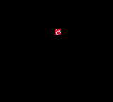</p>
</div>

The first two lines of the `code` block rotate the `A` spaceship when holding down the left and right keys. Then, when the A button is held down, two movements are applied to the spaceship: one toward the current `rotate` angle by `3` pixels executing the ship movement and one to 180 degrees (which is to the bottom of the screen) by 2 pixels simulating the gravity.

Finally, the `B` green square coordinates are moved from their current values to the spaceship coordinates by `pan` with a speed of `5`: the distance between the starting value and destination value is split by `5` and then added to the starting value resulting in a smooth movement.

## Physics

While manually moving sprites is fun you can do _more with less_ moving them with the Rewtro physics engine. You can control sprites mostly using the `set` statement on specific [sprites attributes](spriteattributes.md) but there are some statements to make your life easier.

  * `speedTo` and `setSpeedTo` add or set a force vector to a sprite like the `moveTo` statement. The exception is that this statement changes the sprite `speedX` and `speedY` keys instead of its coordinates so it will keep moving and be affected by gravity according to the physics engine.
  * `bounce` works together with [physics events](conditions.md) and changes a sprite speed when colliding with a blocking sprite. It accepts an object made this way:
    * `speedX` and `speedY` are getters to a _multiplier_ that's applied to the `speedX` and `speedY` keys speed after colliding horizontally or vertically to another sprite. Negative values will make the colliding sprite bounce back.
    * `restitutionX` and `restitutionY` work the same but affecting the _opposite force_: `restitutionX` is applied to `speedX` on _vertical_ collisions and `restitutionY` is applied to `speedY` on _horizontal_ collisions, simulating friction.

```
{
   "systemVersion":"0.2",
   "metadata":{
      "title":"My first game"
   },
   "data":[{
      "id":"A",
      "sprites":[
         {"id":"A","text":"A","x":76,"y":68,"zIndex":1,"gravityY":0.2},
         {"id":"B","backgroundColor":5},
         {"id":"C","width":160,"x":0,"y":132,"backgroundColor":6},
         {"id":"D","width":160,"x":0,"y":0,"backgroundColor":7}
      ],
      "tilemaps":[{"map":["ABCD"]}],
      "code":[
         {
            "when":[{"as":"keyboard","attribute":"left","if":[{"is":"down"}]}],
            "then":[{"id":"A","subtract":[{"rotate":[{"smallNumber":4}]}]}]
         },
         {
            "when":[{"as":"keyboard","attribute":"right","if":[{"is":"down"}]}],
            "then":[{"id":"A","sum":[{"rotate":[{"smallNumber":4}]}]}]
         },
         {
            "when":[{"as":"keyboard","attribute":"buttonA","if":[{"is":"down"}]}],
            "then":[{
               "id":"A",
               "speedTo":[{"angle":[{"attribute":"rotate"}],"by":[{"smallInteger":1}]}]
            }]
         },
         {
            "then":[
               {
                  "id":"B",
                  "setSpeedTo":[{
                     "angle":[{"angleTo":[{"id":"A"}]}],
                     "by":[{"smallInteger":1}]
                  }]
               }
            ]
         },
         {
            "when":[{"event":"hitWall","id":"A","if":[{"is":"collidingWith","id":"C"}]}],
            "then":[{
               "bounce":[{
                  "speedY":[{"float":-0.7}],
                  "restitutionX":[{"float":0.3}]
               }]
            }]
         },
         {
            "when":[{"event":"hitWall","id":"A","if":[{"is":"collidingWith","id":"D"}]}],
            "then":[{
               "bounce":[{
                  "speedY":[{"float":-1}]
               }]
            }]
         }
      ]
   }]
}
```

This cartridge is the _sequel_ of the previous example. This time our `A` spaceship is affected by gravity even when not thrusting, it accelerates and bounces when hitting the yellow ceiling and purple floor. The floor _feels_ like rubber: when the ship collides to it, it will bounce back vertically _and_ slow down horizontally a little due to some friction happening. Finally, the chasing green square is moving constant speed.

<div align="center" style="margin:60px 0">
    <p>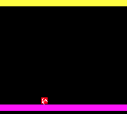</p>
</div>

The first two lines of code are the same as before: the sprite rotation is changed when pressing the left and right keys.

Hitting the A button a force is added to the current `A` spaceship sprite using `speedTo` to the direction that's facing. We don't need to apply gravity since we've set the `gravityY` sprite property in its descriptor: the physics engine will do the rest.

Then a fixed speed is set to the green `B` sprite aiming to the `A` spaceship with a speed of `1` pixel per frame. This speed is _set_ and not _added_ so `B` won't gain speed like the spaceship.

The last two lines handle the spaceship collisions:

  * the first one checks the `C` floor, giving to the colliding spaceship 7/10 of its vertical speed, making it bouncing slower every bump, and 3/10 of its horizontal speed, simulating friction.
  * the second one checks the `D` ceiling but this time returns to the spaceship the full vertical speed back and without simulating any friction.

## Audio

In a Rewtro cartridge, you can add both `sounds` and `songs` in your game cartridges using [data blocks](datablocks.md) and play them using `tilemaps`. And... that's not enough to add sounds to a game.

You can play a sound effect setting `playAudio` to a getter to the sound `id` to play or stop all playing sound effects just setting `stopAudio` to `true`. You can also stop a single sound effect channel instead of setting `stopChannel` to a getter to the `channelId` you want to stop - learn more about assigning a channel to a sound effect in the [data blocks](datablocks.md) chapter.

You can play one of the `songs` defined in a data block setting `runSong` to a getter to the song `id`. Then you can control the music player to stop, pause, and play the playing song setting `stopSong`, `pauseSong`, and `playSong` to `true`. You can also change the current `song` `tempo` setting the `setSongTempo` to a getter key with the new tempo.

```
{
   "systemVersion":"0.2",
   "metadata":{
      "title":"My first game"
   },
   "systemConfiguration":[{"controllerModel":3}],
   "data":[{
      "id":"A",
      "sounds":[
         {"id":"A","wave":"square","sustain":255},
         {"id":"B","wave":"whitenoise"}
      ],
      "music":[
         {
            "id":"A",
            "notes":[
               ["C4-","   ","   ","C4-","   ","   ","B3-","   ","   ","B3-","   ","   "],
               ["C4-","   ","   ","G7-","   ","   ","C4-","   ","   ","G7-","   ","   "]
            ],"instruments":"AB"
         },
         {
            "id":"B",
            "notes":[
               ["A3-","   ","B3-","A3-","   ","B3-","   ","   ","   ","   ","   ","   "],
               ["C4-","   ","G7-","G7-","   ","C4-","   ","   ","G7-","G7-","   ","G7-"]
            ],"instruments":"AB"
         },
         {
            "id":"C",
            "notes":[
               ["A3-","   ","B3-","A3-","   ","G3-","   ","   ","G3-","A3-","   ","B3-"],
               ["C4-","   ","G7-","G7-","   ","C4-","   ","   ","G7-","G7-","   ","G7-"]
            ],"instruments":"AB"
         }
      ],
      "songs":[{"id":"A","music":"ABAC","loopTo":0,"tempo":2}],
      "code":[
         {
            "when":[{"as":"keyboard","attribute":"buttonA","if":[{"is":"hit"}]}],
            "then":[{"playAudio":[{"character":"A"}]}]
         },
         {
            "when":[{"as":"keyboard","attribute":"buttonB","if":[{"is":"hit"}]}],
            "then":[{"stopAudio":true}]
         },
         {
            "when":[{"as":"keyboard","attribute":"buttonC","if":[{"is":"hit"}]}],
            "then":[{"setSongTempo":[{"smallNumber":1}]}]
         },
         {
            "when":[{"as":"keyboard","attribute":"buttonD","if":[{"is":"hit"}]}],
            "then":[{"setSongTempo":[{"smallNumber":4}]}]
         },
         {
            "when":[{"as":"keyboard","attribute":"up","if":[{"is":"hit"}]}],
            "then":[{"runSong":[{"character":"A"}]}]
         },
         {
            "when":[{"as":"keyboard","attribute":"down","if":[{"is":"hit"}]}],
            "then":[{"stopSong":true}]
         },
         {
            "when":[{"as":"keyboard","attribute":"right","if":[{"is":"hit"}]}],
            "then":[{"playSong":true}]
         },
         {
            "when":[{"as":"keyboard","attribute":"left","if":[{"is":"hit"}]}],
            "then":[{"pauseSong":true}]
         }
      ]
   }]
}
```

No screenshot this time: the screen is completely black but there is something to hear.

Hitting the A button a sound is played and then stops. Hitting the B button before the sound is over it will stop it immediately.

Hit the up direction to play a song and down to stop it. You can pause the song hitting left and resume it hitting right.

Hit the C and D buttons to change the music tempo. Remember that tempo is kept when music is paused and resumed but it's reset to the default value when stopped.

## Scene change and multi-load

There isn't a _true_ scene manager in Rewtro but it's possible to load one or multiple [data blocks](datablocks.md) at once simulating a change of scene or a new game state. You can decide to reset the current scene with `runScene`, removing all of the running sprites and forgetting the loaded `code` blocks or replace part of the loaded data in realtime with `load`.

Both of these statements accept a getter to a string or a single character identifying a sequence of data blocks to load.

```
{
   "systemVersion":"0.2",
   "metadata":{
      "title":"My first game"
   },
   "data":[{
      "id":"A",
      "sprites":[
         {"id":"A","x":76,"y":64,"textAlignment":"center","text":"TITLE~SCREEN","scale":2},
         {"id":"C","x":76,"y":68,"textAlignment":"center","text":"GET READY"}
      ],
      "tilemaps":[{"map":["A"]}],
      "code":[{
         "when":[{"as":"keyboard","attribute":"buttonA","if":[{"is":"hit"}]}],
         "then":[{"runScene":[{"string":"1S"}]}]
      }]
   },{
      "id":"S",
      "tilemaps":[{"map":["C"]}],
      "code":[
         {
            "when":[{"as":"scene","attribute":"timer","if":[{"is":">","smallNumber":25}]}],
            "then":[{"id":"C","remove":true,"load":[{"string":"R"}]}]
         },
         {
            "when":[{"id":"X"}],
            "then":[{"set":[{"backgroundColor":[{"list":[0,8],"randomNumber":true}]}]}]
         }
      ]
   },{
      "id":"R",
      "sprites":[{"id":"Y","width":236,"y":136,"backgroundColor":6}],
      "tilemaps":[{"map":["Y"]}],
      "code":[
         {
            "when":[{"as":"scene","attribute":"timer","if":[{"is":"==","smallNumber":50}]}],
            "then":[{"id":"X","set":[{"speedY":[{"smallNumber":3}]}]}]
         },{
            "when":[{"id":"Y","if":[{"is":"collidingWith","id":"X"}]}],
            "then":[{"runScene":[{"as":"scene","attribute":"value5"}]}]
         }
      ]
   },{
      "id":"1",
      "sprites":[
         {"id":"X"}
      ],
      "tilemaps":[{
         "x":40,"y":16,
         "map":[
            "X X X X X ",
            " X X X X X"
         ],
         "set":[{"value5":"2S"}]
      }]
   },{
      "id":"2",
      "tilemaps":[{
         "x":40,"y":16,
         "map":[
            "X X X X X",
            " X X X X ",
            "  X X X  "
         ],
         "set":[{"value5":"A"}]
      }]
   }]
}
```

Good news. This cartridge is a game featuring a title screen and multiple levels. Bad news. Except for the title screen there is no interaction. Sorry.

<div align="center" style="margin:60px 0">
    <p>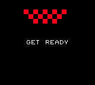</p>
</div>

When the game starts the `A` data block is loaded and executed as usual. It describes the `A` and `C` sprites but displays only the first one using `tilemaps`. The `A` data block `code` waits for the player to hit the A button and then executes the `runScene` statement with `1S`.

`runScene` clears all of the spawned sprites, stops any music and fakes load time as explained in [Rewtro cartridge](rewtrocartridge.md) chapter. Then load the `1` block and `S` block and start the game again:

  * the `1` data block defines the `X` sprite and spawn, spawn them in a tilemap, and set `2S` to the `value5`
  * the `S` scene spawns the `C` sprite, which is the `GET READY` message. Then the `code` block waits a second making the `X` sprites flash, remove the `C` sprite and `load` the `R` data block.

The `load` statement won't remove the spawned sprites or fakes loading time but spawn its tilemap _into_ the current scene and _replaces_ the running code with the one coming from the `R` That's why the sprites are not flashing anymore: the flash code has been replaced.

Even if the `code` in `R` looks like it's waiting for two seconds (`50` frames) it happens after one second by the time the `R` data block is loaded and that's because the `load` statement doesn't reset any `timer`. After waiting it gives the `X` sprites a vertical speed, moving them to the just spawn `Y` sprite.

The second line of `R` triggers when any of the `X` sprites collide with the `Y` bar: it executes a `loadScene` using the scene attribute `value5` as key value. This way the `2S` data blocks are loaded, looping from the `GET READY` message but with a different tilemap.

Finally, the `2` data block will set `A` as the next scene, ending our game and moving it back to the title screen.

## Events

Rewtro features a tiny event system that uses [code conditions](conditions.md): when an event is triggered on a sprite all the `code` lines with a matching `event` key and targeting that sprite is executed.

These events can be triggered both by the physics engine when a collision happens and manually from your code. To trigger an event set the `triggerEvent` to `event0`, `event1`, `event2`, `event3`, or `event4`. You can also trigger the system events `hitWall`, `isSpawn`, and `isRemoved`.

An event can be triggered on a sprite _just once_ per game frame. If you want to override this behavior set the `forceEvent` key to `true` in your `triggerEvent` call.

```
{
   "systemVersion":"0.2",
   "metadata":{
      "title":"My first game"
   },
   "data":[{
      "id":"A",
      "sprites":[
         {"id":"A","flags":"F"},
         {"id":"B","flags":"F","x":0,"y":8}
      ],
      "tilemaps":[{"map":["AB"]}],
      "code":[
         {
            "then":[
               {"flags":"F","set":[{"value0":[{"smallNumber":0}]}]},
               {"id":"A","triggerEvent":"event0"},
               {"id":"A","triggerEvent":"event0"},
               {"id":"A","triggerEvent":"event0"},
               {"id":"B","triggerEvent":"event0","forceEvent":true},
               {"id":"B","triggerEvent":"event0","forceEvent":true},
               {"id":"B","triggerEvent":"event0","forceEvent":true},
               {"flags":"F","set":[{"text":[{"attribute":"value0"}]}]}
            ]
         },{
            "when":[{"event":"event0","flags":"F"}],
            "then":[{"sum":[{"value0":[{"smallNumber":1}]}]}]
         }
      ]
   }]
}
```

This cartridge shows two _event counters_: the `event0` is called three times on both of the sprites but the first one counts `1` call and the second one is `3`.

<div align="center" style="margin:60px 0">
    <p>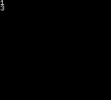</p>
</div>

First, both of the sprites `value0` counter is reset to `0`. Then the `event0` event is called 3 times on sprite `A` and then on the sprite `B` but with the `forceEvent` flag set to `true`. Finally, the `value0` counter is displayed on the screen.

The last line of the code and catches the `event0` event called on sprites having the `F` flag set - which are `A` and `B`. The triggered code increments the `value0` counter. Notice that even if this line is into the `code` block lines it's executed _only_ when the event is triggered: the counter is increased _exactly after_ the `triggerEvent` call, pausing the code execution. 

Since the same event can be triggered on a single sprite _just once per frame_ the `A` sprite will run the `event0` code _just once_ even after three consecutive calls. The `B` sprite `event0` is also called three consecutive times but the `forceEvent` flag set to `true` will force the event code to be executed at every call.

## Calling sub-code and breaks

In the [code statements](codestatements.md) chapter we've seen that every `code` block may contain a `when` command key that describes an iterator or condition, such a list of sprites or a collision condition, and a mandatory `then` command that contains one or more lines of code to be executed.

It's possible to execute a sub-code block using the `code` statement and describing block content as usual in its key value.

Code sub-block execution can be stopped using the `break` statement at any time: just after the current line the running sub-block execution will be aborted and the _previous_ code block execution is continued.

The loaded `code` execution that's run every frame can be also considered a sub-block so `break`ing its execution at the _root level_ will end your game logic for that frame.

```
{
   "systemVersion":"0.2",
   "metadata":{
      "title":"My first game"
   },
   "data":[{
      "id":"A",
      "sprites":[
         {"id":"A","flags":"F"},
         {"id":"B","flags":"F","x":0,"y":8},
         {"id":"C","flags":"F","x":0,"y":16}
      ],
      "tilemaps":[{"map":["ABC"]}],
      "code":[
         {
            "then":[
               {"flags":"F","set":[{"text":[{"attribute":"value0"}]}]},
               {
                  "code":[
                     {
                        "when":[{"as":"scene","if":[{"itsAttribute":"timer","is":"%%","smallNumber":25}]}],
                        "then":[
                           {"break":true,"id":"A","sum":[{"value0":[{"smallNumber":1}]}]},
                           {"id":"C","sum":[{"value0":[{"smallNumber":1}]}]}
                        ]
                     }                     
                  ]
               },
               {"break":true,"id":"B","sum":[{"value0":[{"smallNumber":1}]}]},
               {"id":"C","sum":[{"value0":[{"smallNumber":1}]}]}
            ]
         },{
            "then":[
               {"id":"C","sum":[{"value0":[{"smallNumber":1}]}]}
            ]
         }
      ]
   }]
}
```

This cartridge shows 3 timers but even if the `code` tries to increase all three of them the `C` one is stuck to `0` due to multiple code `break`s.

<div align="center" style="margin:60px 0">
    <p></p>
</div>

Its first line of `code` executes the `then` command without any condition and its first statement displays every `value0` counter on the screen.

Then a sub-`code` block is executed: in this block the `A` sprite `value0` is increased every second. Due to the `break` statement, the `code` block execution is aborted, the next line is not executed, and the `C` sprite counter is not increased.

The code execution resumes from the `code` statement we've left: the `B` counter is increased but the `break` statement will prevent the `C` counter to be increased.

Since there isn't any previous `code` statement it's the turn of the loaded `code` execution to be aborted. The last line of code will be never executed and so the `C` counter will remain `0` every frame.

## Logging

Rewtro debugging tools are _not that great_ but you can check out the `_DEBUG` statement if you are in trouble for now. Setting its key to different string values will make different things to happen:

  * `LOG` logs the current picked object to the JavaScript console
  * `DEBUGGER` also breaks the JavaScript interpreter into the Rewtro engine code

```
{
   "systemVersion":"0.2",
   "metadata":{
      "title":"My first game"
   },
   "data":[{
      "id":"A",
      "code":[
         {
            "when":[{"as":"scene","if":[{"itsAttribute":"timer","is":"%%","smallNumber":25}]}],
            "then":[{"attribute":"timer","_DEBUG":"LOG"}]
         },
         {
            "when":[{"as":"scene","if":[{"itsAttribute":"timer","is":"==","smallNumber":125}]}],
            "then":[{"attribute":"height","_DEBUG":"DEBUGGER"}]
         }
      ]
   }]
}
```

This cartridge shows... a blank screen. But in the JavaScript console will be logged the the scene timer every second and, at the fifth one, the Rewtro engine execution is aborted and the debugger is opened.

<div align="center" style="margin:60px 0">
    <p>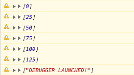</p>
</div>

## Randomizer

Random [getters](getters.md) like `randomNumber` and `randomValue` will return a different random value _every time a new line of code is executed_. This way you can assign the same random number to multiple objects without worrying to store it somewhere. You may want to override this behavior setting the `randomize` key to `true` so a different random number will be picked every time instead.

```
{
   "systemVersion":"0.2",
   "metadata":{
      "title":"My first game"
   },
   "data":[{
      "id":"A",
      "sprites":[
         {"id":"A","height":80},
         {"id":"B","height":80},
         {"id":"C","height":80}
      ],
      "tilemaps":[{"map":["AAA BBB CCC"]}],
      "code":[
         {
            "when":[{"as":"scene","if":[{"itsAttribute":"timer","is":"%%","smallNumber":25}]}],
            "then":[
               {"id":"A","set":[{"backgroundColor":[{"list":[3,15],"randomNumber":true}]}]},
               {"id":"B","set":[{"backgroundColor":[{"list":[3,15],"randomNumber":true}]}]},
               {"id":"C","set":[{"backgroundColor":[{"list":[3,15],"randomNumber":true}]}],"randomize":true}
            ]
         }
      ]
   }]
}
```

This cartridge shows three color changing bands made of three sprites each. The first and the second bands have different colors but the third one is striped.

<div align="center" style="margin:60px 0">
    <p>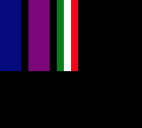</p>
</div>

The bands made with `A` and `B` sprites are randomly colored in the same way but by different lines of code. Since the random number is picked _once per line_ all of the `A` sprites will have the same random color and all of the `B` sprites will have another random one.

The third line of code looks like the previous but the `randomize` flag forces `randomNumber` to pick a different number for each `C` sprite and resulting in a striped band.

# Execution order

Code statements are executed following a fixed order. This is the list of all code statements sorted by execution priority.

  * Mode set
    * `randomize`
  * Get changers
    * `spawn`, `fillAreaWithPattern`, `outlineAreaWithPattern`, or `areaCopy`
  * Statements
    * `remove`
    * `bounce`
    * `areaFlipX`
    * `areaFlipY`
    * `areaRotate`
    * `areaCopy`
    * `placeAt`
    * `set`
    * `invert`
    * `subtract`
    * `sum`
    * `divide`
    * `multiply`
    * `module`
    * `pan`
    * `push`
    * `moveTo`
    * `speedTo`
    * `setSpeedTo`
    * `playAudio`
    * `stopChannel`
    * `stopAudio`
    * `playAudio`
    * `stopSong`
    * `pauseSong`
    * `runSong`
    * `playSong`
    * `setSongTempo`
    * `triggerEvent` / `forceEvent`
    * `runScene`
    * `load`
    * `break`
    * `code`
