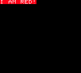
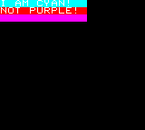
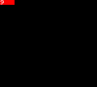
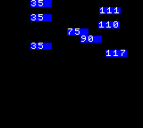
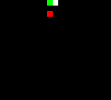
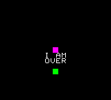

# Conditions

Conditons are used to describe the logic that will trigger the execution of a sequence of [code statements](codestatements.md). Conditions can be used to check if a specific controller button has been pressed, a specific sprite collided with another one, etc. As code lines, _conditions are getters too_ and this _condition picked_ value is often used for comparisons.

They are defined into the `if` key of a `when` [command](codecommands.md) and does its evaluation on the current [picked object](getters.md).

```
{
   "systemVersion":"0.2",
   "metadata":{
      "title":"My first game"
   },
   "data":[{
      "id":"A",
      "sprites":[
         {"id":"A","backgroundColor":5,"width":72}
      ],
      "tilemaps":[{"map":["A"]}],
      "code":[
         {
            "when":[{"id":"A","if":[{"itsAttribute":"backgroundColor","is":"==","smallNumber":5}]}],
            "then":[{"set":[{"text":[{"string":"I AM RED!"}]}]}]
         }
      ]
   }]
}
```

This cartridge defines an empty red sprite but right after the `code` execution its text is set to `I AM RED!`.

<div align="center" style="margin:60px 0">
    <p></p>
</div>

The first `code` line `when` picks the sprite with ID `A` and sets a pretty readable condition in its `if` key: if `itsAttribute` `backgroundColor` `is` equal to the _condition picked_ value of `5` `then` its `text` property is set to `I AM RED!`. That's why our empty sprite immediately displays text.

Notice that the `then` picked object is not the `backgroundColor` attribute but the object that _owns_ that attribute, thanks to the `itsAttribute` key in the condition.

## Sub-attributes

The key `itsAttribute` changes the evaluated object from the picked one to one of its attributes. That's handy when you want to build a condition on a sprite and manipulate it that in the next code block.

```
{
   "systemVersion":"0.2",
   "metadata":{
      "title":"My first game"
   },
   "data":[{
      "id":"A",
      "sprites":[
         {"id":"A","backgroundColor":4,"width":96},
         {"id":"B","backgroundColor":5,"width":96,"x":0,"y":8},
         {"id":"C","backgroundColor":6,"width":96,"x":0,"y":16}
      ],
      "tilemaps":[{"map":["ABC"]}],
      "code":[
         {
            "when":[{"id":"A","if":[{"itsAttribute":"backgroundColor","is":"==","smallNumber":4}]}],
            "then":[{"set":[{"text":[{"string":"I AM CYAN!"}]}]}],
            "else":[{"id":"A","set":[{"text":[{"string":"NOT CYAN!"}]}]}]
         },
         {
            "when":[{"id":"B","if":[{"itsAttribute":"backgroundColor","is":"==","smallNumber":6}]}],
            "then":[{"set":[{"text":[{"string":"I AM PURPLE!"}]}]}],
            "else":[{"id":"B","set":[{"text":[{"string":"NOT PURPLE!"}]}]}]
         },
         {
            "when":[{"id":"C","attribute":"backgroundColor","if":[{"is":"==","smallNumber":6}]}],
            "then":[{"set":[{"text":[{"string":"I AM PURPLE!"}]}]}],
            "else":[{"id":"C","set":[{"text":[{"string":"NOT PURPLE!"}]}]}]
         }
      ]
   }]
}
```

This cartridge displays 3 colored sprites but only 2 of them have text on it even if the `code` tries to change all of them.

<div align="center" style="margin:60px 0">
    <p></p>
</div>

The first line picks the `A` sprite and checks if `itsAttribute` `backgroundColor` is equal to `4`, which is the cyan color in the default palette. Since it's true the `then` command is executed. It will `set` the `text` to `I AM CYAN!` for the currently picked object, which is still the `A` sprite picked by the `when` command. The `else` command is ignored.

The second line picks the `B` one but looks for the purple color. Since it's red the `then` command is ignored and the `else` command is triggered. As we've seen in [commands chapters](codecommands.md) the `else` command picked object is the current `code` block subject. Since we're on the root `code` block the current picked object is `undefined`. To manipulate the `B` sprite we've to pick it again with the `id` getter and then use the `set` statement to change its `text` key to `NOT CYAN!`.

The third line is a little nasty: it picks the `C` sprite and looks for the purple color, which is the right color. The `then` command is executed but no text is set. That's because this time we've used the `attribute` key in the getter instead of `itsAttribute` in the condition. While the `if` condition is still true since the _picked object_ is equal to `6`, the `then` command picked object is _that `6` number_ instead of the `C` sprite so setting the `text` key of that `6` number to `I'M PURPLE!` is not valid and anything will happen.

## Check values

The most common way to build a condition is by using the `is` key. Its value decides the evaluation strategy for the current picked value.

```
{
   "systemVersion":"0.2",
   "metadata":{
      "title":"My first game"
   },
   "data":[{
      "id":"A",
      "sprites":[
         {"id":"A","width":24}
      ],
      "tilemaps":[{"map":["A"]}],
      "code":[
         {
            "when":[{"as":"keyboard","attribute":"up","if":[{"is":"hit"}]}],
            "then":[{"id":"A","sum":[{"value0":[{"smallNumber":1}]}]}]
         },
         {
            "when":[{"as":"keyboard","attribute":"down","if":[{"is":"hit"}]}],
            "then":[{"id":"A","subtract":[{"value0":[{"smallNumber":1}]}]}]
         },
         {
            "when":[{"id":"A","if":[{"itsAttribute":"value0","is":">","smallNumber":4}]}],
            "then":[{"set":[{"backgroundColor":[{"smallNumber":5}]}]}],
            "else":[{"id":"A","set":[{"backgroundColor":[{"smallNumber":0}]}]}]
         },{
            "then":[{"id":"A","set":[{"text":[{"attribute":"value0"}]}]}]
         }
      ]
   }]
}
```

This cartridge shows a counter that increases pressing the up button and decreases pressing the down button. When the counter is 5 or more it becomes red.

<div align="center" style="margin:60px 0">
    <p></p>
</div>

The first two lines are using `is` to check the [special object](specialobjects.md) `keyboard`'s `up` or `down` attributes. The `hit` value means that the condition will be true if the picked value is equal to 1 - and that's when the picked button is hit. The `then` code will increase or decrease the `A` sprite `value0` attribute.

The third line picks the `A` sprites and uses the `>` `is` value to check if its `value0` attribute is higher than 4. If it's true the `A` background is set to red else its background is set to transparent.

### Numbers

You can create a condition that triggers on specific values or a range of values using these `is` key values:

  * `>` triggers when the picked value is greater than the condition picked value.
  * `>=` triggers when the picked value is greater or equal than the condition picked value.
  * `<` triggers when the picked value is less than the condition picked value.
  * `<=` triggers when the picked value is less or equal than the condition picked value.
  * `!=` triggers when the picked value is not equal to the condition picked value.
  * `==` triggers when the picked value is equal to the condition picked value.
  * `%%` triggers when the picked value module the picked condition picked value is less than 1.

If you've coded in other languages before you'll probably recognize these conditions and know how to use them.

```
{
   "systemVersion":"0.2",
   "metadata":{
      "title":"My first game"
   },
   "data":[{
      "id":"A",
      "sprites":[
         {"id":"A","x":76,"y":0,"width":24,"backgroundColor":2,"speedX":-1},
         {"id":"B","x":76,"y":8,"width":24,"backgroundColor":2,"speedX":1},
         {"id":"C","x":76,"y":16,"width":24,"backgroundColor":2,"speedX":-1},
         {"id":"D","x":76,"y":24,"width":24,"backgroundColor":2,"speedX":1},
         {"id":"E","x":76,"y":32,"width":24,"backgroundColor":2,"speedX":-1},
         {"id":"F","x":76,"y":40,"width":24,"backgroundColor":2,"speedX":1},
         {"id":"G","x":76,"y":48,"width":24,"backgroundColor":2,"speedX":-1},
         {"id":"H","x":76,"y":56,"width":24,"backgroundColor":2,"speedX":1}
      ],
      "tilemaps":[{"map":["ABCDEFGH"]}],
      "code":[
         {
            "when":[{"id":"A","if":[{"itsAttribute":"x","is":"<","smallNumber":20}]}],
            "then":[{"set":[{"speedX":[{"smallNumber":0}]}]}]
         },{
            "when":[{"id":"B","if":[{"itsAttribute":"x","is":">","smallNumber":110}]}],
            "then":[{"set":[{"speedX":[{"smallNumber":0}]}]}]
         },{
            "when":[{"id":"C","if":[{"itsAttribute":"x","is":"<=","smallNumber":20}]}],
            "then":[{"set":[{"speedX":[{"smallNumber":0}]}]}]
         },{
            "when":[{"id":"D","if":[{"itsAttribute":"x","is":">=","smallNumber":110}]}],
            "then":[{"set":[{"speedX":[{"smallNumber":0}]}]}]
         },{
            "when":[{"id":"E","if":[{"itsAttribute":"x","is":"!=","smallNumber":76}]}],
            "then":[{"set":[{"speedX":[{"smallNumber":0}]}]}]
         },{
            "when":[{"id":"F","if":[{"itsAttribute":"x","is":"==","smallNumber":90}]}],
            "then":[{"set":[{"speedX":[{"smallNumber":0}]}]}]
         },{
            "when":[{"id":"G","if":[{"itsAttribute":"x","is":"%%","smallNumber":10}]}],
            "then":[{"set":[{"backgroundColor":[{"smallNumber":5}]}]}],
            "else":[{"id":"G","set":[{"backgroundColor":[{"smallNumber":2}]}]}]
         },{
            "when":[
               {"id":"H","if":[{"itsAttribute":"x","is":">","smallNumber":90}]},
               {"id":"H","if":[{"itsAttribute":"x","is":"<","smallNumber":110}]}
            ],
            "then":[{"set":[{"backgroundColor":[{"smallNumber":5}]}]}],
            "else":[{"id":"H","set":[{"backgroundColor":[{"smallNumber":2}]}]}]
         },{
            "then":[{"as":"allSprites","set":[{"text":[{"attribute":"x"}]}]}]
         }
      ]
   }]
}
```

This cartridge shows some sprites displaying their horizontal coordinates that will slowly move away from the center. The first 6 sprites will stop at a specific position, the 6th will move away blinking red and the last one will become red for a short while.

<div align="center" style="margin:60px 0">
    <p></p>
</div>

The `code` shows multiple examples of the `is` key. In the first 6 cases, the sprites are stopped at a specific condition. The 7th sprite will blink red since the `%%` module operator triggers a color change every time the sprite position is multiple of 10. The 8th sprite has a `when` command with 2 conditions: since both of them have to be true in order to trigger the color change it will happen in a range between `90` and `110` excluded.

### Game controller state

To make your game react to user input you've to create conditions on the  `keyboard` [special object](specialobjects.md) attributes. There are 3 `is` values shorthands to check a button state: `up` returns true if the picked button is not pressed, `hit` when has been just pressed and `down` when is hold down.

```
{
   "systemVersion":"0.2",
   "metadata":{
      "title":"My first game"
   },
   "data":[{
      "id":"A",
      "sprites":[{"id":"A","x":76,"y":68}],
      "tilemaps":[{"map":["A"]}],
      "code":[
         {
            "when":[{"as":"keyboard","attribute":"down","if":[{"is":"down"}]}],
            "then":[{"id":"A","sum":[{"y":[{"smallNumber":1}]}]}]
         },{
            "when":[{"as":"keyboard","attribute":"right","if":[{"is":"down"}]}],
            "then":[{"id":"A","sum":[{"x":[{"smallNumber":1}]}]}]
         },{
            "when":[{"as":"keyboard","attribute":"up","if":[{"is":"down"}]}],
            "then":[{"id":"A","subtract":[{"y":[{"smallNumber":1}]}]}]
         },{
            "when":[{"as":"keyboard","attribute":"left","if":[{"is":"down"}]}],
            "then":[{"id":"A","subtract":[{"x":[{"smallNumber":1}]}]}]
         },{
            "when":[{"as":"keyboard","attribute":"buttonA","if":[{"is":"down"}]}],
            "then":[{"id":"A","set":[{"backgroundColor":[{"smallNumber":2}]}]}]
         },{
            "when":[{"as":"keyboard","attribute":"buttonA","if":[{"is":"up"}]}],
            "then":[{"id":"A","set":[{"backgroundColor":[{"smallNumber":5}]}]}]
         },{
            "when":[{"as":"keyboard","attribute":"buttonA","if":[{"is":"hit"}]}],
            "then":[{"id":"A","set":[{"backgroundColor":[{"smallNumber":3}]}]}]
         }
      ]
   }]
}
```

In this cartridge you move a red square around the screen using the up, down, left, and right buttons. Holding down the A button it becomes blue but flashes cyan when the button is just hit.

<div align="center" style="margin:60px 0">
    <p></p>
</div>

The first four lines get the `keyboard` object attributes `up`, `down`, `left`, and `right` and apply the related movement when the buttons are `down`.

Then the 4th line changes the sprite color to blue when the `buttonA` button is `down`. The next line changes the it to `blue` when the same button is up. Since in Rewtro a button can't be `up` and `down` at the same time only one of the two `then` code will run.

The last line instead checks if the A button has been `hit` and changes the sprite color to cyan. A button that's `down` is also `hit` during the single game frame the button has been pressed. Since this color change happens _after_ the `down` condition it _overwrites_ its color change and that's why the sprite blinks for a single game frame to cyan right when the player hits the A button.

### Sprite collisions

Using the `is` key you can also check another very common condition in games: sprite collisions. The `collidingWith` key value checks if _all_ of the picked sprites are colliding with _at least one_ of the condition picked sprites. It's also possible to check if the picked sprite collision applying first a translation setting the `deltaX` and `deltaY` keys to a getter to the position gap.

```
{
   "systemVersion":"0.2",
   "metadata":{
      "title":"My first game"
   },
   "data":[{
      "id":"A",
      "sprites":[
         {"id":"A","x":0,"y":0,"speedX":1,"zIndex":1},
         {"id":"B","x":0,"y":16,"speedX":1},
         {"id":"C","x":76,"y":0,"backgroundColor":8}
      ],
      "tilemaps":[{"map":["ABC"]}],
      "code":[
         {
            "when":[{"id":"A","if":[{"is":"collidingWith","id":"C"}]}],
            "then":[{"set":[{"backgroundColor":[{"smallNumber":5}]}]}],
            "else":[{"id":"A","set":[{"backgroundColor":[{"smallNumber":3}]}]}]
         },
         {
            "when":[{
               "id":"B",
               "if":[{
                  "is":"collidingWith",
                  "deltaX":[{"smallNumber":8}],
                  "deltaY":[{"smallInteger":-16}],
                  "id":"C"
               }]
            }],
            "then":[{"set":[{"backgroundColor":[{"smallNumber":5}]}]}],
            "else":[{"id":"B","set":[{"backgroundColor":[{"smallNumber":3}]}]}]
         }
      ]
   }]
}
```

This cartridge shows two green sprites on the left that slowly moves to the white one at center of the screen. According to the `code` the two green sprites will turn red when colliding with the white one. If the first one is pointing toward the white sprite and will eventually collide, the second one is off-track... and still it will collide even before the first one. How's possible?

<div align="center" style="margin:60px 0">
    <p></p>
</div>

The first condition in `code` check if the picked `A` sprite `is` `collidingWith` the condition picked sprite `C` and changes the `A` sprite color. The second one instead is a little more elaborate.

It checks if the picked sprite `B` `is` `collidingWith` the condition picked sprite `C` as the line before but the collision is checked as if the `B` sprite was moved `8` pixels to the right (the `deltaX` value) and `16` pixels to the top (the `deltaY` value). During the collision evaluation, the `B` sprite will be a little tilted to the top, making it on-track with the `B` sprite and making it collide. Moreover, the `B` sprite is also tilted to the right making the collision happen a little before.

### Sprite positions

You can check if a sprite is under, over, on the right, or on the left of another one using the `is` values `under`, `over`, `onRightOf`, or `onLeftOf`. Two sprites can be _at just one_ of these relative positions: if it's `under` is not `over` but it's also not `onRightOf` or `onLeftOf`.

```
{
   "systemVersion":"0.2",
   "metadata":{
      "title":"My first game"
   },
   "data":[{
      "id":"A",
      "sprites":[
         {"id":"A","x":76,"y":24,"backgroundColor":3},
         {"id":"B","x":76,"y":68,"backgroundColor":6,"textAlignment":"center"}
      ],
      "tilemaps":[{"map":["AB"]}],
      "code":[
         {
            "when":[{"as":"keyboard","attribute":"down","if":[{"is":"down"}]}],
            "then":[{"id":"A","sum":[{"y":[{"smallNumber":3}]}]}]
         },{
            "when":[{"as":"keyboard","attribute":"right","if":[{"is":"down"}]}],
            "then":[{"id":"A","sum":[{"x":[{"smallNumber":3}]}]}]
         },{
            "when":[{"as":"keyboard","attribute":"up","if":[{"is":"down"}]}],
            "then":[{"id":"A","subtract":[{"y":[{"smallNumber":3}]}]}]
         },{
            "when":[{"as":"keyboard","attribute":"left","if":[{"is":"down"}]}],
            "then":[{"id":"A","subtract":[{"x":[{"smallNumber":3}]}]}]
         },{
            "when":[{"id":"B","if":[{"is":"under","id":"A"}]}],
            "then":[{"set":[{"text":[{"string":"~I AM~UNDER"}]}]}]
         },{
            "when":[{"id":"B","if":[{"is":"over","id":"A"}]}],
            "then":[{"set":[{"text":[{"string":"~I AM~OVER"}]}]}]
         },{
            "when":[{"id":"B","if":[{"is":"onRightOf","id":"A"}]}],
            "then":[{"set":[{"text":[{"string":"~I AM~ON RIGHT"}]}]}]
         },{
            "when":[{"id":"B","if":[{"is":"onLeftOf","id":"A"}]}],
            "then":[{"set":[{"text":[{"string":"~I AM~ON LEFT"}]}]}]
         }
      ]
   }]
}
```

This cartridge show a green sprite that you can move around and a purple one in the middle of the screen. Under the purple sprite you'll read its relative position to the green one. Move the square around to see how this text changes.

<div align="center" style="margin:60px 0">
    <p></p>
</div>

Moving the green square around you'll discover that there are 4 quadrants around the purple square and the `under` condition will trigger when the green sprite is on the lower one, the `over` on the top one, the `onRightOf` on the one to the right, and `onLeftOf` on the one to the left.

### Existence

The `existing` value is used to check if the picked element is defined and to check if it contains at least one element on lists. To learn more about how `existing` works have a look at the [iterators](listiterators.md) chapter.
