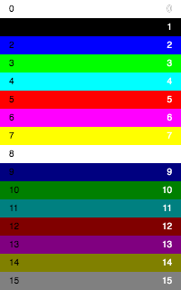

# Data blocks

Data blocks are unsorted _bundles of assets_, like graphics, music, sounds, and more taped together and identified by a single letter identifier. When a Rewtro game is started the `A` data block is loaded and executed.

```
{
   "systemVersion":"0.2",
   "metadata":{
     "title":"My first game"
   },
   "data":[{
      "id":"A",
      <the content of the data block A. It will be loaded when the game starts.>
   },{
      "id":"B",
      <the content of the data block B. It will be loaded on demand.>
   }]
}
```

We already met a working data block in our working [Hello, World!](rewtrocartridge.md) example:

```
{
   "systemVersion":"0.2",
   "metadata":{
     "title":"My first game"
   },
   "data":[{
      "id":"A",
      "sprites":[{"id":"A","text":"HELLO,~WORLD!","textColor":3,"backgroundColor":2,"width":50,"height":16}],
      "tilemaps":[{"map":["A"]}]
   }]
}
```

This cartridge defines the `A` data block, which contains a single sprite in its `sprites` section and a single tilemap in its `tilemaps` section. Except for the `A` data block which is loaded when the game is started, all data blocks are loaded only when your code requires them and can be loaded multiple times at different times. Mixing data blocks and loading them at the right time you can create title and ending screens, games with multiple levels, multi-state scenes, and more.

## Images

Rewtro stores images into game binaries using different formats, none of them is standard. Good news: the Rewtro compiler can read and convert any PNG for you, so you don't need any external processor. Bad news: these formats have some limits since are thought to use a few bytes and to work well with the data compressor.

To add some images to a data block you have to set the `images` key:

```
{
   "systemVersion":"0.2",
   "metadata":{
     "title":"My first game"
   },
   "data":[{
      "id":"A",
      "images":[
         <add your images here>
      ]      
   }]
}
```

An image has the following mandatory keys:

  * `id`: How the image is referenced in code. It must be one of these values: `font`,`graphics`,`graphics0`,`graphics1`,`graphics2`,`graphics3`,``graphics4`,`graphics5`. The `font` image is used as custom font for your game. The `graphics` image is used as default spritesheet for sprites rendering.
  * `image`: The image data. It has two sub-keys:
    * `data`: The raw image data. Since you can't type in raw binary data you can load an external PNG file using the [compiler helper](compilerhelpers.md) `_file`.
    * `format`: The image format. We're going to talk about them later.

We deserve an example. I've drawn this [sample.png](images/sample.png) 32x16 image and saved it into the `carts/` directory, just in the same place our cartridge JSON file is. It looks like this:

<div align="center" style="margin:60px 0">
    <p></p>
</div>

The following cartridge loads our `sample.png` image into the image `id` called `graphics`, which is the default image for sprites rendering. Then it creates a 16x16 sprite and draws the first face on the screen:

```
{
   "systemVersion":"0.2",
   "metadata":{
      "title":"My first game"
   },
   "data":[{
      "id":"A",
      "images":[{"id":"graphics","image":{"data":{"_file":"sample.png"},"format":"monocolor"}}],
      "sprites":[{"id":"A","graphicsX":0,"graphicsY":64,"width":16,"height":16}],
      "tilemaps":[{"map":["A"]}]
   }]
}
```

This cartridge output is this:

<div align="center" style="margin:60px 0">
    <p></p>
</div>

Why the image is colored while our `sample.png` is just in white and transparent? The secret sauce is into the `monocolor` image format. Rewtro supports up to 15 built-in image formats but just some of them are available. Each image format have its limits and perks.

### Monocolor format

The `monocolor` format reads an image that uses just a solid color and a fully transparent one. When loaded is turned into a multicolor one, replacing the black with all of the palette colors of your [system configuration](rewtrocartridge.md).

The `sample.png` image we used in our previous example was encoded using the `monocolor` format. That image is loaded this way instead:

<div align="center" style="margin:60px 0">
    <p></p>
</div>

Why these colors are used? Because, since [no palette has been defined](rewtrocartridge.md) we're using the default Rewtro palette:

<div align="center" style="margin:60px 0">
    <p></p>
</div>

See? The colors from the palette and `sample.png` are matching. We can also explain why there is a `graphicsY` set to 64: `graphicsX` and `graphicsY` decides where the sprite image is into a spritesheet image and, at that coordinates, there is that cyan face that appears on the screen.

### Indexed format

The `indexed` format reads an image that uses just colors from the [system palette](rewtrocartridge.md). The image is loaded as-is.

We need another example. Let's create a _very bad_ multicolor version of our `sample.png`. Say hello to [sample-colors.png](images/sample-colors.png):

<div align="center" style="margin:60px 0">
    <p></p>
</div>

This cartridge loads the image and shows its first frame on the screen:

```
{
   "systemVersion":"0.2",
   "metadata":{
      "title":"My first game"     
   },
   "data":[{
      "id":"A",
      "images":[{"id":"graphics","image":{"data":{"_file":"sample-colors.png"},"format":"indexed"}}],
      "sprites":[{"id":"A","graphicsX":0,"graphicsY":0,"width":16,"height":16}],
      "tilemaps":[{"map":["A"]}]
   }]
}
```

Like this:

<div align="center" style="margin:60px 0">
    <p></p>
</div>

### Rewtro format

You may wonder why there are multiple image formats in Rewtro. The `monocolor` uses less bytes to store an image but you can use one color at a time. The `indexed` format uses more bytes but you can create more detailed sprites. As it usually happens in low-data environments you have to make a trade-off.

The `rewtro` format creates something _in the middle_ between the `monocolor` and the `indexed` format. Images are loaded as-is like the `monocolor` format but just supports _transparency and up to 2 different colors for every 8x8 area of your sprite_.

That means that it can encode our `sample.png` image keeping just the white color...

```
{
   "systemVersion":"0.2",
   "metadata":{
      "title":"My first game"
   },
   "data":[{
      "id":"A",
      "images":[{"id":"graphics","image":{"data":{"_file":"sample.png"},"format":"rewtro"}}],
      "sprites":[{"id":"A","graphicsX":0,"graphicsY":0,"width":16,"height":16}],
      "tilemaps":[{"map":["A"]}]
   }]
}
```

<div align="center" style="margin:60px 0">
    <p></p>
</div>

...but it's a little inefficient: you can just use the `monocolor` format using fewer bytes and giving you more color options. But this new [sample-2colors.png](images/sample-2colors.png) image...

<div align="center" style="margin:60px 0">
    <p></p>
</div>

...while it can be encoded by the `indexed` format...

```
{
   "systemVersion":"0.2",
   "metadata":{
      "title":"My first game"
   },
   "data":[{
      "id":"A",
      "images":[{"id":"graphics","image":{"data":{"_file":"sample-2colors.png"},"format":"indexed"}}],
      "sprites":[{"id":"A","graphicsX":0,"graphicsY":0,"width":16,"height":16}],
      "tilemaps":[{"map":["A"]}]
   }]
}
```

...giving this result...

<div align="center" style="margin:60px 0">
    <p></p>
</div>

...since in our image we've transparency and up to 2 colors for each 8x8 area, we can just use the `rewtro` format...

```
{
   "systemVersion":"0.2",
   "metadata":{
      "title":"My first game"
   },
   "data":[{
      "id":"A",
      "images":[{"id":"graphics","image":{"data":{"_file":"sample-2colors.png"},"format":"rewtro"}}],
      "sprites":[{"id":"A","graphicsX":0,"graphicsY":0,"width":16,"height":16}],
      "tilemaps":[{"map":["A"]}]
   }]
}
```

...for the same result but saving ~115 bytes, which is _a huge amount of data_ in Rewtro. For the more nerdy of you out there, the `rewtro` format limitations were loosely inspired by the [ZX Spectrum 48K](https://en.wikipedia.org/wiki/ZX_Spectrum#ZX_Spectrum_16K/48K).

## Sounds

_TODO_

## Music and songs

_TODO_

## Sprites

_TODO_

## Tilemaps

_TODO_

## Game code

_TODO_
