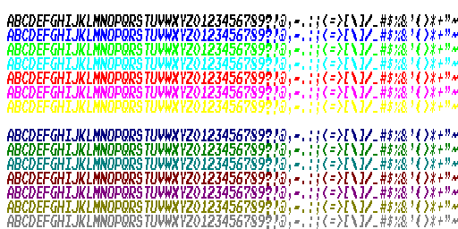
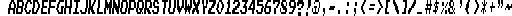
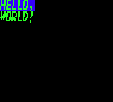
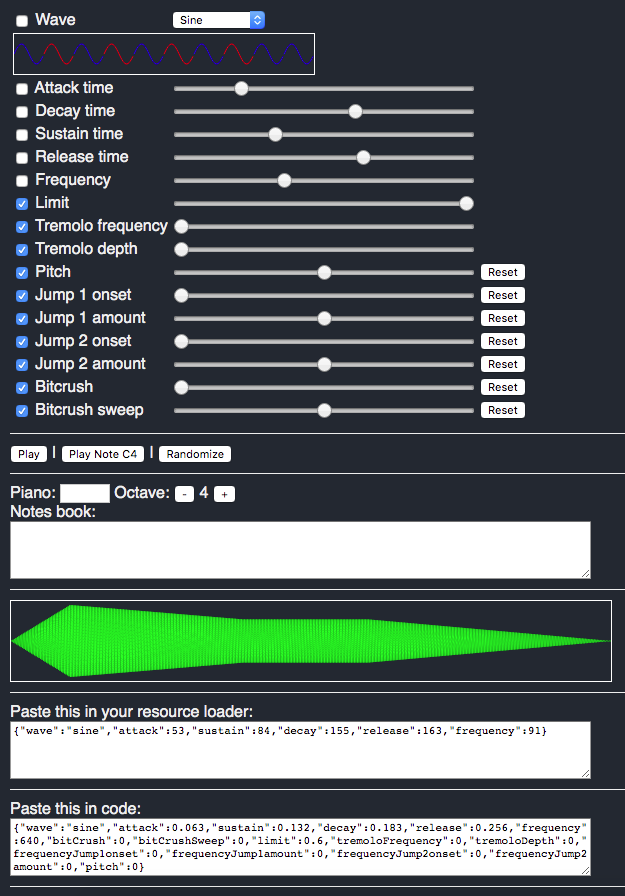
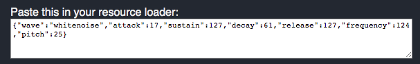

# Data blocks

Data blocks are unsorted _bundles of assets_, like graphics, music, sounds, and more taped together and identified by a single letter identifier. When a Rewtro game is started the `A` data block is loaded and executed.

```
{
   "systemVersion":"0.2",
   "metadata":{
     "title":"My first game"
   },
   "data":[{
      "id":"A",
      <the content of the data block A. It will be loaded when the game starts.>
   },{
      "id":"B",
      <the content of the data block B. It will be loaded on demand.>
   }]
}
```

We already met a working data block in our working [Hello, World!](rewtrocartridge.md) example:

```
{
   "systemVersion":"0.2",
   "metadata":{
     "title":"My first game"
   },
   "data":[{
      "id":"A",
      "sprites":[{"id":"A","text":"HELLO,~WORLD!","textColor":3,"backgroundColor":2,"width":50,"height":16}],
      "tilemaps":[{"map":["A"]}]
   }]
}
```

This cartridge defines the `A` data block, which contains a single sprite in its `sprites` section and a single tilemap in its `tilemaps` section. Except for the `A` data block which is loaded when the game is started, all data blocks are loaded only when your code requires them and can be loaded multiple times at different times. Mixing data blocks and loading them at the right time you can create title and ending screens, games with multiple levels, multi-state scenes, and more.

## Images

Rewtro stores images into game binaries using different formats, none of them is standard. Good news: the Rewtro compiler can read and convert any PNG for you, so you don't need any external processor. Bad news: these formats have some limits since are thought to use a few bytes and to work well with the data compressor.

To add some images to a data block you have to set the `images` key:

```
{
   "systemVersion":"0.2",
   "metadata":{
     "title":"My first game"
   },
   "data":[{
      "id":"A",
      "images":[
         <add your images here>
      ]      
   }]
}
```

An image has the following mandatory keys:

  * `id`: How the image is referenced in code. It must be one of these values: `font`,`graphics`,`graphics0`,`graphics1`,`graphics2`,`graphics3`,``graphics4`,`graphics5`. The `font` image is used as custom font for your game. The `graphics` image is used as default spritesheet for sprites rendering.
  * `image`: The image data. It has two sub-keys:
    * `data`: The raw image data. Since you can't type in raw binary data you can load an external PNG file using the [compiler helper](compilerhelpers.md) `_file`.
    * `format`: The image format. We're going to talk about them later.

We deserve an example. I've drawn this [sample.png](images/sample.png) 32x16 image and saved it into the `carts/` directory, just in the same place our cartridge JSON file is. It looks like this:

<div align="center" style="margin:60px 0">
    <p></p>
</div>

The following cartridge loads our `sample.png` image into the image `id` called `graphics`, which is the default image for sprites rendering. Then it creates a 16x16 sprite and draws the first face on the screen:

```
{
   "systemVersion":"0.2",
   "metadata":{
      "title":"My first game"
   },
   "data":[{
      "id":"A",
      "images":[{"id":"graphics","image":{"data":{"_file":"sample.png"},"format":"monocolor"}}],
      "sprites":[{"id":"A","graphicsX":0,"graphicsY":64,"width":16,"height":16}],
      "tilemaps":[{"map":["A"]}]
   }]
}
```

This cartridge output is this:

<div align="center" style="margin:60px 0">
    <p></p>
</div>

Why the image is colored while our `sample.png` is just in white and transparent? The secret sauce is into the `monocolor` image format. Rewtro supports up to 15 built-in image formats but just some of them are available. Each image format have its limits and perks.

### Monocolor format

The `monocolor` format reads an image that uses just a solid color and a fully transparent one. When loaded is turned into a multicolor one, replacing the black with all of the palette colors of your [system configuration](rewtrocartridge.md).

The `sample.png` image we used in our previous example was encoded using the `monocolor` format. That image is loaded this way instead:

<div align="center" style="margin:60px 0">
    <p></p>
</div>

Why these colors are used? Because, since [no palette has been defined](rewtrocartridge.md) we're using the default Rewtro palette:

<div align="center" style="margin:60px 0">
    <p></p>
</div>

See? The colors from the palette and `sample.png` are matching. We can also explain why there is a `graphicsY` set to 64: `graphicsX` and `graphicsY` decides where the sprite image is into a spritesheet image and, at that coordinates, there is that cyan face that appears on the screen.

### Indexed format

The `indexed` format reads an image that uses just colors from the [system palette](rewtrocartridge.md). The image is loaded as-is.

We need another example. Let's create a _very bad_ multicolor version of our `sample.png`. Say hello to [sample-colors.png](images/sample-colors.png):

<div align="center" style="margin:60px 0">
    <p></p>
</div>

This cartridge loads the image and shows its first frame on the screen:

```
{
   "systemVersion":"0.2",
   "metadata":{
      "title":"My first game"     
   },
   "data":[{
      "id":"A",
      "images":[{"id":"graphics","image":{"data":{"_file":"sample-colors.png"},"format":"indexed"}}],
      "sprites":[{"id":"A","graphicsX":0,"graphicsY":0,"width":16,"height":16}],
      "tilemaps":[{"map":["A"]}]
   }]
}
```

Like this:

<div align="center" style="margin:60px 0">
    <p></p>
</div>

### Rewtro format

You may wonder why there are multiple image formats in Rewtro. The `monocolor` uses less bytes to store an image but you can use one color at a time. The `indexed` format uses more bytes but you can create more detailed sprites. As it usually happens in low-data environments you have to make a trade-off.

The `rewtro` format creates something _in the middle_ between the `monocolor` and the `indexed` format. Images are loaded as-is like the `monocolor` format but just supports _transparency and up to 2 different colors for every 8x8 area of your image_.

That means that it can encode our `sample.png` image keeping just the white color...

```
{
   "systemVersion":"0.2",
   "metadata":{
      "title":"My first game"
   },
   "data":[{
      "id":"A",
      "images":[{"id":"graphics","image":{"data":{"_file":"sample.png"},"format":"rewtro"}}],
      "sprites":[{"id":"A","graphicsX":0,"graphicsY":0,"width":16,"height":16}],
      "tilemaps":[{"map":["A"]}]
   }]
}
```

<div align="center" style="margin:60px 0">
    <p></p>
</div>

...but it's a little inefficient: you can just use the `monocolor` format using fewer bytes and giving you more color options. But this new [sample-2colors.png](images/sample-2colors.png) image...

<div align="center" style="margin:60px 0">
    <p></p>
</div>

...while it can be encoded by the `indexed` format...

```
{
   "systemVersion":"0.2",
   "metadata":{
      "title":"My first game"
   },
   "data":[{
      "id":"A",
      "images":[{"id":"graphics","image":{"data":{"_file":"sample-2colors.png"},"format":"indexed"}}],
      "sprites":[{"id":"A","graphicsX":0,"graphicsY":0,"width":16,"height":16}],
      "tilemaps":[{"map":["A"]}]
   }]
}
```

...giving this result...

<div align="center" style="margin:60px 0">
    <p></p>
</div>

...since in our image we've transparency and up to 2 colors for each 8x8 area, we can just use the `rewtro` format...

```
{
   "systemVersion":"0.2",
   "metadata":{
      "title":"My first game"
   },
   "data":[{
      "id":"A",
      "images":[{"id":"graphics","image":{"data":{"_file":"sample-2colors.png"},"format":"rewtro"}}],
      "sprites":[{"id":"A","graphicsX":0,"graphicsY":0,"width":16,"height":16}],
      "tilemaps":[{"map":["A"]}]
   }]
}
```

...for the same result but saving ~115 bytes, which is _a huge amount of data_ in Rewtro. For the more nerdy of you out there, the `rewtro` format limitations were loosely inspired by the [ZX Spectrum 48K](https://en.wikipedia.org/wiki/ZX_Spectrum#ZX_Spectrum_16K/48K).

### Custom fonts

As I promised [before](rewtrocartridge.md) you can add custom fonts in your game cartridges. All you need is to create an image using any supported format which contains all the letters in all the palette colors into the `font` id image. Something like this:

<div align="center" style="margin:60px 0">
    <p></p>
</div>

All the letters must have the same size but they don't have to be strictly 8x8 pixels. The fastest way to get this image done is to make your pixel font using a single color, like in our [sample-font.png](images/sample-font.png)...

<div align="center" style="margin:60px 0">
    <p></p>
</div>

...and load this image using the `monocolor` format...

```
{
   "systemVersion":"0.2",
   "metadata":{
      "title":"My first game"
   },
   "data":[{
      "id":"A",
      "images":[{"id":"font","image":{"data":{"_file":"sample-font.png"},"format":"monocolor"}}],
      "sprites":[{"id":"A","text":"HELLO,~WORLD!","textColor":3,"backgroundColor":2,"width":50,"height":16}],
      "tilemaps":[{"map":["A"]}]
   }]
}
```

This cartridge gives you this:

<div align="center" style="margin:60px 0">
    <p></p>
</div>

Notice that the blue background doesn't cover the full text as it did in our _Hello, World!_ code since this time our font is taller.

## Sounds

Old computers and gaming consoles had different sound chips, each one with its signature sound. Like most of us _old euro gamers_ I've fond memories of the Commodore 64's [SID 6581](https://en.wikipedia.org/wiki/MOS_Technology_6581) but most of you out there will recognize how a [NES](https://en.wikipedia.org/wiki/Nintendo_Entertainment_System) sounds.

Rewtro uses a very simple retro-inspired sound synthesizer which tries to sound _old_ but breaks some limits to make game development a little easier. You can add sounds in a data block with the `sounds` key:

```
{
   "systemVersion":"0.2",
   "metadata":{
     "title":"My first game"
   },
   "data":[{
      "id":"A",
      "sounds":[
         <add your sounds here>
      ]      
   }]
}
```

Each sound has a one-letter `id` that's used as a reference when you need to play it and some attributes that instruct the synthesizer on how to play that sound. The Rewtro synthesizer has 8 wave generators you can select with the `wave` key. Its allowed values are: `whitenoise`, `square`, `sine`, `saw`, `triangle`, `tangent`, `whistle`, and `breaker`.

```
{
   "systemVersion":"0.2",
   "metadata":{
      "title":"My first game"
   },
   "data":[{
      "id":"A",
      "sounds":[{"id":"A","wave":"square"}],
      "tilemaps":[{"playAudio":"A"}]
   }]
}
```

This cartridge starts with a short _beep_, made using the `sine` wave generator. You can modulate a wave using the keys `bitCrush`, `bitCrushSweep`, `attack`, `sustain`, `limit`, `decay`, `release`, `frequency`, `tremoloFrequency`, `tremoloDepth`, `frequencyJump1onset`, `frequencyJump1amount`, `frequencyJump2onset`, `frequencyJump2amount`, and `pitch`, which accepts values from 0 to 255.

I don't want to annoy you with an in-depth explanation of each of these values. Even I got _super sick_ of fiddling with these values, so I added a super simple _sound editor_ to the SDK. Just select the _note_ icon from the home.

<div align="center" style="margin:60px 0">
    <p></p>
</div>

Yeah. It's kinda scary but it does very little - it's just ugly. Changing the _Wave_ combo box and moving all the sliders, the sound editor will play a sound. You can hear the sound again without touching anything hitting the _Play_ button. The _Randomize_ button will randomize all the combo and slider value every time is hit. You can lock/unlock values to be randomized selecting the checkbox on the left of each option. For now, just skip the _Play note C4_ button and the _Piano_ section. The _Paste this in your resource loader_ contains the JSON you need to put the sound you've just built in your data blocks.

I've moved some sliders and made an explosion sound.

<div align="center" style="margin:60px 0">
    <p></p>
</div>

To use that sound in a game, I've to give that an `id` and kick it in a data block.

```
{
   "systemVersion":"0.2",
   "metadata":{
      "title":"My first game"
   },
   "data":[{
      "id":"A",
      "sounds":[{"id":"A","wave":"whitenoise","attack":17,"sustain":127,"decay":61,"release":127,"frequency":124,"pitch":25}],
      "tilemaps":[{"playAudio":"A"}]
   }]
}
```

This time our cartridge will start with an _EXPLOSION_!

### Channels

Rewtro plays sounds in _virtual channels_ in which only a single sound at a time can be played. By default all `sounds` are played in their _virtual channel_: this means that if the _same sound_ is played _multiple times_ the previous one is stopped. Why? If your game wants to play a _jump_ and _explosion_ sound at the same time it will work since they are played in different channels, but playing the _explosion_ sound ten times will result in a single _explosion_ sound instead, saving you from an unpleasant cacophony.

You are not probably going to set _virtual channels_ to sounds very often but it's good to know that you can set single sounds channels with the `channelId` key. You can set the channel using a single letter.

```
{
   "systemVersion":"0.2",
   "metadata":{
      "title":"My first game"
   },
   "data":[{
      "id":"A",
      "sounds":[{"id":"A","channelId":"A","wave":"triangle"}],
      "tilemaps":[{"playAudio":"A"}]
   }]
}
```

Just remember that sounds with the same `channelId` will stop each other when played.

## Music and songs

_TODO_

## Sprites

_TODO_

## Tilemaps

_TODO_

## Game code

_TODO_
