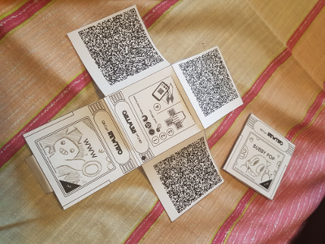
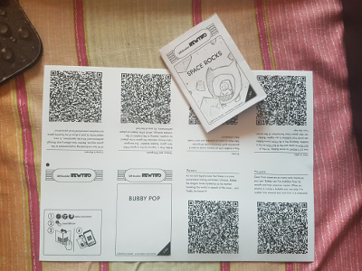
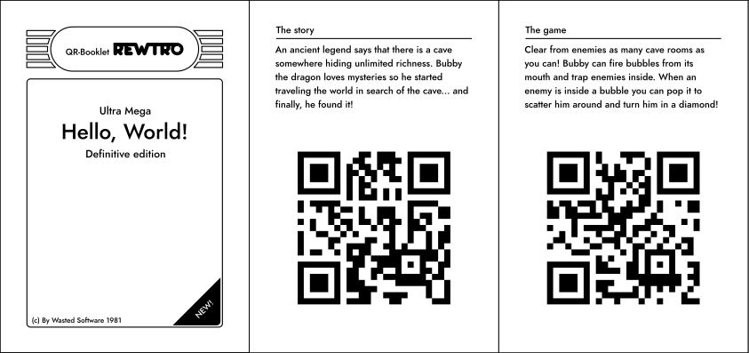
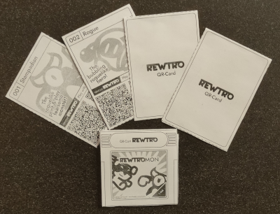
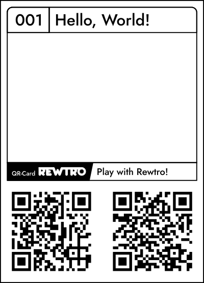
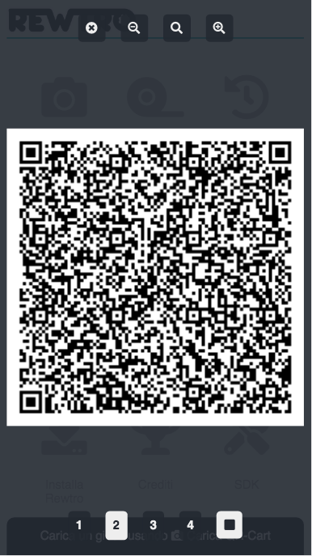

# Data storages

When a Rewtro game is distributed its data is assembled, packed, converted to binary data and then split in multiple QR-Codes. Each QR-Code also contains its progressive number and the total count of its game QR-Codes. This way you can read them in any order and the game will start when all of its codes have been read.

The Rewtro console features a custom QR-Code reader that works in real time so, to load a game, you've just to fetch the QR-Codes one by one without hitting any button: when the game is loaded it will be automatically started.

<div align="center" style="margin:60px 0">
    <p></p>
</div>

The Rewtro QR-Code reader works like other readers: keep the whole QR-Code in the middle of the screen and try moving the camera a little if the game is not loading. Aw. We used to do the same with a [screwdriver and a datasette](https://www.youtube.com/watch?v=wUGTigzpjwk) in the '80s. And did you know that QR-Codes _doesn't have a top or a bottom_? You don't need to find _the right orientation_ of a QR-Code!

Some data storages display _QR-Codes streams_ so you just need to point your mobile phone to the moving code, wait for a little, and the game will start automatically.

## QR-Cart

This is the first data storage thought for Rewtro: is a Gameboy-shaped papercraft that contains 3 QR-Codes ranging from version 1 to 19 and low correction level.

<div align="center" style="margin:60px 0">
    <p></p>
</div>

It's printed on an A4 paper and needs a pair of scissors and a cutter to build it. Use 200gsm paper to make your cartridge extra resistant, harder to bend and easier to read. 

When closed a QR-Cart is a 6.8x6.8cm square. All of the 3 QR-Codes are folded inside and the papercraft is kept closed by a tab folded on the back.

When opened the QR-Cart is cross-shaped showing the 3 QR-Codes. Placing it on a flat surface and holding the folded edges down with one hand you should be able to keep the sides flat for easier reading.

On the back of a QR-Cart there is a black circle on the top left: keeping the QR-Cart closed and punching a hole from part to part in the middle of that circle you'll keep the QR-Codes safe and you can use that to attach the cartridge to a bow on a present.

### Customization

You can customize a QR-Cart print layout setting these keys to your `metadata` object:

  * `centerTitle` prints your game main title.
  * `upperTitle` prints some small text over the title.
  * `lowerTitle` prints some small text under the title.
  * `legalText` prints some very small text on the bottom of your data storage label.
  * `sizeData` prints some fancy text on the bottom right corner of your data storage cover. If omitted the game size in kilobytes is printed instead.

```
{
   "systemVersion":"0.2",
   "metadata":{
      "title":"My first game",
      "upperTitle":"Ultra Mega",
      "centerTitle":"Hello, World!",
      "lowerTitle":"Definitive edition",
      "legalText":"(c) By Wasted Software 1981",
      "sizeData":"NEW!"
   },
   "data":[{
      "id":"A",
      "sprites":[{"id":"A","text":"HELLO,~WORLD!","textColor":3,"backgroundColor":2,"width":50,"height":16}],
      "tilemaps":[{"map":["A"]}]
   }]
}
```

<div align="center" style="margin:60px 0">
    <p></p>
</div>

### How to fold

You will need a pair of scissors, a cutter, and a ruler.

  * Doodle the cartridge cover part as you want.
  * Cut out the QR-Cart border with the scissors.
  * Facing the back of the QR-Cart (where the instructions are) fold all of the three wings with the QR-Code on them to the back of the cartridge following the lines on the edge.
  * The longest wing is still unfolded and there are two lines between the back of the cartridge and the cover. Fold that wing first on the line near the cover and then on the one near the back of the cartridge.
  * Using a cutter cut the dashed line on the back of the cartridge. You can help yourself using the ruler as a guide.
  * Fold the tab on the edge of the longest wing to the back of the cartridge.
  * To close the cartridge:
    * Fold the two wings with the QR-Codes on the opposite side to the back of the cartridge.
    * Do the same with the remaining QR-Code wing.
    * Wrap the cartridge with the longest wing.
    * Slide the tab inside the pocket you made with the cutter.
  * Once the cartridge is closed to press all of the foldings again to make sure the cartridge is as flat as you can.
  * Keeping the cartridge closed you can punch a hole in the middle of the black circle on the top left of the cartridge: the QR-Codes will be safe and you can use that to attach the cartridge to a package.

## QR-Booklet

The QR-Booklet mimics the game manuals that usually were inside the videogames box and used to explain the game story, how to play it, tips and tricks and more. Sadly they are quite dead now. It stores twice the amount of data of the QR-Cart: 6 QR-Codes ranging from version 1 to 19 and low correction level. It's easier to fold, it wastes less paper but it's a little larger than its cartridge version.

<div align="center" style="margin:60px 0">
    <p></p>
</div>

It's printed on an A4 paper and needs a pair of scissors to build it.

When closed a QR-Booklet is a 7.3x10.5cm book. It contains 6 pages with a title, some text, and a QR-Code each. To load a game from a QR-Booklet you've just to fetch all of its pages one by one and scan the QR-Codes.

All of the QR-Cart games can be printed on a QR-Booklet: their QR-Codes will be less dense and easier to read on mobile devices.

### Customization

You can customize a QR-Cart print layout setting these keys to your `metadata` object:

  * `centerTitle` prints your game main title.
  * `upperTitle` prints some small text over the title.
  * `lowerTitle` prints some small text under the title.
  * `legalText` prints some very small text on the bottom of your data storage label.
  * `sizeData` prints some fancy text on the bottom right corner of your data storage cover. If omitted the game size in kilobytes is printed instead.
  * `page1Title` to `page6Title` prints a title on top of the booklet page.
  * `page1Text` to `page6Text` prints the page text. The text is word-wrapped.

```
{
   "systemVersion":"0.2",
   "metadata":{
      "title":"My first game",
      "upperTitle":"Ultra Mega",
      "centerTitle":"Hello, World!",
      "lowerTitle":"Definitive edition",
      "legalText":"(c) By Wasted Software 1981",
      "sizeData":"NEW!",
      "page1Title":"The story",
      "page1Text":"An ancient legend says that there is a cave somewhere hiding unlimited richness. Bubby the dragon loves mysteries so he started traveling the world in search of the cave... and finally, he found it!",
      "page2Title":"The game",
      "page2Text":"Clear from enemies as many cave rooms as you can! Bubby can fire bubbles from its mouth and trap enemies inside. When an enemy is inside a bubble you can pop it to scatter him around and turn him in a diamond!"
   },
   "data":[{
      "id":"A",
      "sprites":[{"id":"A","text":"HELLO,~WORLD!","textColor":3,"backgroundColor":2,"width":50,"height":16}],
      "tilemaps":[{"map":["A"]}]
   }]
}
```

<div align="center" style="margin:60px 0">
    <p></p>
</div>

In the SVG the `page1Text` to `page6Text` contents are flow into a frame and not all of the SVG viewers support that feature. I suggest you to use [Inkscape](https://inkscape.org/) which is the same tool used for making the template.

### How to fold

You will need a pair of scissors. This papercraft is a pretty common one and there are a lot of [video tutorials](https://youtu.be/bHa6kR2SZok?t=160) out there.

  * Face the white side of the paper and flip it horizontally.
  * Fold it in half to the long side from the bottom to the top.
  * Open it back and fold it in half again to the short side from the left to the right.
  * Fold the right edge of the first flap to the left fold.
  * Flip it over and fold the left edge to the right fold of the last flap.
  * Unfold the flaps and go back to the sheet just folded in half to the short side.
  * In the middle of the folded side, there should be another fold crossing. Cut the sheet along that fold and stop in the middle of the paper.
  * Open the sheet and fold it again to the long side.
  * Press the two sides together until the sheet is cross-shaped.
  * In one of the sectors of the cross, you should see the booklet cover and back. Wrap all of the pages around and give a good crease to the edges.

## QR-Card

The QR-Card is a poker card sized sheet containing 2 QR-Codes. While it has been tought for sharing [game expansions](qrreader.md), it may be used to share games too - if it's small enough.

<div align="center" style="margin:60px 0">
    <p></p>
</div>

It needs a pair of scissors and some glue to be built. The SDK builds a single card at a time but you can use a vector graphic editor such as [Inkscape](https://inkscape.org/) to [merge up to 4 cards](../carts/graphics/sources/001-004-rewtromon.svg) on a single A4 sheet.

### Customization

You can customize a QR-Cart print layout setting these keys to your `metadata` object:

  * `cardTitle` prints your card title.
  * `cardNumber` prints a card number on the card top-left.
  * `cardNote` prints a note near the Rewtro logo. You may use it to explain how to use the card.

```
{
   "systemVersion":"0.3",
   "metadata":{
      "title":"My first game",
      "cardTitle": "Hello, World!",
      "cardNumber": "001",
      "cardNote": "Play with Rewtro!"
   },
   "data":[{
      "id":"A",
      "sprites":[{"id":"A","text":"HELLO,~WORLD!","textColor":3,"backgroundColor":2,"width":50,"height":16}],
      "tilemaps":[{"map":["A"]}]
   }]
}
```

<div align="center" style="margin:60px 0">
    <p></p>
</div>

### How to fold

You will need a pair of scissors, and some glue.

  * Doodle the card illustration part as you want.
  * Cut out the QR-Card border with the scissors.
  * Fold the QR-Card in two so the back and the front of the card are both visible.
  * Unfold the QR-Card and put glue on the back. I suggest to use a glue stick and draw a rectangle following one of the two card sides borders.
  * Fold the QR-Card back and press the card hard.

## Animated GIF

Animated GIFs can be used to share a Rewtro game on websites, videos, and other digital or animated media. It's an animated GIF streaming any number of QR-Codes ranging from version 1 to 19 and low correction level.

<div align="center" style="margin:60px 0">
    <p></p>
</div>

To read it frame the QR-Code from the Rewtro console and wait until the game is started. No customization is needed: the animated GIF just displays the mandatory `title` `metadata` key.

## Datasette

Using the Datasette function Rewtro console can share the last played game streaming its QR-Codes on the screen in a very similar way to the animated GIFs.

<div align="center" style="margin:60px 0">
    <p></p>
</div>

Just open the Rewtro console on another mobile device, frame the QR-Code on the sharing screen and wait until the game is started. To make the game easier to read increase the sharing device screen brightness. No game metadata is shared by the datasette.
