# Getters

Rewtro uses getters to _pick what to process_ and probably are the most important part of Rewtro coding - even more than [code](codestatements.md) statements itself. The coding principle in Rewtro is _"get this thing and do that on it"_ and for this very reason, _any line of code is a getter_.

```
{
   "systemVersion":"0.2",
   "metadata":{
      "title":"My first game"
   },
   "data":[{
      "id":"A",
      "sprites":[{"id":"A"}], 
      "tilemaps":[{"map":["A"]}],
      "code":[
         {
            "then":[
               {"id":"A","set":[{"text":[{"string":"HELLO WORLD!"}]}]}
            ]
         }
      ]
   }]
}
```

The single line of code of this cartridge is:

```
{"id":"A","set":[{"text":[{"string":"HELLO WORLD!"}]}]}
```

We have two getters here: the first one is the line _itself_...

```
{"id":"A"}
```

It means _get all the sprites with `id` set to `A`. Then we have a second getter:

```
{"string":"HELLO WORLD!"}
```

This _gets a string with the HELLO WORLD! text_. Reading the code altogether we have: get all the sprites with `id` set to `A` and `set` the `text` property to a `string` with `HELLO WORLD!` in it.

Getters are not just a way to _get sprites_: it's more a way to _temporarily get a thing_. Getters can access the game `keyboard`, generate primitives like `string` and `float` numbers, pick random numbers, and even do some math.

## ID and Flags

If you're roaming around this manual from some time you should have seen the `id` and `flags` getters in _a lot_ of examples. These getters are used to reference spawned sprites with a given `id` or owning a specific `flag`.

There is also a less used `ids` getter that can reference multiple sprites `id`, working like a more narrow `flags` getter.

```
{
   "systemVersion":"0.2",
   "metadata":{
      "title":"My first game"
   },
   "data":[{
      "id":"A",
      "sprites":[
         {"id":"A","flags":"F","width":16,"height":16,"backgroundColor":3},
         {"id":"B","width":16,"height":16,"backgroundColor":4},
         {"id":"C","flags":"G","width":16,"height":16,"backgroundColor":5},
         {"id":"D","flags":"FH","width":16,"height":16,"backgroundColor":6}
      ], 
      "tilemaps":[{
         "x":24,"y":64,
         "tileWidth":16,
         "map":["A B C D"]
      }],
      "code":[
         {
            "then":[
               {"id":"B","set":[{"y":[{"smallNumber":40}]}]},
               {"flags":"FG","set":[{"rotate":[{"smallNumber":45}]}]},
               {"ids":"BC","set":[{"scale":[{"float":1.5}]}]}
            ]
         }
      ]
   }]
}
```

This cartridge shows some scattered and rotated colored squares...

<div align="center" style="margin:60px 0">
    <p>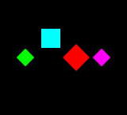</p>
</div>

...but removing the `code` it shows a more tidy line of squares.

<div align="center" style="margin:60px 0">
    <p>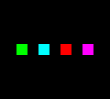</p>
</div>

Why?

The first line of code `id` gets the `B` sprite and moves it a little more up and that's why the cyan square is misaligned.

Then the second line `flags` get all the sprites having the `F` or `G` `flag` set and `rotate` them by 45 degrees clockwise. The `A` sprite is taken since it has the `F` flag, the `B` sprite has no flag so it's skipped, the `C` sprite has the `G` flag so it's taken and the `D` flags, even it has the unrequested `H` flag set, it has the `F` flag and it's taken by the getter too. That's why all the shapes but the cyan one are rotated.

Finally, the third line `ids` get the sprites with `id` set to `B` and `C` and then zoomed a bit. That's why the cyan and red shapes are a little larger than the others.

### Advanced ID and flags

_(Added in [version 0.2](rewtrochangelog.md) of Rewtro)_

The `id` and `flags` getters have their search criteria _hardcoded_. While this method requires less space in your cartridge, it can lead to a lot of duplicated code when you need some sprites to interact together in the same way.

`idsByName` and `flagsByName` work like `ids` and `flags` but they can read the search criteria from another getter, making your logic more flexible.

This cartridge...

```
{
   "systemVersion":"0.2",
   "metadata":{
      "title":"My first game"
   },
   "data":[{
      "id":"A",
      "sprites":[
         {"id":"A","flags":"F","value5":"D","text":"A"},
         {"id":"B","flags":"F","value5":"E","text":"B"},
         {"id":"C","flags":"F","value5":"F","text":"C"},
         {"id":"D","backgroundColor":3,"x":60,"y":66,"speedY":-1},
         {"id":"E","backgroundColor":4,"x":84,"y":66,"speedY":1},
         {"id":"F","backgroundColor":5,"x":100,"y":66,"speedX":1}
      ],
      "tilemaps":[{"map":["ABCDEF"]}],
      "code":[{
         "when":[{"flags":"F"}],
         "then":[{
            "placeAt":[{"idsByName":[{"attribute":"value5"}]}],
            "sum":[{"x":[{"smallNumber":9}]}]
         }]
      }]
   }]
}
```

...and this cartridge...

```
{
   "systemVersion":"0.2",
   "metadata":{
      "title":"My first game"
   },
   "data":[{
      "id":"A",
      "sprites":[
         {"id":"A","text":"A"},
         {"id":"B","text":"B"},
         {"id":"C","text":"C"},
         {"id":"D","backgroundColor":3,"x":60,"y":66,"speedY":-1},
         {"id":"E","backgroundColor":4,"x":84,"y":66,"speedY":1},
         {"id":"F","backgroundColor":5,"x":84,"y":66,"speedX":1}
      ],
      "tilemaps":[{"map":["ABCDEF"]}],
      "code":[{
         "then":[
            {"id":"A","placeAt":[{"id":"D"}],"sum":[{"x":[{"smallNumber":9}]}]},
            {"id":"B","placeAt":[{"id":"E"}],"sum":[{"x":[{"smallNumber":9}]}]},
            {"id":"C","placeAt":[{"id":"F"}],"sum":[{"x":[{"smallNumber":9}]}]}
         ]
      }]
   }]
}
```

...will both show the same three moving squares closely followed by a letter.

<div align="center" style="margin:60px 0">
    <p>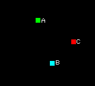</p>
</div>

They occupy the same amount of bytes in your game cartridge but the first one is more readable and flexible than the second one: adding a new _follower sprite_ will just require you to create a new sprite with a `value5` key set instead of a new sprite _and_ a new line of code. Moreover, you can change the `value5` of an `F` flagged sprite in runtime to make it follow another sprite and this dynamic behavior is way harder to implement using the _hardcoded_ version of the getters.

## Direct getters

The key `as` is a getter that's used to get special objects or sprites. You can set the `as` to get:

  * `this`: it's a special keyword that gets the current _context object_ the code is running. It's the default getter so you don't need to specify it most of the time.
  * `that`: it's a special keyword that gets the current _destination object_. Some `code` statements set a secondary object you can get using the `that` value. For example, when checking if a group of sprites is colliding with another one the `this` value holds the colliding object and the `that` value the collided ones.
  * `target`: it's a special keyword that gets the _upper level_ object. When a line executes some sub-code using the `code` [statement](codestatements.md) `target` gets the `this` object at the start of execution.
  * `allSprites`: it gets all the spawned sprites. It's useful to clear the screen.
  * `scene`: it gets the `scene` [special object](specialobjects.md). You can change its properties to move the camera, change the screen background color and so on.
  * `game`: it gets the `game` [special object](specialobjects.md). It's mostly used to set game-wide variables, like high scores, etc.
  * `keyboard`: it gets the `keyboard` [special object](specialobjects.md). It knows which controller buttons the player is hitting.
  * `songRow`: it gets the `songRow` [special object](specialobjects.md). It knows what the song player is playing.

In many cases these getters are not useful alone: they are used together with _subgetters_ that we will see later.

It's time for an example. Get ready because this one is not going to be so straightforward.

```
{
   "systemVersion":"0.2",
   "metadata":{
      "title":"My first game"
   },
   "data":[{
      "id":"A",
      "sounds":[
         {"id":"A","wave":"triangle"}
      ],
      "music":[
         {"id":"A","notes":[["C4-","D4-","E4-","F4-","G4-"]],"instruments":"A"}
      ],
      "songs":[
         {"id":"A","loopTo":0,"music":"A","tempo":25}
      ],      
      "sprites":[
         {"id":"A","x":0,"y":0,"flags":"F","width":112,"text":"I'M A!"},
         {"id":"B","x":0,"y":8,"flags":"F","x":0,"y":8,"width":112,"text":"I'M B!"},
         {"id":"C","x":0,"y":0,"width":112,"text":"I'M C!","textColor":10},
         {"id":"D","x":0,"y":24,"width":112,"text":"I'M D!"},
         {"id":"E","x":0,"y":40,"width":112,"text":"I'M E!"}
      ], 
      "tilemaps":[{"map":["ABCDE"],"song":"A"}],
      "code":[
         {
            "when":[{"flags":"F"}],
            "then":[
               {"set":[{"text":[{"string":"I HAVE FLAG F!"}]}]},
               {
                  "code":[
                     {
                        "when":[{"id":"A","if":[{"is":"collidingWith","id":"C"}]}],
                        "then":[
                           {"as":"this","set":[{"backgroundColor":[{"smallNumber":3}]}]},
                           {"as":"that","set":[{"flipX":[{"smallNumber":1}]}]},
                           {"as":"target","set":[{"x":[{"smallNumber":48}]}]},
                           {"as":"allSprites","set":[{"textColor":[{"smallNumber":5}]}]},
                           {"id":"D","set":[{"text":[{"as":"keyboard","attribute":"buttonA"}]}]},
                           {"id":"E","set":[{"text":[{"as":"songRow","attribute":"M0"}]}]},
                           {"as":"scene","set":[{"value0":[{"string":"HELLO SCENE!"}]}]},
                           {"as":"game","set":[{"value0":[{"string":"HELLO GAME!"}]}]}
                        ]
                     }
                  ]
               }
            ]
         }
      ]
   }]
}
```

There is a lot going on the screen... and some audio is even playing!

<div align="center" style="margin:60px 0">
    <p>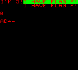</p>
</div>

This time we need to have a look to the _debugger status_ too below the game screen:

<div align="center" style="margin:60px 0">
    <p>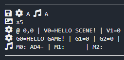</p>
</div>

Let's explain the code step by step. First of all, let's play the cartridge without any `code`.

<div align="center" style="margin:60px 0">
    <p>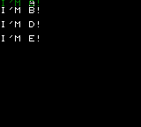</p>
</div>

Sprites `A` and `C` are drawn one on top of the other so the `I'M A!` and `I'M C!` messages are not clearly readable. All of the other sprites are regularly in their position. The looping song `A` started by `tilemaps` and is playing in the background.

Now let's add some code:

```
{
   "when":[{"flags":"F"}],
   "then":[
      {"set":[{"text":[{"string":"I HAVE FLAG F!"}]}]}               
   ]
}
```

<div align="center" style="margin:60px 0">
    <p>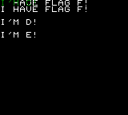</p>
</div>

This `when` code iterates all the spawned sprites having the `F` flag one by one. The following code line is going to `set` the `text` of some object. Like any other line of code, this one is a _getter_ too and since it's not using any direct getter the line is getting `this` - which are `F` flagged sprites, one by one. Sprite `A` and `B` `text` is now changed. Notice that the `I'M C!` message is still there since `C` has no `F` flag.

Let's add some more code:

```
{
   "when":[{"flags":"F"}],
   "then":[
      {"set":[{"text":[{"string":"I HAVE FLAG F!"}]}]},
      {
         "code":[
            {
               "when":[{"id":"A","if":[{"is":"collidingWith","id":"C"}]}],
               "then":[
                  {"as":"this","set":[{"backgroundColor":[{"smallNumber":3}]}]},
                  {"as":"that","set":[{"flipX":[{"smallNumber":1}]}]}
               ]
            }
         ]
      }
   ]
}
```

<div align="center" style="margin:60px 0">
    <p>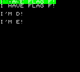</p>
</div>

The `code` statement is executing some sub-code in which we're going to check if the `A` sprite is colliding with the `C` sprite. Keep in mind that the `this` getter is getting the `F` flagged sprites here, as we have seen in the previous example. We're going to use this information in the next example.

Since `A` and `C` are one on top of each other they are colliding and the `then` code is executed: the getter `this` picks all of the colliding sprite (that's our `A` sprite) and changes its `backgroundColor` and the getter `that` picks all of the collided sprites (that's the `C` sprite) and flips its letters horizontally. That's why you're seeing mirrored letters in `I'M C!` and a green background under the first `I HAVE FLAG F!`.

Notice that the `this` getter could be omitted since it's the default getter for any line of code.

More code again:

```
{
   "when":[{"flags":"F"}],
   "then":[
      {"set":[{"text":[{"string":"I HAVE FLAG F!"}]}]},
      {
         "code":[
            {
               "when":[{"id":"A","if":[{"is":"collidingWith","id":"C"}]}],
               "then":[
                  {"as":"this","set":[{"backgroundColor":[{"smallNumber":3}]}]},
                  {"as":"that","set":[{"flipX":[{"smallNumber":1}]}]},
                  {"as":"target","set":[{"x":[{"smallNumber":48}]}]},
                  {"as":"allSprites","set":[{"textColor":[{"smallNumber":5}]}]},
                  {"id":"D","set":[{"text":[{"as":"keyboard","attribute":"buttonA"}]}]},
                  {"id":"E","set":[{"text":[{"as":"songRow","attribute":"M0"}]}]}
               ]
            }
         ]
      }
   ]
}
```

<div align="center" style="margin:60px 0">
    <p></p>
</div>

It looks like the final screenshot we displayed before!

The `target` getter is referencing the `this` of the previous sub-code execution, that's the `code` statement we added the previous example. Do you remember what the `this` was getting during the `code` call of before? Exactly! They were the `F` flagged sprites and that's why changing the `x` coordinates of the `target` sprites will move them.

Then the `allSprites` getter gets all the spawned sprites and sets its `textColor` to the color `5` of the palette, making all the `text` on the screen red.

The `D` sprite now displaying a `0` but... try holding down the _button A_ (that's mapped on the `Z` key of your [keyboard](specialobjects.md)). The number will raise! That's because the code is setting the `D` sprite `text` to the `buttonA` sub-value of the `keyboard` object which contains for how many game frames the button has been held down.

Finally, the `E` sprite is displaying... the note the song player is currently playing! The direct getter `songRow` gets the current row of notes played by the song player and its key `M0` returns the note on the first row. If you want to know more about `music` and `songs` have a look to [data blocks](datablocks.md).

Let's add the last two lines:

```
{
   "when":[{"flags":"F"}],
   "then":[
      {"set":[{"text":[{"string":"I HAVE FLAG F!"}]}]},
      {
         "code":[
            {
               "when":[{"id":"A","if":[{"is":"collidingWith","id":"C"}]}],
               "then":[
                  {"as":"this","set":[{"backgroundColor":[{"smallNumber":3}]}]},
                  {"as":"that","set":[{"flipX":[{"smallNumber":1}]}]},
                  {"as":"target","set":[{"x":[{"smallNumber":48}]}]},
                  {"as":"allSprites","set":[{"textColor":[{"smallNumber":5}]}]},
                  {"id":"D","set":[{"text":[{"as":"keyboard","attribute":"buttonA"}]}]},
                  {"id":"E","set":[{"text":[{"as":"songRow","attribute":"M0"}]}]},
                  {"as":"scene","set":[{"value0":[{"string":"HELLO SCENE!"}]}]},
                  {"as":"game","set":[{"value0":[{"string":"HELLO GAME!"}]}]}
               ]
            }
         ]
      }
   ]
}
```

Nothing changes on the screen but let's have a look to the _debugger status_:

<div align="center" style="margin:60px 0">
    <p></p>
</div>

The `scene` getter gets the [scene object](specialobjects.md) and changes its `value0` key to `HELLO SCENE!` and the `game` getter changes the `value0` of the [game object](specialobjects.md) instead.

## Constructors

Another kind of getters we've seen a lot around this manual examples are the _constructors_.

Constructors can get _primitive values_ like characters, text strings, numbers, and lists. You can use them to _construct_ a value on the fly and change a sprite key from your `code` in order to change its `text`, movement speed, color, etc.

There are a lot of _constructor_ getters in Rewtro but luckily you're not going to use all of them... and there is a [compiler helper](compilerhelpers.md) that guesses the constructor you need for you, so you'll going to _forget about them_ soon. But _cool people know internals_ and learning them may give you some flexibility in the future.

### Text

There are two types of text getters: `character` which gets a single symbol and `string` that gets a string of symbols. While the `string` getter can be used for getting a single symbol too it occupies a little more space in your QR-Cart so use the `character` getter as much as you can.

```
{
   "systemVersion":"0.2",
   "metadata":{
      "title":"My first game"
   },
   "data":[{
      "id":"A",
      "code":[{
         "then":[
            {"as":"game","set":[{
               "value0":[{"character":"1"}],
               "value1":[{"character":"A"}],
               "value2":[{"string":"SOME TEXT!"}]
            }]}
         ]
      }]
   }]
}
```

This cartridge does nothing on the screen but sets some text into the [game object](scenegameobject.md) variables. Let's have a look to the _debugger status_:

<div align="center" style="margin:60px 0">
    <p>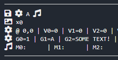</p>
</div>

The `code` gets the single `character` `1` and assign it to the `game` object key `value0`, the single `character` `A` to `value1` and gets the `string` `SOME TEXT!` to set `value3`.

### Numbers

In order to use the fitting amount of space when storing a number in your cartridge, there are a lot of number getters in Rewtro. They work all the same way except for the range and type of numbers they can get. From the smallest cartridge space to the largest one there are:

  * `smallNumber` gets values from `0` to `127`
  * `number` gets values from `0` to `255`
  * `smallInteger` gets values from `-127` to `128`
  * `integer` gets values from `-511` to `512`
  * `float` gets single decimal float number from `-25` to `26.1`
  * `largeNumber` gets values from `0` to `2047`

Choosing the right getter may be difficult and that's why I strongly suggest you use [compiler helpers](compilerhelpers.md) instead of these getters.

```
{
   "systemVersion":"0.2",
   "metadata":{
      "title":"My first game"
   },
   "data":[{
      "id":"A",
      "code":[{
         "then":[
            {"as":"game","set":[{
               "value0":[{"smallNumber":127}],
               "value1":[{"number":255}],
               "value2":[{"smallInteger":-127}],
               "value3":[{"integer":512}],
               "value4":[{"float":26.1}],
               "value5":[{"largeNumber":2047}]
            }]}
         ]
      }]
   }]
}
```

<div align="center" style="margin:60px 0">
    <p>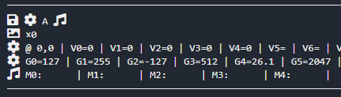</p>
</div>

The different numbers are get and set to the [game object](specialobjects.md) keys.

### Lists

There are three ways to get lists in Rewtro:

  * An empty one with `emptyList`
  * A _set of numbers_ from `-511` to `512` with `numbers`
  * A _single list of numbers_ from `-511` to `512` with `list`

The `list` gets a _single object_ that collects all of the numbers while `numbers` get all its numbers, one by one. I'll try to better explain with an example.

```
{
   "systemVersion":"0.2",
   "metadata":{
      "title":"My first game"
   },
   "data":[{
      "id":"A",
      "sprites":[
         {"id":"A"},
         {"id":"B","x":0,"y":8},
         {"id":"C","x":0,"y":16}
      ],
      "tilemaps":[{"map":["ABC"]}],
      "code":[{
         "then":[
            {"id":"A","set":[{"text":[{"numbers":[2,4,6,3],"count":true}]}]},
            {"id":"B","set":[{"text":[{"numbers":[2,4,6,3],"max":true}]}]},
            {
               "numbers":[2,4,6,3],
               "code":[{
                  "then":[{"id":"C","set":[{"text":[{"as":"target"}]}]}]
               }]
            }
         ]
      }]
   }]
}
```

<div align="center" style="margin:60px 0">
    <p></p>
</div>

The `A` sprite says that the _set of numbers_ created by `numbers` is 4 elements long and `B` that's the highest value is 6. The iterator fetches the list and set them one by one to the `C` sprite `text` but, since the screen is rendered after the code execution, we will just see the last number, that's `3`.

Replacing all of the instances of `numbers` with `list` to the same example the results are very different:

<div align="center" style="margin:60px 0">
    <p>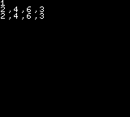</p>
</div>

This time we're getting _a single list of numbers_ and that's why the `A` sprite is showing an element count of 1: there is _just one list_. The highest value displayed by `B` is _the list itself_ since it's the only element we got and the same goes for the iterator: it iterates just the whole _list object_ once and sets it to the `C` sprite text.

It looks like that the `list` getter is not so useful and counterintuitive... and that's right in most of the cases. But sometimes you don't need to _process a list of values in the very moment it's created_. You may want to create a list for later use.

```
{
   "systemVersion":"0.2",
   "metadata":{
      "title":"My first game"
   },
   "data":[{
      "id":"A",
      "sprites":[
         {"id":"A"},
         {"id":"B","x":0,"y":8},
         {"id":"C"}
      ],
      "tilemaps":[{"map":["AB"]}],
      "code":[
         {
            "when":[{"as":"scene","if":[{"itsAttribute":"timer","is":"==","smallNumber":"0"}]}],
            "then":[
               {"spawn":[{"ids":[{"character":"C"}],"at":[{"list":[8,24]}]}]},
               {"id":"A","set":[{"value0":[{"list":[1,6]}]}]},
               {"id":"B","set":[{"value0":[{"list":[100,200]}]}]},
               {"id":"C","set":[{"value0":[{"list":[200,250]}]}]}
            ]
         },
         {
            "when":[{"as":"allSprites"}],
            "then":[{
               "set":[{"text":[{"attribute":"value0","randomNumber":true}]}]
            }]
         }
      ]
   }]
}
```

This cartridge spawn 3 sprites that works like dices: every game frame they will display a random number. The `A` sprite values ranges from 1 to 6, the `B` sprite ones from 100 to 200 and the `C` sprite values are from 200 to 250.

<div align="center" style="margin:60px 0">
    <p>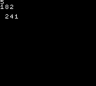</p>
</div>

These 3 _different dices_ are rolled by the same single line of code (the one with `randomNumber` on it) and that's possible because we are _setting each dice range_ using the `list` getter: when the game starts the `A`, `B`, and `C` sprites key `value0` is set to a `list` which describes the range of values of each dice, from the lowest number one to the highest one. But we don't want to use the list _in the very moment it's assigned_: ranges will be used later to generate a random number and that's why we used the `list` getter to assign _a list of values_ to every sprite.

The iterator will fetches `allSprites` one by one and sets their `text` to a random number into the range found in `value0` key. Since all `value0` ranges are different for each sprite a different _kind_ of random number is generated for each one.

The `C` sprite is spawned in a quite peculiar way. Instead of being spawned by `tilemaps` it's spawned by `code` using the `spawn` [statement](codestatements.md). In this case, the `list` is used to set the spawn coordinates. The `list` getter is also used by some special statements, like `spawn`.

### Undefined

Finally, you can get an _empty_ value with the `undefined` key. Just set the `undefined` key to `true`. You'll rarely need this.

## Subgetters

Getting a sprite, a list, or a [special object](specialobjects.md) it's nice... but most of the time you'll need to manipulate one of its key values: changing a sprite `speedX` can change its direction, timing a `backgroundColor` can make a sprite blink, etc. _Subgetters_ are _special getters that get key values from the current picked object_.

```
{
   "systemVersion":"0.2",
   "metadata":{
      "title":"My first game"
   },
   "data":[{
      "id":"A",
      "sprites":[
         {"id":"A","text":"HELLO!"},
         {"id":"B","x":8,"y":8,"textColor":3}
      ],
      "tilemaps":[{"map":["AB"]}],
      "code":[{
         "then":[
            {"id":"B","set":[{"text":[{"id":"A","attribute":"text"}]}]}
         ]
      }]
   }]
}
```

This cartridge displays the `HELLO!` `text` using sprite `A` and then _copies_ its `text` key to sprite `B` via `code`.

<div align="center" style="margin:60px 0">
    <p>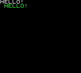</p>
</div>

Let's explain this block:

```
{"id":"A","attribute":"text"}
```

The getter `id` gets the sprite with `id` `A` and then the _subgetter_ `attribute` gets its `text` key value, which is `HELLO!`. This value is then `set` to the `text` key of `B` sprite, _copying_ its value.

### Attribute

The `attribute` subgetter gets the key value of any of the [sprite attributes](spriteattributes.md) from the picked object. Just set its value to the attribute you want.

In the previous example, we used the `attribute` subgetter to get the `text` key of a sprite.

```
{"id":"A","attribute":"text"}
```

Changing `text` to `id`...

<div align="center" style="margin:60px 0">
    <p>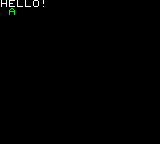</p>
</div>

...will copy the `A` sprite `id` instead, which is... `A`.

Some objects may have some special attributes sprites don't have. Let's see them.

#### Keyboard

The `keyboard` [special object](specialobjects.md) holds the game controller status. In order to query a specific button, you've to set the `attribute` subgetter to `up`, `down`, `left`, `right`, `buttonA`, `buttonB`, `buttonC`, or `buttonD`. The button's availability depends on the [system configuration](rewtrocartridge.md) of your game.

```
{
   "systemVersion":"0.2",
   "metadata":{
      "title":"My first game"
   },
   "data":[{
      "id":"AB",
      "sprites":[
         {"id":"A"},
         {"id":"B","backgroundColor":5,"restitutionX":0,"restitutionY":0,"x":76,"y":68}
      ],
      "tilemaps":[{"map":["AB"]}],
      "code":[
         {
            "when":[{"as":"keyboard","attribute":"left","if":[{"is":"down"}]}],
            "then":[{"id":"B","set":[{"speedX":[{"smallInteger":-5}]}]}]
         },
         {
            "when":[{"as":"keyboard","attribute":"right","if":[{"is":"down"}]}],
            "then":[{"id":"B","set":[{"speedX":[{"smallInteger":5}]}]}]
         },
         {
            "when":[{"as":"keyboard","attribute":"up","if":[{"is":"down"}]}],
            "then":[{"id":"B","set":[{"speedY":[{"smallInteger":-5}]}]}]
         },
         {
            "when":[{"as":"keyboard","attribute":"down","if":[{"is":"down"}]}],
            "then":[{"id":"B","set":[{"speedY":[{"smallInteger":5}]}]}]
         },
         {
            "then":[
               {"id":"A","set":[{"text":[{"as":"keyboard","attribute":"buttonA"}]}]}
            ]
         }
      ]
   }]
}
```

This cartridge shows a controllable red square in the middle of the screen! There is also a number on the top left of the screen: holding down the _button A_ of your game controller increases that number. If you're playing this example using the debugger hold the up/down/left/right keys for moving the square around and the Z key for changing the number.

<div align="center" style="margin:60px 0">
    <p>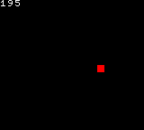</p>
</div>

The [special object](specialobjects.md) `keyboard` is used together with the `attribute` subgetter to get the `up`, `down`, `left`, and `right` keys and change the `B` sprite speed. The number on the top left of the screen reveals what the `keyboard` keys are containing: there are numbers that go up when holding one button down and then go back to `0` when that button is released.

#### Song row

The `songRow` [special object](specialobjects.md) knows which notes are actually played by the song player. Quite like the `keyboard` special object, you can query the status of a single row setting the `attribute` key to `M0`, `M1`, `M2`, `M3`, `M4`, `M5`, `M6`, `M7`, `M8`, or `M9`.

```
{
   "systemVersion":"0.2",
   "metadata":{
      "title":"My first game"
   },
   "data":[{
      "id":"A",
      "sounds":[
         {"id":"A","wave":"triangle"},
         {"id":"B","wave":"whitenoise"}
      ],
      "music":[
         {
            "id":"A",
            "notes":[
               ["C4-","D4-","E4-","F4-","G4-","F4-","E4-","D4-"],
               ["C4-","   ","G7-","   ","C4-","   ","G7-","   "]
            ],"instruments":"AB"}
      ],
      "songs":[
         {"id":"A","loopTo":0,"music":"A","tempo":5}
      ],
      "sprites":[
         {"id":"A"},
         {"id":"B","x":0,"y":16}
      ],
      "tilemaps":[{"map":["AB"],"song":"A"}],
      "code":[
         {
            "then":[
               {"id":"A","set":[{"text":[{"as":"songRow","attribute":"M0"}]}]},
               {"id":"B","set":[{"text":[{"as":"songRow","attribute":"M1"}]}]}
            ]
         }
      ]
   }]
}
```

This cartridge plays a simple song and a beat. The screen displays the notes played in real time.

<div align="center" style="margin:60px 0">
    <p>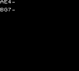</p>
</div>

The `M0` subgetter gets the currently playing notes on the first row of the `music`, that's the theme, and `M1` the ones from the second row of the `music`, that's the beat. The `code` block will assign these values to `A` and `B` `text` keys, making them appear on the screen.

### List

There is a number of subgetters you can use to work with a _set of elements_:

  * `max` gets the maximum number of the set.
  * `min` gets the maximum number of the set.
  * `count` gets the number of elements of the set.
  * `oneRandom` gets a random element of the set.

...and others that operate on a _single list of elements_:

  * `index` gets an element at a specific position of the list and uses another getter to decide the position.
  * `randomValue` gets a random element picked from the list.
  * `randomNumber` gets a random integer number between the first list element and the second list element included.
  
Some objects may have a _single list of elements_ as key values, like the `touchUp` or `touchLeft` keys we've seen in [sprite attributes](spriteattributes.md) or when setting a `list` to a sprite key like in the `list` and `numbers` example of this chapter.

The `sublist` getter _goes inside_ a _single list of elements_ turning it in a _set of elements_. This way you can use iterators and `max`, `min`, and `count` subgetters on its elements.

I've another example that may be a little hard. I'll try my best on explaining:

```
{
   "systemVersion":"0.2",
   "metadata":{
      "title":"My first game"
   },
   "data":[{
      "id":"A",
      "sprites":[
         {"id":"A"},
         {"id":"B","x":0,"y":8},
         {"id":"C","x":0,"y":16},
         {"id":"D","x":0,"y":24},
         {"id":"E","x":0,"y":40},
         {"id":"F","x":0,"y":48},
         {"id":"G","x":0,"y":56},
         {"id":"H","x":0,"y":72},
         {"id":"I","x":0,"y":80},
         {"id":"J","x":0,"y":96},
         {"id":"K","x":0,"y":104}
      ],
      "tilemaps":[{"map":["ABCDEFGHIJK"]}],
      "code":[
         {
            "then":[
               {"id":"A","set":[{"text":[{"numbers":[2,6,4,1,10],"count":true}]}]},
               {"id":"B","set":[{"text":[{"numbers":[2,6,4,1,10],"min":true}]}]},
               {"id":"C","set":[{"text":[{"numbers":[2,6,4,1,10],"max":true}]}]},
               {"id":"D","set":[{"text":[{"numbers":[2,6,4,1,10],"oneRandom":true}]}]},
               
               {"id":"E","set":[{"text":[{"list":[2,6,4,1,10],"index":[{"smallNumber":2}]}]}]},
               {"id":"F","set":[{"text":[{"list":[2,6,4,1,10],"randomNumber":true}]}]},
               {"id":"G","set":[{"text":[{"list":[2,6,4,1,10],"randomValue":true}]}]},

               {"id":"A","set":[{"value0":[{"list":[1,2,3,4,5]}]}]},
               {"id":"H","set":[{"text":[{"id":"A","attribute":"value0","count":true}]}]},
               {"id":"I","set":[{"text":[{"id":"A","sublist":"value0","count":true}]}]},

               {
                  "id":"A","attribute":"value0",
                  "code":[{"then":[{"id":"J","set":[{"text":[{"as":"that"}]}]}]}]
               },{
                  "id":"A","sublist":"value0",
                  "code":[{"then":[{"id":"K","set":[{"text":[{"as":"that"}]}]}]}]
               }
            ]
         }
      ]
   }]
}
```

This cartridge does a lot of stuff:

<div align="center" style="margin:60px 0">
    <p>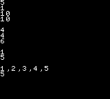</p>
</div>

Let's explain the `code` line by line:

  * As we've seen before `numbers` gets a _set of elements_ so calling its subgetter `count` will result on the elements count of the set, that's `5`.
  * The same happens for the `min`imum value of the set, that's `1`...
  * ...and the `max`imum one, that's `10`.
  * The `oneRandom` gets a random element from the set.

  * Then the `list` key creates a _single list of elements_ this time and the subgetter `index` gets its `2`nd element, that's 4. (positions starts from 0)
  * The next line generates a `randomNumber` from `2` to `6`, ignoring the other values...
  * ...and the next one picks any `randomValue` from the `list`.

  * Then a `list`, that's a _single list of elements_, is set to the `value0` of sprite `A`.
  * The next line uses the `attribute` to get that list and prints the `count` subgetter. The result is `1` because we are manipulating a _single list of elements_ but...
  * ...the `sublist` getter it _goes inside_ the list instead, turning the `list` from a _single list of elements_ to a _set of elements_. That's why the `count` subkey returns `5` this time.

  * The iterators work the same. Using the `attribute` getter there will be just one iteration on the _single list object_ so the whole `list` is printed...
  * ...but the `sublist` subgetter _goes inside_ the list and iterates its element one by one. Even if all of the list elements are iterated one by one we will just see the last element `5` because the screen frame is rendered just when the code has been fully executed.

Take your time to understand how a _set of elements_ and a _single list of elements_ works and how their subgetters behave and feel free to experiment. After working on some games you'll get when the difference matters and eventually forget everything about the _internals_. Nothing to see here. _Let's move on._

### Sprites

_TODO_

```
{ key:"angleTo", values:"*GETTERS*" },
{ key:"distanceTo", values:"*GETTERS*" },
{ key:"nearest", values:"*GETTERS*" },
{ key:"farthest", values:"*GETTERS*" },
{ key:"inArea", values:AREA },
```

### Math and logic

_TODO_

```
LIST:

{ key:"abs", flag:true },
{ key:"sqrt", flag:true },
{ key:"sin", flag:true },
{ key:"cos", flag:true },
{ key:"acos", flag:true },
{ key:"limit", listNumbers:RANGES.INTEGER },
{ key:"oneRandom", flag:true },
{ key:"prefix", string:SYMBOLS },
{ key:"suffix", string:SYMBOLS },
{ key:"negate", flag:true },
```