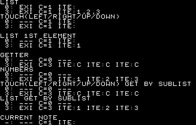
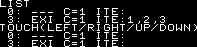
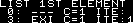
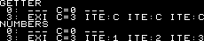
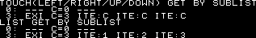
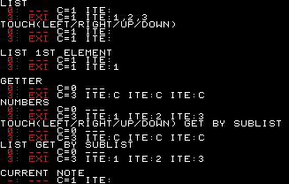

# Lists and iterators

In most of the cases, you can make a game knowing anything about how iterators and lists work in Rewtro. But if you want to add some kind of complex logic in your game you've to know how they work.

Since it isn't easy to explain, let's start with a huge example:

```
{
   "systemVersion":"0.2",
   "metadata":{
      "title":"My first game"
   },
   "systemConfiguration":[{
      "screenHeight":208,
      "renderHeight":208,
      "screenWidth":327,
      "renderWidth":327
   }],
   "data":[{
      "id":"A",
      "sounds":[
         {"id":"A","wave":"triangle"}
      ],
      "music":[
         {"id":"A","notes":[["C4-","D4-","E4-","F4-","G4-"]],"instruments":"A"}
      ],
      "songs":[
         {"id":"A","loopTo":0,"music":"A","tempo":25}
      ],
      "sprites":[
         {"id":"A"},
         {"id":"B","speedX":1},
         {"id":"C","x":16,"y":0}
      ],
      "tilemaps":[{"map":["ABCCC"],"song":"A"}],
      "code":[
         {"then":[{
            "id":"A",
            "set":[{
               "text":[{"string":""}],
               "value0":[{"list":[]}],
               "value1":[{"list":[1,2,3]}]
            }]}]
         },


         {
            "when":[{"id":"A","attribute":"value0","if":[{"is":"existing"}]}],
            "then":[{"id":"A","sum":[{"text":[{"string":"LIST~ 0: EXI "}]}]}],
            "else":[{"id":"A","sum":[{"text":[{"string":"LIST~ 0: --- "}]}]}]
         },         
         {
            "then":[
               {"id":"A","sum":[{"text":[{"id":"A","attribute":"value0","count":true,"prefix":"C="}]}]}
            ]
         },
         {
            "when":[{"id":"A","attribute":"value0"}],
            "then":[{"id":"A","sum":[{"text":[{"as":"that","prefix":" ITE:"}]}]}],
            "else":[{"id":"A","sum":[{"text":[{"string":" --- "}]}]}]
         },
         {
            "when":[{"id":"A","attribute":"value1","if":[{"is":"existing"}]}],
            "then":[{"id":"A","sum":[{"text":[{"string":"~ 3: EXI "}]}]}],
            "else":[{"id":"A","sum":[{"text":[{"string":"~ 3: --- "}]}]}]
         },         
         {
            "then":[
               {"id":"A","sum":[{"text":[{"id":"A","attribute":"value1","count":true,"prefix":"C="}]}]}
            ]
         },
         {
            "when":[{"id":"A","attribute":"value1"}],
            "then":[{"id":"A","sum":[{"text":[{"as":"that","prefix":" ITE:"}]}]}],
            "else":[{"id":"A","sum":[{"text":[{"string":" --- "}]}]}]
         },


         {
            "when":[{"id":"A","attribute":"touchRight","if":[{"is":"existing"}]}],
            "then":[{"id":"A","sum":[{"text":[{"string":"~TOUCH(LEFT/RIGHT/UP/DOWN)~ 0: EXI "}]}]}],
            "else":[{"id":"A","sum":[{"text":[{"string":"~TOUCH(LEFT/RIGHT/UP/DOWN)~ 0: --- "}]}]}]
         },
         {
            "then":[
               {"id":"A","sum":[{"text":[{"id":"A","attribute":"touchRight","count":true,"prefix":"C="}]}]}
            ]
         },
         {
            "when":[{"id":"A","attribute":"touchRight"}],
            "then":[{"id":"A","sum":[{"text":[{"as":"that","attribute":"id","prefix":" ITE:"}]}]}],
            "else":[{"id":"A","sum":[{"text":[{"string":" --- "}]}]}]
         },
         {
            "when":[{"id":"B","attribute":"touchRight","if":[{"is":"existing"}]}],
            "then":[{"id":"A","sum":[{"text":[{"string":"~ 3: EXI "}]}]}],
            "else":[{"id":"A","sum":[{"text":[{"string":"~ 3: --- "}]}]}]
         },
         {
            "then":[
               {"id":"A","sum":[{"text":[{"id":"B","attribute":"touchRight","count":true,"prefix":"C="}]}]}
            ]
         },
         {
            "when":[{"id":"B","attribute":"touchRight"}],
            "then":[{"id":"A","sum":[{"text":[{"as":"that","attribute":"id","prefix":" ITE:"}]}]}],
            "else":[{"id":"A","sum":[{"text":[{"string":" --- "}]}]}]
         }, 


         {
            "when":[{"id":"A","attribute":"value0","index":[{"smallNumber":0}],"if":[{"is":"existing"}]}],
            "then":[{"id":"A","sum":[{"text":[{"string":"~~LIST 1ST ELEMENT~ 0: EXI "}]}]}],
            "else":[{"id":"A","sum":[{"text":[{"string":"~~LIST 1ST ELEMENT~ 0: --- "}]}]}]
         },
         {
            "then":[
               {"id":"A","sum":[{"text":[{"id":"A","attribute":"value0","index":[{"smallNumber":0}],"count":true,"prefix":"C="}]}]}
            ]
         },
         {
            "when":[{"id":"A","attribute":"value0","index":[{"smallNumber":0}]}],
            "then":[{"id":"A","sum":[{"text":[{"as":"that","prefix":" ITE:"}]}]}],
            "else":[{"id":"A","sum":[{"text":[{"string":" --- "}]}]}]
         },
         {
            "when":[{"id":"A","attribute":"value1","index":[{"smallNumber":0}],"if":[{"is":"existing"}]}],
            "then":[{"id":"A","sum":[{"text":[{"string":"~ 3: EXI "}]}]}],
            "else":[{"id":"A","sum":[{"text":[{"string":"~ 3: --- "}]}]}]
         },
         {
            "then":[
               {"id":"A","sum":[{"text":[{"id":"A","attribute":"value1","index":[{"smallNumber":0}],"count":true,"prefix":"C="}]}]}
            ]
         },
         {
            "when":[{"id":"A","attribute":"value1","index":[{"smallNumber":0}]}],
            "then":[{"id":"A","sum":[{"text":[{"as":"that","prefix":" ITE:"}]}]}],
            "else":[{"id":"A","sum":[{"text":[{"string":" --- "}]}]}]
         },


         {
            "when":[{"id":"E","if":[{"is":"existing"}]}],
            "then":[{"id":"A","sum":[{"text":[{"string":"~~GETTER~ 0: EXI "}]}]}],
            "else":[{"id":"A","sum":[{"text":[{"string":"~~GETTER~ 0: --- "}]}]}]
         },
         {
            "then":[
               {"id":"A","sum":[{"text":[{"id":"E","count":true,"prefix":"C="}]}]}
            ]
         },
         {
            "when":[{"id":"E"}],
            "then":[{"id":"A","sum":[{"text":[{"as":"that","attribute":"id","prefix":" ITE:"}]}]}],
            "else":[{"id":"A","sum":[{"text":[{"string":" --- "}]}]}]
         },
         {
            "when":[{"id":"C","if":[{"is":"existing"}]}],
            "then":[{"id":"A","sum":[{"text":[{"string":"~ 3: EXI "}]}]}],
            "else":[{"id":"A","sum":[{"text":[{"string":"~ 3: --- "}]}]}]
         },
         {
            "then":[
               {"id":"A","sum":[{"text":[{"id":"C","count":true,"prefix":"C="}]}]}
            ]
         },
         {
            "when":[{"id":"C"}],
            "then":[{"id":"A","sum":[{"text":[{"as":"that","attribute":"id","prefix":" ITE:"}]}]}],
            "else":[{"id":"A","sum":[{"text":[{"string":" --- "}]}]}]
         },
         


         {
            "when":[{"numbers":[],"if":[{"is":"existing"}]}],
            "then":[{"id":"A","sum":[{"text":[{"string":"~NUMBERS~ 0: EXI "}]}]}],
            "else":[{"id":"A","sum":[{"text":[{"string":"~NUMBERS~ 0: --- "}]}]}]
         },
         {
            "then":[
               {"id":"A","sum":[{"text":[{"numbers":[],"count":true,"prefix":"C="}]}]}
            ]
         },
         {
            "when":[{"numbers":[]}],
            "then":[{"id":"A","sum":[{"text":[{"as":"that","attribute":"id","prefix":" ITE:"}]}]}],
            "else":[{"id":"A","sum":[{"text":[{"string":" --- "}]}]}]
         },
         {
            "when":[{"numbers":[1,2,3],"if":[{"is":"existing"}]}],
            "then":[{"id":"A","sum":[{"text":[{"string":"~ 3: EXI "}]}]}],
            "else":[{"id":"A","sum":[{"text":[{"string":"~ 3: --- "}]}]}]
         },
         {
            "then":[
               {"id":"A","sum":[{"text":[{"numbers":[1,2,3],"count":true,"prefix":"C="}]}]}
            ]
         },
         {
            "when":[{"numbers":[1,2,3]}],
            "then":[{"id":"A","sum":[{"text":[{"as":"that","prefix":" ITE:"}]}]}],
            "else":[{"id":"A","sum":[{"text":[{"string":" --- "}]}]}]
         },


         {
            "when":[{"id":"A","sublist":"touchRight","if":[{"is":"existing"}]}],
            "then":[{"id":"A","sum":[{"text":[{"string":"~TOUCH(LEFT/RIGHT/UP/DOWN) GET BY SUBLIST~ 0: EXI "}]}]}],
            "else":[{"id":"A","sum":[{"text":[{"string":"~TOUCH(LEFT/RIGHT/UP/DOWN) GET BY SUBLIST~ 0: --- "}]}]}]
         },
         {
            "then":[
               {"id":"A","sum":[{"text":[{"id":"A","sublist":"touchRight","count":true,"prefix":"C="}]}]}
            ]
         },
         {
            "when":[{"id":"A","sublist":"touchRight"}],
            "then":[{"id":"A","sum":[{"text":[{"as":"that","attribute":"id","prefix":" ITE:"}]}]}],
            "else":[{"id":"A","sum":[{"text":[{"string":" --- "}]}]}]
         },
         {
            "when":[{"id":"B","sublist":"touchRight","if":[{"is":"existing"}]}],
            "then":[{"id":"A","sum":[{"text":[{"string":"~ 3: EXI "}]}]}],
            "else":[{"id":"A","sum":[{"text":[{"string":"~ 3: --- "}]}]}]
         },
         {
            "then":[
               {"id":"A","sum":[{"text":[{"id":"B","sublist":"touchRight","count":true,"prefix":"C="}]}]}
            ]
         },{
            "when":[{"id":"B","sublist":"touchRight"}],
            "then":[{"id":"A","sum":[{"text":[{"as":"that","attribute":"id","prefix":" ITE:"}]}]}],
            "else":[{"id":"A","sum":[{"text":[{"string":" --- "}]}]}]
         },


         {
            "when":[{"id":"A","sublist":"value0","if":[{"is":"existing"}]}],
            "then":[{"id":"A","sum":[{"text":[{"string":"~LIST GET BY SUBLIST~ 0: EXI "}]}]}],
            "else":[{"id":"A","sum":[{"text":[{"string":"~LIST GET BY SUBLIST~ 0: --- "}]}]}]
         },
         {
            "then":[
               {"id":"A","sum":[{"text":[{"id":"A","sublist":"value0","count":true,"prefix":"C="}]}]}
            ]
         },
         {
            "when":[{"id":"A","sublist":"value0"}],
            "then":[{"id":"A","sum":[{"text":[{"as":"that","prefix":" ITE:"}]}]}],
            "else":[{"id":"A","sum":[{"text":[{"string":" --- "}]}]}]
         },
         {
            "when":[{"id":"A","sublist":"value1","if":[{"is":"existing"}]}],
            "then":[{"id":"A","sum":[{"text":[{"string":"~ 3: EXI "}]}]}],
            "else":[{"id":"A","sum":[{"text":[{"string":"~ 3: --- "}]}]}]
         },
         {
            "then":[
               {"id":"A","sum":[{"text":[{"id":"A","sublist":"value1","count":true,"prefix":"C="}]}]}
            ]
         },
         {
            "when":[{"id":"A","sublist":"value1"}],
            "then":[{"id":"A","sum":[{"text":[{"as":"that","prefix":" ITE:"}]}]}],
            "else":[{"id":"A","sum":[{"text":[{"string":" --- "}]}]}]
         },


         {
            "when":[{"as":"songRow","attribute":"M0","if":[{"is":"existing"}]}],
            "then":[{"id":"A","sum":[{"text":[{"string":"~~CURRENT NOTE~ -: EXI "}]}]}],
            "else":[{"id":"A","sum":[{"text":[{"string":"~~CURRENT NOTE~ -: --- "}]}]}]
         },
         {
            "then":[
               {"id":"A","sum":[{"text":[{"as":"songRow","attribute":"M0","count":true,"prefix":"C="}]}]}
            ]
         },
         {
            "when":[{"as":"songRow","attribute":"M0"}],
            "then":[{"id":"A","sum":[{"text":[{"as":"that","prefix":" ITE:"}]}]}],
            "else":[{"id":"A","sum":[{"text":[{"string":" --- "}]}]}]
         },
         
         


         {
            "when":[{"event":"hitWall","id":"B","if":[{"is":"collidingWith","id":"C"}]}],
            "then":[]
         }
      ]
   }]
}
```

This cartridge plays a basic music and shows a _huge_ amount of _cryptic_ data!

<div align="center" style="margin:60px 0">
    <p></p>
</div>

It runs a number of tests on different data lists: the text aligned to the left shows the test name and the following lines encode how the list reacts to the `existing` [condition](conditions.md), the `count` [getter](getters.md), and which elements are fetched when the list is iterated. The test is executed on the same list type twice: first on a list containing no elements and then on the same list containing exactly 3 elements. That's why there are two lines per experiment.

The last test just displays one line - we'll talk about that later.

Ready?

## Lists and sets

In Rewtro there are two kinds of _lists_:

  * A _set of elements_ that can come from `numbers`, `id` [getters](getters.md), etc.
  * A _single list of elements_ that you can create with `list` [getters](getters.md), etc.

Most of the lists in Rewtro are _sets of elements_ and you can think about them as a _group of single elements outside a box_: you can count the elements, iterate each element one by one, compare them, and more.

Some lists work as _a single list of elements_ instead and, following our previous example, you can think about them as the box _itself_: even if it contains a lot of elements there is _a single box_ and iterating its content you'll get _the whole contents at once_.

There are some advantages to be a _single list of elements_ instead of a _set of elements_: while _sets of elements_ are volatile and are forgot just after being processed, _lists of elements_ can be set to [special objects](specialobjects.md) and [sprites](spriteattributes.md) as key values and keep their contents to be used later.

Moreover, there is a way to use a _single list of elements_ as a _set of elements_, using the `sublist` [getter](getters).

## System and custom lists

The first two tests of the example code explain how a `list` created by a getter and the built-in list `touchRight` works.

<div align="center" style="margin:60px 0">
    <p></p>
</div>

Since they are _single lists of elements_ their elements `count` is 1 even if they are containing `0` or `3` elements and iterating their contents will just get a single element, that's the list content as a whole.

## Accessing to the list elements

Elements of _single lists of elements_ can be accessed by its position using the `index` [getter](getters.md) key:

<div align="center" style="margin:60px 0">
    <p></p>
</div>

Getting the first element of a `list` containing `1`, `2`, and `3` will return the `1` value and doing the same on an empty one will return a single `undefined` element. That's why both of the tests are returning `1` as element count. 
In both cases, the iterator will run once but the `existing` condition will fail on the `undefined` element of the empty list.

## Getters and numbers

The getters you're going to use the most like `id` or `flags` and the `numbers` getter returns _sets of elements_ that behave in a more intuitive way:

<div align="center" style="margin:60px 0">
    <p></p>
</div>

When empty they return a count of `0` elements and are not iterable and when containing `3` elements will return a more intuitive elements count and all items are iterable one by one.

## Using sublist

When _single lists of elements_ are picked using the _sublist_ getter they behave like a _set of elements_:

<div align="center" style="margin:60px 0">
    <p></p>
</div>

List counts and iterators work in the same exact way of getters even on the built-in list `touchRight`. It makes handling these lists object easier to fetch and process.

## Working with the song player

The [special object](specialobjects.md) `songRow` returns the playing note. The `CURRENT NOTE` test asks for the playing note on the first music track so its row values will change following the song in real-time:

<div align="center" style="margin:60px 0">
    <p></p>
</div>

When the song player plays a note on the requested track it will return that playing note. When no note is playing it returns an `undefined` note so the `count` value will be `1` all the time.

## The existing condition

The `existing` [condition](conditions.md) will consistently be true when the picked element is defined and to check when it contains at least one element on lists.

<div align="center" style="margin:60px 0">
    <p></p>
</div>

## Conclusion

In Rewtro there are two kinds of lists: _sets of elements_ that are easy to check and iterate and _single lists of elements_ that are easy to store and manipulate.

A simple `when` condition without any `if` condition is enough to check if a _set of elements_ contains at least an element and iterate it. Using the _sublist_ getter you can make _single lists of elements_ to work as _sets of elements_.

The `existing` condition is a _cross type_ condition that checks if a picked element is defined and, on any kind of list, if it contains at least an element. This way you can check _true-ishness_ of a picked object without caring too much about its type.