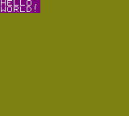
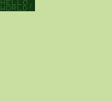
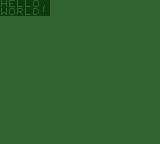
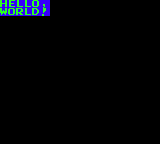
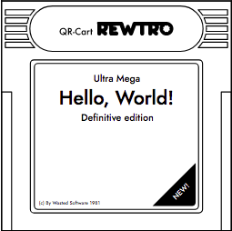

# The Rewtro Cartridges

Rewtro can be scripted using a monolithic or multi-part JSON file that describes the virtual machine configuration, your music, sound effects, graphics, and the game code. When distributed this JSON is assembled, converted to binary data, compressed, and then split and enveloped in simple protocols depending on the distribution format. Right now Rewtro supports papercraft cartridges and animated GIFs that use QR-Codes to store and load data. In this case, the binarized and compressed JSON is split into parts, one for each QR-Code, each part is labeled with an ID, a progressive number and the total number of parts and then converted to QR-Codes.

When Rewtro loads a game, it repeats the process in reverse: the data is loaded from QR-Codes, sorted using the progressive ID, converted to a compressed binary, unpacked and then converted back to your original JSON file and run.

I'm not going to dwell into this nerdy protocol part: what I'd like you to know is that to make a Rewtro game you're going to put together a JSON file and that very file _is run mainly as-is by the Rewtro engine_. The compile, compress, encode part is up to the Rewtro compiler and is done just for the sake of data transfer, so you're not going to fiddle with bit and bytes. _Probably._

## The JSON backbone

Let's start making an _empty cartridge_.

  * Rewtro supports multiple _core versions_ which are a combination of a game engine and its configuration. Right now the latest version of Rewtro is `0.2`, which uses the custom `RewtroEngine` with extended commands set.
  * Then there is a `metadata` section, which includes several extra details of your game. This part is never encoded in cartridges data but is useful to configure text printed on data storages and more. The only mandatory key of `metadata` is your game name, which is used as file name in exports and displayed by the debugger.
  * There is a `data` section, which holds all your game contents grouped in [data blocks](datablocks.md). Unsurprisingly enough, it's a mandatory section too. Since we're creating a minimal cartridge, let's keep that empty.

That's all. Our minimal cartridge is this one:

```
{
   "systemVersion":"0.2",
   "metadata":{
     "title":"My first game"
   },
   "data":[]
}
```

Which displays a boring blank screen and a controller with a single button.

## Hello, World!

First of all, we need mandatory unexplained _Hello World!_ every manual feature:

```
{
   "systemVersion":"0.2",
   "metadata":{
     "title":"My first game"
   },
   "data":[{
      "id":"A",
      "sprites":[{"id":"A","text":"HELLO,~WORLD!","textColor":3,"backgroundColor":2,"width":50,"height":16}],
      "tilemaps":[{"map":["A"]}]
   }]
}
```

This cartridge displays just this:

<div align="center" style="margin:60px 0">
    <p></p>
</div>

Even if it's quite straightforward what's going on, I'll explain what's happening in that [data block](datablocks.md) later but, for now, let's accept this _Hello, World!_ as it is.

Rewtro system can be configured to have different font, screen resolution, and more. I'd like to explain to you how to do that changing this _Hello, World!_ a little. I promise to add a few screenshots, okay?

## System configuration

You can configure the Rewtro adding a `systemConfiguration` to your JSON root, like this.

```
{
   "systemVersion":"0.2",
   "metadata":{
     "title":"My first game"
   },
   "systemConfiguration":[{
      <your configuration here>
   }],
   "data":[]
}
```

In our working blank cartridge, this key wasn't there. All of the system configurations have nice defaults, so you don't have to worry about that. But if you want to personalize your game system a bit, you can do it here.

### Screen resolution

Rewtro screen has a _screen resolution_ which is the usual screen size that's used to place stuff on the screen and a _render resolution_ which stretches that screen image to any other size when rendered. By default, both of them are set to 160x144, inspired by the [GameBoy](https://en.wikipedia.org/wiki/Game_Boy#Technical_specifications) screen size. Changing these values you can use larger and smaller resolutions for your games and, with some creativity, can easily recreate some _resolution weirdness_ from systems of the past.

  * `screenWidth` and `screenHeight` change the _screen resolution_. You can set any value from 0 to 2047.
  * `renderWidth` and `renderHeight` change the _render resolution_. You can set any value from 0 to 2047.

If you want an unstretched screen just remember to set the same values for the _screen resolution_ and the _render resolution_.

Example time! Let's try emulating the [VIC-20](https://en.wikipedia.org/wiki/Commodore_VIC-20) screen resolution. Wikipedia says that _"At startup the screen showed 176×184 pixels, with a fixed-color border to the edges of the screen. Since a PAL or NTSC screen has a 4:3 width-to-height ratio, each VIC pixel was much wider than it was high."_ So, we can double the _render resolution width_ to obtain a similar effect:

```
{
   "systemVersion":"0.2",
   "metadata":{
     "title":"My first game"
   },
   "systemConfiguration":[{
      "screenWidth":176,
      "screenHeight":184,
      "renderWidth":352,
      "renderHeight":184
   }],
   "data":[{
      "id":"A",
      "sprites":[{"id":"A","text":"HELLO,~WORLD!","textColor":3,"backgroundColor":2,"width":50,"height":16}],
      "tilemaps":[{"map":["A"]}]
   }]
}
```

This cartridge displays:

<div align="center" style="margin:60px 0">
    <p></p>
</div>

It looks a little like the original VIC-20 screen, right?

<div align="center" style="margin:60px 0">
    <p></p>
</div>

Rewtro also supports up to 128 standard resolutions, inspired to classic systems, that you can select just using the single `resolutionModel` key. Only a few of them are available right now: you can see the complete list from the SDK home screen, hitting the _corners_ button.

```
{
   "systemVersion":"0.2",
   "metadata":{
     "title":"My first game"
   },
   "systemConfiguration":[{
      "resolutionModel":2
   }],
   "data":[{
      "id":"A",
      "sprites":[{"id":"A","text":"HELLO,~WORLD!","textColor":3,"backgroundColor":2,"width":50,"height":16}],
      "tilemaps":[{"map":["A"]}]
   }]
}
```

This cartridge uses the 320x200 resolution of my beloved [Commodore 64](https://en.wikipedia.org/wiki/Commodore_64#Graphics). I don't think you need a screenshot here.

### Color palette

Colors in Rewtro are arranged in a palette, a set of predefined colors that can be referenced used an index. By default, Rewtro uses a 15-colors palette inspired by the [ZX Spectrum 48K](https://en.wikipedia.org/wiki/ZX_Spectrum#ZX_Spectrum_16K/48K). It's not a particularly cool palette but it features that solid _developer colors_ most of the older machines used to feature.

But fear not. You can create your palette for your game using the `palette` key and use it for your game. Then list up to 256 colors using RGBA values from 0 to 255. Just remember to set the first color to full transparency (i.e. the last number set to 0) to make your sprites work.

```
{
   "systemVersion":"0.2",
   "metadata":{
     "title":"My first game"
   },
   "systemConfiguration":[{
      "palette":[
         [  0,  0,  0,  0],
         [127,127,  0,255],
         [127,  0,127,255],
         [255,255,255,255]
      ]
   }],
   "data":[{
      "id":"A",
      "sprites":[{"id":"A","text":"HELLO,~WORLD!","textColor":3,"backgroundColor":2,"width":50,"height":16}],
      "tilemaps":[{"map":["A"]}]
   }]
}
```

This cartridge changes our _Hello, World!_ colors a bit.

<div align="center" style="margin:60px 0">
    <p></p>
</div>

There are some built-in color palettes you can use in your game using the `paletteModel` key. Rewtro supports up to 128 built-in palettes but only a few of them are available right now. As usual, you can see the complete list from the SDK home screen, hitting the _palette_ button.

```
{
   "systemVersion":"0.2",
   "metadata":{
     "title":"My first game"
   },
   "systemConfiguration":[{
      "paletteModel":1
   }],
   "data":[{
      "id":"A",
      "sprites":[{"id":"A","text":"HELLO,~WORLD!","textColor":3,"backgroundColor":2,"width":50,"height":16}],
      "tilemaps":[{"map":["A"]}]
   }]
}
```

This cartridge gives our _Hello, World!_ a GameBoy vibe.

<div align="center" style="margin:60px 0">
    <p></p>
</div>

The second color of your palette is used as default background color but you can change it using the `defaultColor` key, setting a number from 0 to 127.

```
{
   "systemVersion":"0.2",
   "metadata":{
     "title":"My first game"
   },
   "systemConfiguration":[{
      "paletteModel":1,
      "defaultColor":3
   }],
   "data":[{
      "id":"A",
      "sprites":[{"id":"A","text":"HELLO,~WORLD!","textColor":3,"backgroundColor":2,"width":50,"height":16}],
      "tilemaps":[{"map":["A"]}]
   }]
}
```

This cartridge uses the GameBoy palette from before but with a darker color as background.

<div align="center" style="margin:60px 0">
    <p></p>
</div>

Notice that the screen background and the "HELLO, WORLD!" text are the same color since `defaultColor` and `textColor` were both set to 3.

### Font

In Rewtro you can write text on the screen... and that's what our _Hello, World!_ is doing right now. You can customize your font face both storing a font image in your [data blocks](datablocks.md) or selecting one of the Rewtro built-in fonts. You can select a built-in font using the `fontModel` key.

```
{
   "systemVersion":"0.2",
   "metadata":{
     "title":"My first game"
   },
   "systemConfiguration":[{
      "fontModel":4
   }],
   "data":[{
      "id":"A",
      "sprites":[{"id":"A","text":"HELLO,~WORLD!","textColor":3,"backgroundColor":2,"width":50,"height":16}],
      "tilemaps":[{"map":["A"]}]
   }]
}
```

This cartridge is surely ready for 80's arcades!

<div align="center" style="margin:60px 0">
    <p></p>
</div>

All fonts have monospaced 8x8 letters and there is no _conventional way_ to change its size right now. Moreover, only capitals and few symbols are supported: to keep games small I decided to cut down standard ASCII _a little_. We're going to talk more about text and fonts on [data blocks](datablocks.md), [sprite attributes](spriteattributes.md) and [code statements](codestatements.md).

### Game controls

By default Rewtro uses a virtual 8-directions controller with a single action button, called _Button A_. There are some built-in controllers presets you can use in your game setting the `controllerModel` key.

```
{
   "systemVersion":"0.2",
   "metadata":{
     "title":"My first game"
   },
   "systemConfiguration":[{
      "controllerModel":4
   }],
   "data":[{
      "id":"A",
      "sprites":[{"id":"A","text":"HELLO,~WORLD!","textColor":3,"backgroundColor":2,"width":50,"height":16}],
      "tilemaps":[{"map":["A"]}]
   }]
}
```

This makes our _Hello, World!_ a one-button game. Rewtro supports up to 128 controllers layout. Only a few of them are available right now: you can see the complete list from the SDK home screen, hitting the _controller_ button.

### Audio

Rewtro uses a different volume for playing sound effects and for music. Defaults are usually just right but you can change them using the `musicVolume` and the `effectsVolume` with a number from 0 to 127. By default `effectsVolume` is set to 115 and `musicVolume` is set to 64.

```
{
   "systemVersion":"0.2",
   "metadata":{
     "title":"My first game"
   },
   "systemConfiguration":[{
      "musicVolume":32,
      "effectsVolume":64
   }],
   "data":[{
      "id":"A",
      "sprites":[{"id":"A","text":"HELLO,~WORLD!","textColor":3,"backgroundColor":2,"width":50,"height":16}],
      "tilemaps":[{"map":["A"]}]
   }]
}
```

This cartridge is a little less louder than the default one.

### Frame rate

By default, all Rewtro games run at 25 frames per second. You can change this preset setting the `fps` key to a number from 0 to 127.

```
{
   "systemVersion":"0.2",
   "metadata":{
     "title":"My first game"
   },
   "systemConfiguration":[{
      "fps":60
   }],
   "data":[{
      "id":"A",
      "sprites":[{"id":"A","text":"HELLO,~WORLD!","textColor":3,"backgroundColor":2,"width":50,"height":16}],
      "tilemaps":[{"map":["A"]}]
   }]
}
```

This cartridge runs at 60 frames per second.

### Fake loading time

Old systems used to load and unpack data _a lot_. That's why I decided to simulate these delays at every scene change in Rewtro: the screen goes blank and the system waits for a certain amount of frames. Right now it's waiting for 13 frames, which is about a half of a second using the default 25 frames per second configuration. You can change the number of frames setting the `loadingTime` to any value from 0 to 255.

```
{
   "systemVersion":"0.2",
   "metadata":{
     "title":"My first game"
   },
   "systemConfiguration":[{
      "loadingTime":75
   }],
   "data":[{
      "id":"A",
      "sprites":[{"id":"A","text":"HELLO,~WORLD!","textColor":3,"backgroundColor":2,"width":50,"height":16}],
      "tilemaps":[{"map":["A"]}]
   }]
}
```

This way our cartridge will take 3 seconds (25 frames per seconds multiplied by 3 seconds gives 75 frames) to load every scene, even the first one: the screen will stay blank for 3 seconds and then our usual "HELLO, WORLD!" message is displayed.

The background color of this blank loading screen is the `defaultColor` you defined in your system configuration.

## Cartridge metadata

You can set some extra attributes to your game cartridge adding keys to the `metadata` attribute. All of the values in `metadata` are _never encoded in your game cartridge storage_ and it's mostly used to customize multiple [data storage](datastorage.md) layouts.

```
{
   "systemVersion":"0.2",
   "metadata":{
     "title":"My first game",
     <your metadata here>
   },
   "data":[]
}
```

### Game title

We already know the mandatory `title` key. It's a string containing your game name and it will be used as the file name when exporting your game cartridge and as label on prints and animated GIFs.

### Printing layout

Rewtro supports some [data storages](datastorage.md) to distribute your games, each one with its layout and _maximum capacity_. Because Rewtro stores your game data _on a papercraft_ so different layouts may fit larger games than the others!

By design its covers are usually blank: doodling your cover by hand is _a hell of fun_ and makes all of your physical data storages unique! Sometimes you need that _professional details_ that make your games extra _cringey_. These are some of the `metadata` keys that may help you with that:

  * `centerTitle` prints your game main title.
  * `upperTitle` prints some small text over the title.
  * `lowerTitle` prints some small text under the title.
  * `legalText` prints some very small text on the bottom of your data storage label.
  * `sizeData` prints some fancy text on the bottom right corner of your data storage cover. If left blank, it prints your game size in kilobytes _because data storage sizes were cool in the 90s_.

Different [data storage](datastorage.md) may have different keys.

```
{
   "systemVersion":"0.2",
   "metadata":{
      "title":"My first game",
      "upperTitle":"Ultra Mega",
      "centerTitle":"Hello, World!",
      "lowerTitle":"Definitive edition",
      "legalText":"(c) By Wasted Software 1981",
      "sizeData":"NEW!"
   },
   "data":[{
      "id":"A",
      "sprites":[{"id":"A","text":"HELLO,~WORLD!","textColor":3,"backgroundColor":2,"width":50,"height":16}],
      "tilemaps":[{"map":["A"]}]
   }]
}
```

Printing this our _Hello, World!_ game on a [QR-Cart](datastorage.md) you'll get this _fancy cover_:

<div align="center" style="margin:60px 0">
    <p></p>
</div>

You can download your cartridge SVG version from the SDK home by selecting the data storage you want from the printer combo box on the top of the screen and hitting the _printer_ icon under your game JSON file name.

If you want to learn more about Rewtro data storages have a look at [this chapter](datastorage.md).

## Data blocks

Here we are! Data blocks are the data content of your cartridge, which includes graphics, sounds, music, and code.

```
{
   "systemVersion":"0.2",
   "metadata":{
     "title":"My first game"
   },
   "data":[
      <add here your data blocks>
   ]
}
```

Let's see [what you can store](datablocks.md) in Rewtro cartridges.