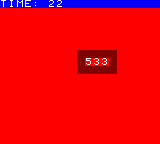
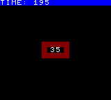

# The Scene and Game objects

In Rewtro there are some _special objects_ you can test and manipulate in [code commands](codecommands.md) to store scene and game variables, handle the game controls, etc.

## Scene object

Testing and changing the `scene` object keys you can manage a lot of scene features like global variables and timers, the screen background color, and more.

```
{
   "systemVersion":"0.2",
   "metadata":{
      "title":"My first game"
   },
   "data":[{
      "id":"A",
      "sprites":[
         {"id":"A","x":0,"y":0,"noCamera":true,"backgroundColor":2,"width":160},
         {"id":"B","textAlignment":"center"},
         {"id":"C","backgroundColor":12}
      ],
      "tilemaps":[{
         "x":60,"y":60,
         "map":[
            "CCCCC",
            "CAB C",
            "CCCCC"
         ]
      }],
      "code":[
         {
            "when":[{"as":"scene","if":[{"itsAttribute":"timer","is":"%%","smallNumber":25}]}],
            "then":[{"sum":[{"value0":[{"smallNumber":1}]}]}]
         },
         {
            "when":[{"as":"scene","if":[{"itsAttribute":"value0","is":"%%","smallNumber":10}]}],
            "then":[{"set":[{"backgroundColor":[{"list":[2,7],"randomNumber":true}]}]}]
         },
         {
            "when":[{"as":"keyboard","attribute":"buttonA","if":[{"is":"hit"}]}],
            "then":[{"runScene":[{"character":"A"}]}]
         },
         {
            "then":[
               {"id":"A","set":[{"text":[{"as":"scene","attribute":"value0","prefix":"TIME: "}]}]},
               {"id":"B","set":[{"text":[{"as":"scene","attribute":"timer"}]}]},
               {
                  "as":"scene",
                  "set":[{
                     "x":[{"attribute":"timer","sin":true}],
                     "y":[{"attribute":"timer","cos":true}]
                  }],
                  "multiply":[{
                     "x":[{"smallNumber":20}],
                     "y":[{"smallNumber":20}]
                  }]
               }
            ]
         }
      ]
   }]
}
```

This cartridge shows a timer on the top of the screen and a faster red-framed counter spinning in the middle of the screen _like crazy_. Every time the top timer shows a number divisible by 10 the screen blinks for a while. When you hit the A button of the controller the scene is reset: both of the timers are reset to zero.

<div align="center" style="margin:60px 0">
    <p></p>
</div>

We'll learn how this example works in the next paragraphs.

### Scene timer

The `scene` object is like an invisible sprite that's _never_ destroyed until a new scene is loaded. As any [sprite](spriteattributes.md), it has a `timer` attribute that's increased every game frame. You can use this as a _scene timer_ in your game since it holds how many frames have passed by the start of your scene.

In our example we print this `timer` in the spinning square:

```
{"id":"B","set":[{"text":[{"as":"scene","attribute":"timer"}]}]}
```

Pick the `B` sprite and `set` its `text` to the `scene` `timer`. We also use the `scene` timer to increase the scene variable `value0`.

```
{
    "when":[{"as":"scene","if":[{"itsAttribute":"timer","is":"%%","smallNumber":25}]}],
    "then":[{"sum":[{"value0":[{"smallNumber":1}]}]}]
}
```

`when` the scene `timer` is divisible by `25` `then` increase its `value0` by `1`. `value0` is a _scene variable_. Let's talk about that.

### Scene variables

Like [standard sprites](spriteattributes.md), the `scene` object has general-purpose attributes named from `value0` to `value4` to store any single decimal float number from `-25` to `26.1` and from `value5` to `value9` to store a text string.

You can initialize these attributes at the scene start using the `tilemap` [data block](datablocks.md) key and manipulate them using the `as` [getter](getters.md) set to `scene`.

In our previous example, we've used the `scene` attribute `value0` to store the slower timer value.

```
{
    "when":[{"as":"scene","if":[{"itsAttribute":"timer","is":"%%","smallNumber":25}]}],
    "then":[{"sum":[{"value0":[{"smallNumber":1}]}]}]
}
```

`when` the scene `timer` is divisible by `25` `then` increase its `value0` by `1`. This `value0` attribute is also printed on screen using the `A` sprite

```
{"id":"A","set":[{"text":[{"as":"scene","attribute":"value0","prefix":"TIME: "}]}]}
```

Every frame this line picks the `A` sprite and `set` its `text` to the `scene` `attribute` named `value0` and prefixes it with the text `TIME:`.

### Screen background color

The `background` color of the `scene` object is used to set the screen background color. This color is kept until a new scene is started.

In our example we randomly change the scene `backgroundColor` every 10 seconds:

```
{
	"when":[{"as":"scene","if":[{"itsAttribute":"value0","is":"%%","smallNumber":10}]}],
	"then":[{"set":[{"backgroundColor":[{"list":[2,7],"randomNumber":true}]}]}]
}
```

`when` the scene custom attribute `value0` is divisible by `10` `then` `set` its `backgroundColor` to a `randomNumber` between `2` and `7`.

### Virtual camera

The `x` and `y` attributes of the `scene` object are used to move a _virtual camera_ around. Rewtro simulates a camera that's placed at the `x` 0 and `y` 0 coordinates and that shows all of the sprites that fall in an area as big as the screen size.

To make a sprite appear on the screen you can both move the sprite _in front of the camera_ or move the camera to frame that sprite. You can move the camera around changing the `x` and `y` attributes of the `camera` special object as you do with sprites.

In our example we used camera movement to trick the eye:

```
{
  "as":"scene",
  "set":[{
     "x":[{"attribute":"timer","sin":true}],
     "y":[{"attribute":"timer","cos":true}]
  }],
  "multiply":[{
     "x":[{"smallNumber":20}],
     "y":[{"smallNumber":20}]
  }]
}
```

The `scene` `x` and `y` is `set` to the sine and cosine of the `scene` `timer` and then multiplied by the constant `20`. That makes the camera moving in circle and that's why we see the red frame spinning: the sprites _are not moving_ but it's the camera that is framing them from different positions! _Aw, relativity._

The `TIMER:` sprite is not following the camera and that's because its `A` sprite has the `noCamera` attribute set to `true`. Learn more about sprite attributes [here](spriteattributes.md).

## Game object

the `game` special object works like the `scene` special object except that it's created when your cartridge is started and is never destroyed.

```
{
   "systemVersion":"0.2",
   "metadata":{
      "title":"My first game"
   },
   "data":[{
      "id":"A",
      "sprites":[
         {"id":"A","x":0,"y":0,"backgroundColor":2,"width":160},
         {"id":"B","textAlignment":"center"},
         {"id":"C","backgroundColor":12}
      ],
      "tilemaps":[{
         "x":60,"y":60,
         "map":[
            "CCCCC",
            "CAB C",
            "CCCCC"
         ]
      }],
      "code":[
         {
            "when":[{"as":"scene","if":[{"itsAttribute":"timer","is":"%%","smallNumber":25}]}],
            "then":[{"as":"game","sum":[{"value0":[{"smallNumber":1}]}]}]
         },
         {
            "when":[{"as":"keyboard","attribute":"buttonA","if":[{"is":"hit"}]}],
            "then":[{"runScene":[{"character":"A"}]}]
         },
         {
            "then":[
               {"id":"A","set":[{"text":[{"as":"game","attribute":"value0","prefix":"TIME: "}]}]},
               {"id":"B","set":[{"text":[{"as":"scene","attribute":"timer"}]}]}               
            ]
         }
      ]
   }]
}
```

This cartridge is a _lite_ version of our first example: still two timers but no screen blinking or spinning. Hitting the A button a new scene is loaded: the timer in the middle of the screen is reset as usual but the `TIMER:` value is not this time.

<div align="center" style="margin:60px 0">
    <p></p>
</div>

None of the `game` attributes are used by Rewtro so you can use them to store any game-wise values, like high scores, the player respawn coordinates, and more. 

## Keyboard

The `keyboard` special object allows your game to check the virtual controller status. You can set the `as` [getter](getters.md) to the `keyboard` value, select a button picking the sub-`attribute` to any of `up`, `down`, `left`, `right`, `buttonA`, `buttonB`, `buttonC`, or `buttonD` and create a [condition](conditions.md) that checks if it's `up`, `down`, or `hit`. You can learn more about these conditions [here](conditions.md).

Buttons' availability depends on the button layout you've chosen for your game. To learn more about that have a look at the `systemConfiguration` key `controllerModel` [here](rewtrocartridge.md).

```
{
   "systemVersion":"0.2",
   "metadata":{
      "title":"My first game"
   },
   "data":[{
      "id":"A",
      "sprites":[{"id":"A","x":76,"y":68}],
      "tilemaps":[{"map":["A"]}],
      "code":[
         {
            "when":[{"as":"keyboard","attribute":"down","if":[{"is":"down"}]}],
            "then":[{"id":"A","sum":[{"y":[{"smallNumber":1}]}]}]
         },{
            "when":[{"as":"keyboard","attribute":"right","if":[{"is":"down"}]}],
            "then":[{"id":"A","sum":[{"x":[{"smallNumber":1}]}]}]
         },{
            "when":[{"as":"keyboard","attribute":"up","if":[{"is":"down"}]}],
            "then":[{"id":"A","subtract":[{"y":[{"smallNumber":1}]}]}]
         },{
            "when":[{"as":"keyboard","attribute":"left","if":[{"is":"down"}]}],
            "then":[{"id":"A","subtract":[{"x":[{"smallNumber":1}]}]}]
         },{
            "when":[{"as":"keyboard","attribute":"buttonA","if":[{"is":"down"}]}],
            "then":[{"id":"A","set":[{"backgroundColor":[{"smallNumber":2}]}]}]
         },{
            "when":[{"as":"keyboard","attribute":"buttonA","if":[{"is":"up"}]}],
            "then":[{"id":"A","set":[{"backgroundColor":[{"smallNumber":5}]}]}]
         },{
            "when":[{"as":"keyboard","attribute":"buttonA","if":[{"is":"hit"}]}],
            "then":[{"id":"A","set":[{"backgroundColor":[{"smallNumber":3}]}]}]
         }
      ]
   }]
}
```

In this cartridge you move a red square around the screen using the up, down, left, and right buttons. Holding down the A button it becomes blue but flashes cyan when the button is just hit.

<div align="center" style="margin:60px 0">
    <p></p>
</div>

The `keyboard` special object is queried multiple times by the `when` [commands](codecommands.md) asking for specific controller keys and key states. Once a `when` command [condition](conditions.md) is true the game reacts executing the `then` [command](codecommands.md) and making it interactive.

## Song row

The `songRow` special object knows which note has been played right now by the Rewtro song player and you can know it in the very same way we used for the keyboard. Have a look at the _song row_ sub-getters from `M0` to `M9` into the [getters](getters.md) documentation.

```
{
   "systemVersion":"0.2",
   "metadata":{
      "title":"My first game"
   },
   "data":[{
      "id":"A",
      "sounds":[
         {"id":"A","wave":"triangle"},
         {"id":"B","wave":"whitenoise"}
      ],
      "music":[
         {
            "id":"A",
            "notes":[
               ["C4-","D4-","E4-","F4-","G4-","F4-","E4-","D4-"],
               ["C4-","   ","G7-","   ","C4-","   ","G7-","   "]
            ],"instruments":"AB"}
      ],
      "songs":[
         {"id":"A","loopTo":0,"music":"A","tempo":5}
      ],
      "sprites":[
         {"id":"A","width":80,"height":72},
         {"id":"B","x":80,"width":80,"height":72}
      ],
      "tilemaps":[{"map":["AB"],"song":"A"}],
      "code":[
         {
            "when":[{"as":"songRow","attribute":"M0","if":[{"is":"==","string":"AC4-"}]}],
            "then":[{"as":"scene","set":[{"backgroundColor":[{"smallNumber":3}]}]}],
            "else":[{"as":"scene","set":[{"backgroundColor":[{"smallNumber":1}]}]}]
         },
         {
            "when":[{"as":"songRow","attribute":"M1","if":[{"is":"==","string":"BC4-"}]}],
            "then":[{"id":"A","set":[{"backgroundColor":[{"smallNumber":5}]}]}],
            "else":[{"id":"A","set":[{"backgroundColor":[{"smallNumber":0}]}]}]
         },
         {
            "when":[{"as":"songRow","attribute":"M1","if":[{"is":"==","string":"BG7-"}]}],
            "then":[{"id":"B","set":[{"backgroundColor":[{"smallNumber":2}]}]}],
            "else":[{"id":"B","set":[{"backgroundColor":[{"smallNumber":0}]}]}]
         }
      ]
   }]
}
```

This cartrige plays a short scale of notes with a beat. The screen flashes green every time the loop is started, a red square on the top left of the screen blinks of red when a beat is played and a blue one on the top right flashes when the snare is played.

<div align="center" style="margin:60px 0">
    <p></p>
</div>

This example `code` has 3 `when` [commands](codecommands.md) controlling the 3 flashes. They are very similar so let's have a look just to the first one.

The line `when` command [conditions](conditions.md) picks the `songRow` special object and its sub-attribute `M0` and checks if its value is equal to the `string` `AC4-`.

The `M0` represents the `music` track we want to query and in this case it's the first one. The tracks are the horizontal lines of notes defined in the `music` key of the [data block](datablocks.md) - have a look at the [data blocks](datablocks.md) chapter to learn more. The sub-getter `M0` on the special object `songRow` returns the note that's currently playing on the first track of the current `music`.

`songRow` returns the currently played note _prefixed_ with _the instrument that's playing it_. So `AC4-` means that the `A` instrument is playing the `C4-` note. A [condition](conditions.md) to this value on track `M0` will trigger when the `A` instrument plays the `C4-` note on the first `music` track: the `then` [statements](codestatements.md) will change the screen background to green `else` it's set back to black.