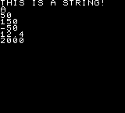
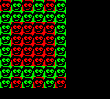
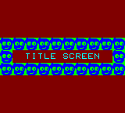
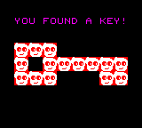

# Special symbols

In the [Rewtro cartridge](rewtrocartridge.md) chapter we mentioned that game assets and code are _assembled_ before being converted to binary data and stored into a [data storage](datastorage.md).

During the assembly part Rewtro _solves_ several _special symbols_ you can add to your JSON file that may help you on code faster and better. Using these special symbols you can include an external JSON into your game, automatically generate the best [getter](getters.md) for a value, etc.

Special symbols keys always start with the `_` character and there won't be any trace of them in your [data storage](datastorage.md) once resolved: like the `metadata` section of your [Rewtro cartridge](rewtrocartridge.md) special symbols are _never encoded in your game cartridge data storage_.

## Getter auto-generator

When saved on a [data storage](datastorage.md) a [getter](getters.md) takes an amount of space depending on the type you decided to use: an `integer` getter can pick an integer number between `-511` and `512` but, if the number you need is between `-127` and `128`, you may use the `smallInteger` getter instead which does the same thing but taking less space.

The `_` special symbol looks like a getter key but it's converted to the one that best fits its value during after your cartridge is assembled.

```
{
   "systemVersion":"0.2",
   "metadata":{
      "title":"My first game"
   },
   "data":[{
      "id":"A",
      "sprites":[
         {"id":"A"},
         {"id":"B","x":0,"y":8},
         {"id":"C","x":0,"y":16},
         {"id":"D","x":0,"y":24},
         {"id":"E","x":0,"y":32},
         {"id":"F","x":0,"y":40},
         {"id":"G","x":0,"y":48}
      ],
      "tilemaps":[{"map":["ABCDEFG"]}],
      "code":[
         {
            "then":[
               {"id":"A","set":[{"text":[{"string":"THIS IS A STRING!"}]}]},
               {"id":"B","set":[{"text":[{"character":"A"}]}]},
               {"id":"C","set":[{"text":[{"smallNumber":50}]}]},
               {"id":"D","set":[{"text":[{"number":150}]}]},
               {"id":"E","set":[{"text":[{"smallInteger":-50}]}]},
               {"id":"F","set":[{"text":[{"float":12.4}]}]},
               {"id":"G","set":[{"text":[{"largeNumber":2000}]}]}
            ]
         }
      ]
   }]
}
```

This cartridge shows some sprites displaying text and numbers on the screen. Each `text` `set` [statement](codestatements.md) uses the best [getter](getters.md) to pick the value.

<div align="center" style="margin:60px 0">
    <p></p>
</div>

You can get the same result replacing each specific getter with the `_` symbol: Rewtro will automatically replace it with the best getter during the assembling phase.

```
{
   "systemVersion":"0.2",
   "metadata":{
      "title":"My first game"
   },
   "data":[{
      "id":"A",
      "sprites":[
         {"id":"A"},
         {"id":"B","x":0,"y":8},
         {"id":"C","x":0,"y":16},
         {"id":"D","x":0,"y":24},
         {"id":"E","x":0,"y":32},
         {"id":"F","x":0,"y":40},
         {"id":"G","x":0,"y":48}
      ],
      "tilemaps":[{"map":["ABCDEFG"]}],
      "code":[
         {
            "then":[
               {"id":"A","set":[{"text":[{"_":"THIS IS A STRING!"}]}]},
               {"id":"B","set":[{"text":[{"_":"A"}]}]},
               {"id":"C","set":[{"text":[{"_":50}]}]},
               {"id":"D","set":[{"text":[{"_":150}]}]},
               {"id":"E","set":[{"text":[{"_":-50}]}]},
               {"id":"F","set":[{"text":[{"_":12.4}]}]},
               {"id":"G","set":[{"text":[{"_":2000}]}]}
            ]
         }
      ]
   }]
}
```

This JSON will be the same of the one with specific getters right after being assembled.

## Loading external images

Sounds and songs can be added to a cartridge [data block](datablocks.md) typing them into the cartridge JSON but images must be loaded externally instead. To add an image to a data block you've to use the `_file` special symbol.

```
{
   "systemVersion":"0.2",
   "metadata":{
      "title":"My first game"
   },
   "data":[{
      "id":"A",
      "images":[{"id":"graphics","image":{"data":{"_file":"sample.png"},"format":"monocolor"}}]
   }]
}
```

This cartridge contains just one `data` block and its `images` key describes the single `image` with `id` `graphics`. The `graphics` `image` `data` is not directly typed into your cartridge JSON but it's loaded from the `sample.png` external `_file` instead.

## Loading external JSONs

You can use the `_file` special symbol to add external JSON files too.

```
{
   "systemVersion":"0.2",
   "metadata":{
      "title":"My first game"
   },
   "data":[{
      "id":"A",
      "images":[{"_file":"project-images.json"}],
      "sprites":[
         {"id":"A","backgroundColor":3,"_file":"sprite-face.json"},
         {"id":"B","backgroundColor":5,"_file":"sprite-face.json"}         
      ],
      "tilemaps":[{
         "tileWidth":16,"tileHeight":16,
         "map":[
            "BABABA",
            {"_file":"map-1.json"},
            "ABABAB"
         ]
      }]
   }]
}
```

The `_file` special symbols in this cartridge code are including 3 external files. The `projects-images.json` file contains an _array of elements_ with a single element:

```
[
   {"id":"graphics","image":{"data":{"_file":"sample.png"},"format":"monocolor"}}
]
```

Its single element includes the `sample.png` image file. Then we have the `sprite-face.json`, which it's included twice, and contains a JSON object:

```
{"width":16,"height":16,"graphicsX":0,"graphicsY":16}
```

Finally there is the `map-1.json` file which contains an array of strings:

```
[
   "AAAAAA",
   "ABBBBA",
   "ABBBBA",
   "ABBBBA",
   "ABBBBA",
   "AAAAAA"
]
```

Once the cartridge is assembled and executed this grid of faces will appear on the screen;

<div align="center" style="margin:60px 0">
    <p></p>
</div>

The included files are _merged_ during the cartridge assembly using different strategies depending on _the included file content_. The `project-images.json` contains an array of elements so its values _will be appended_ to the including list:

```
"images":[{"_file":"project-images.json"}]
```

The `sprite-face.json` contains a JSON object so its keys and values _will be added_ to the including object:

```
{"id":"A","backgroundColor":3,"_file":"sprite-face.json"}
```

Using these strategies you can get creative: the `map-1.json` file is a _list of strings_ and, since a `tilemap` `map` is a list of strings too, you can _glue_ two tilemaps this way like a roll:

```
"tilemaps":[{
   "tileWidth":16,"tileHeight":16,
   "map":[
      "BABABA",
      {"_file":"map-1.json"},
      "ABABAB"
   ]
}]
```

The `_file` special symbol can make your life a lot easier: you can create libraries of sounds, songs, and scenes and reuse them in multiple games, sync multiple sprites attributes, etc. Just keep in mind that included files are always _assembled_ to your cartridge code and never _referenced_ so this may lead to _replicated code_. After being assembled our previous cartridge will be like:

```
{
   "systemVersion":"0.2",
   "metadata":{
      "title":"My first game"
   },
   "data":[{
      "id":"A",
      "images":[
         {"id":"graphics","image":{"data":<image binary data>,"format":"monocolor"}}
      ],
      "sprites":[
         {"id":"A","backgroundColor":3,"width":16,"height":16,"graphicsX":0,"graphicsY":16},
         {"id":"B","backgroundColor":5,"width":16,"height":16,"graphicsX":0,"graphicsY":16}
      ],
      "tilemaps":[{
         "tileWidth":16,"tileHeight":16,
         "map":[
            "BABABA",
            "AAAAAA",
            "ABBBBA",
            "ABBBBA",
            "ABBBBA",
            "ABBBBA",
            "AAAAAA",
            "ABABAB"
         ]
      }]
   }]
}
```

All of the `_file` references have been resolved and replaced by the referenced file contents. Notice how `sprite-face.json` keys and values have been _referenced and copied twice_ inside the `A` and `B` sprite definitions.

### Placeholders

`_file` included JSON files may feature placeholders that are _solved_ during the assembly phase.

To do that set an object with a `_placeholder` key and a string label value on any value of your included JSON file. Then map all of the labels to their values in the including file adding in a `_replace` object a the same level of the `_file` special command. After your cartridge is assembled all the `_placeholders` of the included file will be replaced following the `_replace` map and included as explained before.

```
{
   "systemVersion":"0.2",
   "metadata":{
      "title":"My first game"
   },
   "data":[
      {
         "id":"A",
         "images":[{"id":"graphics","image":{"data":{"_file":"sample.png"},"format":"monocolor"}}],
         "_file":"scene-model.json",
         "_replace":{
            "title":"TITLE SCREEN",
            "titleGap":0,
            "sceneColor":12,
            "textColor":4,
            "faceColor":2,
            "sceneMap":[
               "BBBBBBBBBB",
               "B    A   B",
               "BBBBBBBBBB"
            ],
            "button":"buttonA",
            "nextScene":"B"
         }
      },{
         "id":"B",
         "_file":"scene-model.json",
         "_replace":{
            "title":"YOU FOUND A KEY!",
            "titleGap":-48,
            "sceneColor":1,
            "textColor":6,
            "faceColor":8,
            "sceneMap":[
               " CCC      ",
               " CACCCCCC ",
               " CCC   CC "
            ],
            "button":"up",
            "nextScene":"A"
         }
      }
   ]
}
```

This cartridge defines two scenes that includes the same `scene-model.json`:

```
{
   "sprites":[
      {
         "id":"A","x":76,"textAlignment":"center",
         "y":{"_placeholder":"titleGap","_sum":68},
         "textColor":{"_placeholder":"textColor"},
         "text":{"_placeholder":"title"}
      },
      {
         "id":"B","width":16,"height":16,"backgroundColor":3,"graphicsX":0,
         "graphicsY":{"_placeholder":"faceColor","_multiply":16}
      },
      {
         "id":"C","width":16,"height":16,"backgroundColor":5,"graphicsX":0,
         "graphicsY":{"_placeholder":"faceColor","_multiply":16}
      }
   ],
   "tilemaps":[{
      "backgroundColor":{"_placeholder":"sceneColor"},
      "tileWidth":16,"tileHeight":16,
      "y":48,
      "map":{"_placeholder":"sceneMap"}
   }],
   "code":[{
      "when":[{"as":"keyboard","attribute":{"_placeholder":"button"},"if":[{"is":"hit"}]}],
      "then":[{"runScene":[{"_":{"_placeholder":"nextScene"}}]}]
   }]
}
```

This cartrige shows a scene with a frame with some blue faces on it in the middle of the screen and the `TITLE SCREEN` text in the middle:

<div align="center" style="margin:60px 0">
    <p></p>
</div>

When hitting the A button the `YOU FOUND A KEY!` text is displayed on the top of the screen along with a big key made by red squares and white faces:

<div align="center" style="margin:60px 0">
    <p></p>
</div>

Hitting the up direction the first scene is displayed again.

Even if these scenes are different, they were made including the same `scene-model.json` changing its `_placeholder` values using a `_replace` map. Let's talk about the `scene-model.json` file first. It describes a _partial_ Rewtro [data block](datablocks.md). The mandatory single letter identifier `id` is missing and a lot of `_placeholder` special symbols scattered around.

The `A` sprite will be used to display the text on the screen.

```
{
   "id":"A","x":76,"textAlignment":"center",
   "y":{"_placeholder":"titleGap","_sum":68},
   "textColor":{"_placeholder":"textColor"},
   "text":{"_placeholder":"title"}
}
```

Its definition contains three placeholders used as [sprite attribute](spriteattributes.md) values:

  * The sprite `y` position is set to a placeholder named `titleGap`. We expect the including file to define a `titleGap` value in its `_replace` map and customize the sprite vertical position. The `"_sum":68` part in the placeholder definition sums `68` to the including file defined value before replacing the placeholder. We will explain why later.
  * The sprite `textColor` is set to a placeholder named `textColor`. We expect the including file will define a `textColor` value in its `_replace` map and customize the sprite text color.
  * The sprite `text` is set to a placeholder named `title`. We expect the including file to define a `title` value in its `_replace` map and customize the sprite text.

The `B` and `C` sprites are the green and red squares containing a face sprite and arranged on the screen by the tilemap. 

```
{
   "id":"B","width":16,"height":16,"backgroundColor":3,"graphicsX":0,
   "graphicsY":{"_placeholder":"faceColor","_multiply":16}
},
{
   "id":"C","width":16,"height":16,"backgroundColor":5,"graphicsX":0,
   "graphicsY":{"_placeholder":"faceColor","_multiply":16}
}
```

There is the same placeholder in its definition:

  * The sprite `graphicsY` is set to a placeholder named `faceColor`. We expect the including file to define a `faceColor` value in its `_replace` map and customize the spritesheet frame vertical position. The `"_multiply":16` part in the placeholder definition multiplies by `16` the including file defined value before replacing the placeholder. We will explain why later.

Also, the `tilemaps` section have some `_placeholders`.

```
"tilemaps":[{
   "backgroundColor":{"_placeholder":"sceneColor"},
   "tileWidth":16,"tileHeight":16,
   "y":48,
   "map":{"_placeholder":"sceneMap"}
}]
```

  * The scene `backgroundColor` is set to a placeholder named `sceneColor`. We expect the including file to define a `sceneColor` value in its `_replace` map and change the scene the background color.
  * The `map` value is set to a placeholder named `sceneMap` and we expect the including file to define a `sceneMap` array in its `_replace`. Placeholder values may be _any_ valid JSON key value, including arrays, objects, strings, and numbers.
 
Finally, there are two placeholders on `code` too.

```
"code":[{
   "when":[{"as":"keyboard","attribute":{"_placeholder":"button"},"if":[{"is":"hit"}]}],
   "then":[{"runScene":[{"_":{"_placeholder":"nextScene"}}]}]
}]
```

  * The condition that waits `when` the `keyboard` `is` `hit` has the `button` placeholders as the button name. We expect the including file to define the `button` value in its `_replace` map and decide which button of the game controller will trigger that condition.
  * The `then` [code command](codecommands.md) is executed when the button is hit and its [statement](codestatements.md) `runScene` will change the running scene. The new scene [data block](datablocks.md) IDs have been replaced by the `nextScene` placeholder we expect a `nextScene` value defined in the including file `_replace` map.

This is the list of all the placeholders we've found and a short description of how they change the `scene-model.json` scene:

  * `titleGap`: changes the title text vertical position
  * `textColor`: changes the title text color
  * `title`: changes the title text
  * `faceColor`: changes the face color inside the `A` and `B` sprites
  * `sceneColor`: changes the scene background color
  * `sceneMap`: sets the scene tilemap
  * `button`: decides which button have to be pressed for the scene change
  * `nextScene`: decides the data blocks to load after hitting the button

The main cartridge code includes this `scene-model.json` file twice to create the two different scenes. The first one is the `TITLE SCREEN`:

<div align="center" style="margin:60px 0">
    <p></p>
</div>

```
{
   "id":"A",
   "images":[{"id":"graphics","image":{"data":{"_file":"sample.png"},"format":"monocolor"}}],
   "_file":"scene-model.json",
   "_replace":{
      "title":"TITLE SCREEN",
      "titleGap":0,
      "sceneColor":12,
      "textColor":4,
      "faceColor":2,
      "sceneMap":[
         "BBBBBBBBBB",
         "B    A   B",
         "BBBBBBBBBB"
      ],
      "button":"buttonA",
      "nextScene":"B"
   }
}
```

This data block just defines its `id` and loads an image before including the `scene-model.json` file.

Do you remember that the `scene-model.json` data block is missing its mandatory `id` value? The including object will feature both its keys (`id` and `image`) and the `scene-model.json` ones (`sprites`, `tilemaps`, and `code`) becoming a full-featured and valid data block.

All of the keys required by `scene-model.json` are defined in this data block `_replace` key:

  * `titleGap` is set to 0. This value is `_sum` to `68` value so the replaced value will be `68`.
  * `textColor` is 4, which is the cyan color index in the system palette. This makes the title text cyan colored.
  * `title` is `TITLE SCREEN` and that's will be the text printed in the middle of the screen.
  * `faceColor` is set to 2. This `2` is multiplied by `16` by the `_placeholder` so the resulting value will be `32`. In `sample.png`, once loaded, at `graphicsY` `32` there is a blue face.
  * `sceneColor` is set to 12, which is the brown color index in the system palette. This will make the scene background color brown.
  * `sceneMap` draws a rectangle made with `B` sprites and one `A` sprite in the middle. This will draw a green colored rectangle in the middle of the screen with the `TITLE SCREEN` text in it.
  * `button` is set to `buttonA` so the game will wait for the `buttonA` to be pressed to change the scene.
  * `nextScene` is set to `B` so the `B` data block will be read and a new scene will appear.

The second one is the `YOU FOUND A KEY!` one:

<div align="center" style="margin:60px 0">
    <p></p>
</div>

```
{
   "id":"B",
   "_file":"scene-model.json",
   "_replace":{
      "title":"YOU FOUND A KEY!",
      "titleGap":-48,
      "sceneColor":1,
      "textColor":6,
      "faceColor":8,
      "sceneMap":[
         " CCC      ",
         " CACCCCCC ",
         " CCC   CC "
      ],
      "button":"up",
      "nextScene":"A"
   }
}
```

This scene works like the previous one: it defines the `id` key the `scene-model.json` is missing and describes all of its `_placeholder` values.

  * `titleGap` is set to `-48`. This value is `_sum` to `68` value so the replaced value will be `20`. This time the text label will be on the top of the screen.
  * `textColor` is 6, which is the purple color index in the system palette. This makes the title text purple colored.
  * `title` is `YOU FOUND THE KEY!` and that's will be the text printed in the middle of the screen.
  * `faceColor` is set to 8. This `8` is multiplied by `16` by the `_placeholder` so the resulting value will be `128`. In `sample.png`, once loaded, at `graphicsY` `128` there is a white face.
  * `sceneColor`is set to 1, which is black in the system palette. This will make the scene background black.
  * `sceneMap` draws a key made with `C` sprites and one `A` sprite in the middle. This will draw a red-colored key in the middle of the screen with the `YOU FOUND A KEY` text in it.
  * `button` is set to `up` so the game will wait for the `up` to be pressed to change the scene.
  * `nextScene` is set to `A` so the `A` data block will be read and a new scene will appear.
