# Sprite attributes

Sprites are rectangular things that may show a background color, an image or some text that are defined in [data blocks](datablocks.md) and can be spawned multiple times by both `tilemaps` or via `code`.

```
{
   "systemVersion":"0.2",
   "metadata":{
     "title":"My first game"
   },
   "data":[{
      "id":"A",
      "sprites":[
         {"id":"A","text":"SHOW~SOME~TEXT","backgroundColor":5,"width":48,"height":24,"x":56,"y":60}
      ],
      "tilemaps":[{"map":["A"]}]
   }]
}
```

<div align="center" style="margin:60px 0">
    <p>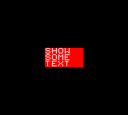</p>
</div>

Once spawned sprites can be moved, removed and animated manually or following the rules of a very basic physic engine.

## ID and Flags

Sprites can be referenced by `code` using `id`s or `flags`.

  * `id` is a mandatory single letter reference that is used by `tilemaps` and `code` to spawn a sprite as it's defined in a loaded data block. While `id` _must_ be unique in a single data block, multiple sprites can have the same `id` once they're spawned.
  * `flags` is a multiple letters identifier. Sprites sharing the same letter in its `flags` can be considered as _a group_.

Time for a little example.

```
{
   "systemVersion":"0.2",
   "metadata":{
     "title":"My first game"
   },
   "data":[{
      "id":"A",
      "sprites":[
         {"id":"A","text":"A"},
         {"id":"B","text":"B","flags":"AB"},
         {"id":"C","text":"C","flags":"AC"},
         {"id":"D","text":"D","flags":"CDE"}
      ],
      "tilemaps":[{"map":["ABCD"]}],
      "code":[
         {"then":[
            {"id":"A","set":[{"backgroundColor":[{"smallNumber":5}]}]},
            {"flags":"A","set":[{"backgroundColor":[{"smallNumber":6}]}]},
            {"flags":"CD","set":[{"y":[{"smallNumber":8}]}]}
         ]}
      ]
   }]
}
```

This cartridge displays some colored letters:

<div align="center" style="margin:60px 0">
    <p>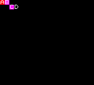</p>
</div>

Let's have a look to what happened. The data block defines these `sprites`:

  * Sprite with `A` id and text have no flags.
  * Sprite with `B` id and text have the `A` and `B` flags.
  * Sprite with `C` id and text have the `A` and `C` flags.
  * Sprite with `D` id and text have the `C`, `D`, and `E` flags.

These four sprites are spawned on the top left of the screen by a `tilemap`. Then these sprites' background color and position are changed by three lines of `code`.

  * Sprites with `id` `A` are set to `backgroundColor` `5`, which is red. It's just our `A` sprite.
  * Sprites with `flags` `A` are set to `backgroundColor` `6`, which is purple. The `B` and `C` sprites both shares the `A` flags, so they are now purple.
  * Sprites with `C` _or_ `D` flags are set to `y` `8`, moving them a little.  The `C` sprite has the `C` flag only and the `D` sprite has both the `C` and `D` flags, so they are moved.

Sprite `id` and `flags` are _just normal attributes_, so they can be changed by your game `code` at any time.

```
{
   "systemVersion":"0.2",
   "metadata":{
     "title":"My first game"
   },
   "data":[{
      "id":"A",
      "sprites":[
         {"id":"A","text":"A"},
         {"id":"B","text":"B","flags":"B"},
         {"id":"C","text":"C"},
         {"id":"D","text":"D"}
      ],
      "tilemaps":[{"map":["ABCD"]}],
      "code":[
         {"then":[
            {"id":"A","set":[{"backgroundColor":[{"smallNumber":5}]}]},
            {"flags":"B","set":[{"backgroundColor":[{"smallNumber":6}]}]}
         ]},
         {
            "when":[{"as":"scene","if":[{"itsAttribute":"timer","is":"==","smallNumber":25}]}],
            "then":[
               {"id":"C","set":[{"id":[{"character":"A"}]}]},
               {"id":"D","set":[{"flags":[{"string":"AB"}]}]}
            ]
         }
      ]
   }]
}
```

Like the previous one, this cartridge spawns 4 sprites and its code keep setting the `backgroundColor` of the sprites with `id` `A` and `flags` `B`, which are just the `A` and `B` sprites.

<div align="center" style="margin:60px 0">
    <p>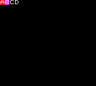</p>
</div>

After a little while the sprite with `id` `C` is changed and its `id` is set to `A`. Then the sprite with `id` `D` gains the `A` and `B` flags. From now the `C` and `D` sprites will be targeted by the color change, resulting in this:

<div align="center" style="margin:60px 0">
    <p>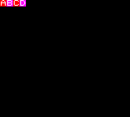</p>
</div>

On the screen we have now two sprites with `id` `A` and two sprites with flag `B`.

## Background color and graphic

Sprites are mostly used to display enemies, bullets, and the player itself. Sprites in Rewtro are rectangles and you can set its position using `x` and `y` and its size with `width` and `height`.

Sprites are transparent by default. The easiest way to make them appear is by setting their `backgroundColor` to a color index of your [system](rewtrocartridge.md) color palette.

```
{
   "systemVersion":"0.2",
   "metadata":{
     "title":"My first game"
   },
   "data":[{
      "id":"A",
      "sprites":[
         {"id":"A","x":16,"y":32,"width":16,"height":48,"backgroundColor":4},
         {"id":"B","x":40,"y":40,"width":16,"height":48},
         {"id":"C","x":64,"y":48,"width":16,"height":48,"backgroundColor":5},
         {"id":"D","x":88,"y":56,"width":16,"height":48,"backgroundColor":6}
      ],
      "tilemaps":[{"map":["ABCD"]}]
   }]
}
```

This cartridge shows 4 sprites...

<div align="center" style="margin:60px 0">
    <p>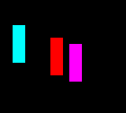</p>
</div>

...but only 3 of them are visible since the `B` sprite has no background color.

The way you're going to use sprites the most is to display and moving graphics. To do that you've to load `images` in a [data block](datablocks.md) and use that images as a _sprite sheet_, selecting the image you want to use with the `graphic` key and the portion you want to display with `graphicsX` and `graphicsY`. The `graphic` key can be set to any valid image id: `font`, `graphics`, `graphics0`, `graphics1`, `graphics2`, `graphics3`, `graphics4`, `graphics5`. If no `graphic` key is defined the `graphics` image is used.

The size of the displayed portion is already defined by the `width` and `height` keys of your sprite we mentioned before but you can _stretch_ a larger or smaller portion of the image into the sprite using `graphicsX` and `graphicsY`. All these keys values must be numbers from `0` to `255`.

Do you remember our ugly [sample.png](images/sample.png) and [sample-colors.png](images/sample-colors.png) images?

```
{
   "systemVersion":"0.2",
   "metadata":{
      "title":"My first game"
   },
   "data":[{
      "id":"A",
      "images":[
         {"id":"graphics","image":{"data":{"_file":"sample.png"},"format":"monocolor"}},
         {"id":"graphics1","image":{"data":{"_file":"sample-colors.png"},"format":"indexed"}}
      ],
      "sprites":[
         {"id":"A","x":16,"y":16,"graphicsX":0,"graphicsY":64,"width":16,"height":16},
         {"id":"B","x":40,"y":16,"graphicsX":16,"graphicsY":80,"width":16,"height":16},
         {"id":"C","x":64,"y":16,"graphic":"graphics1","graphicsX":0,"graphicsY":0,"width":16,"height":16},
         {"id":"D","x":16,"y":40,"graphic":"graphics1","graphicsX":0,"graphicsY":0,"graphicsWidth":16,"graphicsHeight":16,"width":72,"height":32},
         {"id":"E","x":16,"y":80,"graphicsX":0,"graphicsY":96,"graphicsWidth":16,"graphicsHeight":16,"width":8,"height":8},
         {"id":"F","x":32,"y":80,"graphic":"font","graphicsX":16,"graphicsY":16,"width":80,"height":16}
      ],
      "tilemaps":[{"map":["ABCDEF"]}]
   }]
}
```

It displays some sprites with different sizes and portions:

<div align="center" style="margin:60px 0">
    <p>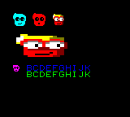</p>
</div>

There is a lot of stuff going on. Let's fetch the sprites one by one:

  * The `A` sprite is cyan: it just _cuts_ the part at 0,64 of the default `graphics` image by 16x16 pixels.
  * The `B` sprite is red: it does the same as the `A` sprite but changing the cut coordinates to 16,80.
  * The `C` sprite is the smaller colored one: it does the same of the others but using the `graphics1` image instead
  * The `D` sprite is the stretched one: even if it _cuts_ a 16x16 area from `graphics1` as the sprite `C` did, it used `graphicsWidth` and `graphicsHeight` instead of `width` and `height`, allowing the sprite to have different sizes for the size and the cut. Rewtro then draws a 16x16 image cut into a 72x32 area, resulting in a stretched image.
  * The `E` sprite is the tiny purple one: it does the same of `D` but this time the sprite size is smaller than the image cut, resulting in a shrunk face.
  * The `D` sprite... are all the letters: in Rewtro fonts are just images, so you can render parts of them setting `graphic` to `font`.

## Effects

Rewtro sprite renderer is very simple... but it supports some effects you can apply to sprites, setting keys:

  * `flipX` and `flipY` can be set to `true` or `false` and mirrors the sprite horizontally or vertically.
  * `scale` can be set to a single decimal float number from `-25` to `26.1` and scales and shrink the sprite by the center.
  * `opacity` can be a number from `0` to `127` and can make a sprite transparent.
  * `rotate` can be set to a number from `0` and `360` and rotates the sprite by the center.
  * `visible` can be `true` or `false` and can prevent your sprite to be displayed.

All of these effects can be mixed and matched as you want. Mandatory _effects gallery_!

```
{
   "systemVersion":"0.2",
   "metadata":{
      "title":"My first game"
   },
   "data":[{
      "id":"A",
      "images":[
         {"id":"graphics","image":{"data":{"_file":"sample.png"},"format":"monocolor"}}
      ],
      "sprites":[
         {"id":"A","x":16,"y":4,"graphicsX":0,"graphicsY":64,"width":16,"height":16},
         {"id":"B","x":40,"y":4,"graphicsX":0,"graphicsY":64,"width":16,"height":16,"opacity":60},
         {"id":"C","x":48,"y":4,"graphicsX":0,"graphicsY":64,"width":16,"height":16,"opacity":30},
         {"id":"D","x":56,"y":4,"graphicsX":0,"graphicsY":64,"width":16,"height":16,"opacity":15},
         {"id":"E","x":40,"y":28,"graphicsX":0,"graphicsY":64,"width":16,"height":16,"flipX":true},
         {"id":"F","x":64,"y":28,"graphicsX":0,"graphicsY":64,"width":16,"height":16,"flipY":true},
         {"id":"G","x":88,"y":28,"graphicsX":0,"graphicsY":64,"width":16,"height":16,"flipX":true,"flipY":true},
         {"id":"I","x":40,"y":52,"graphicsX":0,"graphicsY":64,"width":16,"height":16,"rotate":45},
         {"id":"J","x":40,"y":76,"graphicsX":0,"graphicsY":64,"width":16,"height":16,"scale":1.5},
         {"id":"K","x":40,"y":100,"graphicsX":0,"graphicsY":64,"width":16,"height":16,"visible":false},
         {"id":"L","x":40,"y":124,"graphicsX":0,"graphicsY":64,"width":16,"height":16,"scale":0.7,"flipX":true,"opacity":60,"rotate":20}
      ],
      "tilemaps":[{"map":["ABCDEFGHIJKL"]}]
   }]
}
```

<div align="center" style="margin:60px 0">
    <p></p>
</div>

Sprite `A` has no effect applied, sprites from `B`, `C`, and `D` have different opacity, sprites `E`, `F`, and `G` are flipped, sprite `I` is rotated, `J` is scaled, `K` is not visible since its `visible` key is `false` and `L` has multiple effects applied.

## Animations

Sprites displaying an image can be animated frame by frame using the `animations` and `animation` key. To do that all of your sprite animation frames must be one next to the other in your image like I did in [sample-animated.png](images/sample-animated.png).

<div align="center" style="margin:60px 0">
    <p>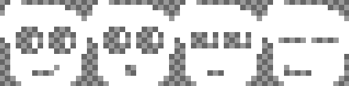</p>
</div>

You can have multiple sprites and animations in the same image. Starting from your sprite `graphicsX` and `graphicsY`, each frame size is given by the sprite _cut_ size (`graphicsWidth` or `graphicsHeight` or `width` and `height` if they're missing). The first frame of the sequence has id 0, the second one has id 1 and so on. The frame order doesn't matter since each animation has its own `frames` sequence.

To animate your sprites you've to define first one or multiple animations with the `animations` key. Each animation is described by:

  * The `frames` key, which is a sequence of frames ids that will be played in the specified order.
  * The `speed` key, which is a number from `0` to `127`, sets for how many screen frames a frame is displayed before going to the next one. Under default [system settings](rewtrocartridge.md) the game runs at 25 frames per second so an animation with `speed` set to `25` will wait a second between each animation frame. An animation with `speed` set to the default value of  `0` will run at the same speed of the screen frame rate.
  * The `mode` key which sets how the animation will be played. It can be set to:
    * `loop` will play the animation forever, starting the `frames` sequence again. It's the `mode` default value.
    * `once` will play the animation just once.
    * `bounce` will play the animation following the `frames` order and then plays it backward forever.

Once your animations are defined, just set the `animation` key to `0` to play the first animation you defined, `1` for the second one and so on.

```
{
   "systemVersion":"0.2",
   "metadata":{
      "title":"My first game"
   },
   "data":[{
      "id":"A",
      "images":[
         {"id":"graphics","image":{"data":{"_file":"sample-animated.png"},"format":"monocolor"}}
      ],
      "sprites":[
         {
            "id":"A","x":16,"y":8,"graphicsX":0,"graphicsY":64,"width":16,"height":16,
            "animations":[
               {"frames":[0,1,2,3],"speed":10},
               {"frames":[0,1,2,3],"speed":5}
            ]
         },
         {
            "id":"B","x":40,"y":8,"graphicsX":0,"graphicsY":64,"width":16,"height":16,
            "animations":[
               {"frames":[0,1,2,3],"speed":10},
               {"frames":[0,1,2,3],"speed":5}
            ],
            "animation":0
         },
         {
            "id":"C","x":64,"y":8,"graphicsX":0,"graphicsY":64,"width":16,"height":16,
            "animations":[
               {"frames":[0,1,2,3],"speed":10},
               {"frames":[0,1,2,3],"speed":5}
            ],
            "animation":1
         },
         {
            "id":"D","x":88,"y":8,"graphicsX":0,"graphicsY":64,"width":16,"height":16,
            "animations":[
               {"frames":[0,1,2,3],"speed":2,"mode":"bounce"}
            ],
            "animation":0
         },
         {
            "id":"E","x":112,"y":8,"graphicsX":0,"graphicsY":64,"width":16,"height":16,
            "animations":[
               {"frames":[1,3,0,2],"speed":25,"mode":"once"}
            ],
            "animation":0
         }
      ],
      "tilemaps":[{"map":["ABCDE"]}]
   }]
}
```

This cartridge shows 5 sprites following different animations. Sorry for the not-so-helpful screenshot.

<div align="center" style="margin:60px 0">
    <p>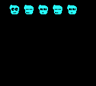</p>
</div>

The `A` sprite has some defined `animations` but no `animation` set, so it's still. The `B` and `C` sprites have the same `animations` but `B` uses the first one and `C` uses the second one, which is faster. Both of them will loop forever, going back to the first frame of the `frames` list every loop. The `D` sprite animation will instead `bounce` going from the first frame of the `frames` list to the last one and then goes backward. The `E` sprite is the slowest of all sprites, displaying a new image every `25` frames (i.e. every second). Its `frames` order is different than the other sprites and the animation will be played just `once`: after the `frames` sequence is over, the `E` sprite will stay still.

## Text

Sprites can be also used to print text on the screen. Just set the `text` key to the text you want to display, using just the  `ABCDEFGHIJKLMNOPQRSTUVWXYZ0123456789?!@,-.:;<=>[\]/_#$%&'()*+"` symbols and `~` for a new line, the `textColor` key to a color index of your [system](rewtrocartridge.md) color palette and align text inside the sprite area setting the `textAlignment` key to `right`, `center`, or `left` (which is the default alignment).

Like the `graphic` key of a sprite, you can set the source image to change the font face. By default the `font` image is used but you can use multiple fonts adding a [custom font in a data block](datablocks.md) and using its id.

```
{
   "systemVersion":"0.2",
   "metadata":{
      "title":"My first game"
   },
   "data":[{
      "id":"A",
      "images":[{"id":"graphics1","image":{"data":{"_file":"sample-font.png"},"format":"monocolor"}}],
      "sprites":[
         {"id":"A","text":"THIS TEXT IS~LEFT ALIGNED!","textColor":3,"backgroundColor":2,"x":8,"y":8,"width":144,"height":16},
         {"id":"B","text":"THIS TEXT IS~RIGHT ALIGNED!","textColor":4,"backgroundColor":2,"x":24,"y":32,"width":128,"height":16,"textAlignment":"right"},
         {"id":"C","text":"THIS TEXT IS~CENTERED!","textColor":5,"backgroundColor":2,"x":40,"y":56,"width":112,"height":16,"textAlignment":"center"},
         {"id":"D","text":"THIS TEXT USES~A CUSTOM FONT!","font":"graphics1","textColor":7,"backgroundColor":2,"x":8,"y":80,"width":144,"height":32,"textAlignment":"center"}
      ],
      "tilemaps":[{"map":["ABCD"]}]
   }]
}
```

This cartridge shows some text with different alignment and font face:

<div align="center" style="margin:60px 0">
    <p>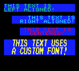</p>
</div>

Effects on text works this way:

```
{
   "systemVersion":"0.2",
   "metadata":{
      "title":"My first game"
   },
   "data":[{
      "id":"A",
      "sprites":[
         {"id":"A","text":"LETTERS ARE~ROTATED!","rotate":90,"x":36,"y":40,"backgroundColor":5,"width":88,"height":16},
         {"id":"B","x":36,"y":40,"backgroundColor":6,"width":88,"height":16,"opacity":64},
         {"id":"C","text":"SPRITE~SCALED","backgroundColor":5,"x":48,"y":108,"width":64,"height":16,"scale":2,"textAlignment":"right"},
         {"id":"D","backgroundColor":6,"x":48,"y":108,"width":64,"height":16,"opacity":64}
      ],
      "tilemaps":[{"map":["ABCD"]}]
   }]
}
```

<div align="center" style="margin:60px 0">
    <p>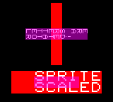</p>
</div>

Purple areas are covering the matching sprite but without any effect applied. Sprite `A` shows that the `rotate` effect is applied to _single letters_ and separately to the sprite, resulting in misalignment. Sprite `B` shows that the text `scale` effect follows its sprite size and position. Like `rotate` also `flipX` and `flipY` effects are applied to single letters too.

## Physics

All spawned sprites are ruled by Rewtro tiny physic engine. Default sprites are still because they don't have any speed by default but you can start moving them just setting `speedX` and `speedY` keys. Sprites movement can be influenced by a constant horizontal acceleration with `gravityX` and a vertical one with `gravityY` and be slowed down until they stop by `restitutionX` and `restitutionY` keys.

All physics key values are single decimal float numbers from `-25` to `26.1`.

```
{
   "systemVersion":"0.2",
   "metadata":{
      "title":"My first game"
   },
   "data":[{
      "id":"A",
      "sprites":[
         {"id":"A","text":"A","speedX":-1},
         {"id":"B","text":"B","speedY":2},
         {"id":"C","text":"C","gravityY":0.1},
         {"id":"D","text":"D","gravityX":-0.2},
         {"id":"E","text":"E","speedX":3,"restitutionX":0.9}
      ],
      "tilemaps":[{
         "y":68,
         "x":52,
         "map":["ABCDE"]
      }]
   }]
}
```

This cartridge spawns some letters in the middle of the screen but, as soon as it's started, the letter are scattered around.

<div align="center" style="margin:60px 0">
    <p>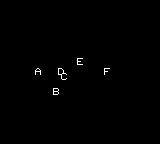</p>
</div>

Let's explain their movement:

  * The `A` sprite has a constant horizontal speed to the left. It will go out to the left of the screen.
  * The `B` sprite has a constant vertical speed to the top and it's faster than `A`. It will go out to the top of the screen.
  * The `C` sprite starts with no speed but is affected by a soft vertical gravity. It will gain a `0.1` speed to the bottom every frame and will slowly fall out to the bottom of the screen.
  * The `D` sprite starts still like the `C` sprite but is affected by horizontal gravity. It will do the same as the `C` sprite but faster (`0.2`) and to the left.
  * The `E` sprite will try moving fast to the right but have a restitution value to the same side that will make it lose 9/10 (`0.9`) of its horizontal speed every frame. It will move to the right until it stops.

Mixed physic attributes can help you implementing game genres with less code: setting `restitutionX` and `restitutionY` to the same value recreates a top-down behavior, setting `restitutionX` and positive `gravityY` helps on making a platformer, etc.

Maximum vertical speed can be automatically limited in a range by `speedLimitYBottom` and `speedLimitYTop` and the horizontal one by `speedLimitXBottom` and `speedLimitXTop`. By default, bottom speed limit is `-4` for and the top is `-4`. You can disable restitution for a single game frame setting `applyRestitutionX` and `applyRestitutionY`.

```
{
   "systemVersion":"0.2",
   "metadata":{
      "title":"My first game"
   },
   "data":[{
      "id":"A",
      "sprites":[
         {"id":"A","text":"A","gravityY":0.1},
         {"id":"B","text":"B","gravityY":0.1,"speedLimitYTop":1.5},
         {"id":"C","text":"C","speedY":-3,"restitutionY":0.9},
         {"id":"D","text":"D","speedY":-3,"restitutionY":0.9,"applyRestitutionY":false}
      ],
      "tilemaps":[{
         "y":68,
         "x":52,
         "map":["ABCD"]
      }]
   }]
}
```

Sprite `A` and `B` will fall to the bottom at the same speed but the `A` sprite will eventually surpass `B` once it reaches its speed limit. `C` and `D` will move to the top with some restitution applied, so they will be slowed down until stopped. The `D` sprite will stop a little later than `C` since restitution wasn't applied in the first frame.

`applyRestitutionX` and `applyRestitutionY` are thought to be set by your code: when the player wants to move its character to a direction, restitution will keep trying stopping it slowing down its movements. Disabling restitution on player inputs will make its character more reactive.

## Auto-effects

It is possible to link a sprite effect to the physics engine in order to make your code slimmer. When set to `true` the `flipXtoSpeedX` and `flipYtoSpeedY` keys will flip the sprite horizontally or vertically when it moves to the left or to the down. The `aim` key works like the `rotate` key but without applying any sprite rotation. When you want the sprite `rotate` to follow its `aim` value you can set the `rotateToAim` to `true`.

```
{
   "systemVersion":"0.2",
   "metadata":{
      "title":"My first game"
   },
   "data":[{
      "id":"A",
      "images":[{"id":"graphics","image":{"data":{"_file":"sample.png"},"format":"monocolor"}}],
      "sprites":[
         {"id":"A","graphicsX":0,"graphicsY":64,"width":16,"height":16,"speedY":-3,"gravityY":0.1,"flipYtoSpeedY":true},
         {"id":"B","graphicsX":0,"graphicsY":80,"width":16,"height":16,"speedX":3,"gravityX":-0.1,"flipXtoSpeedX":true},
         {"id":"C","graphicsX":0,"graphicsY":96,"width":16,"height":16,"aim":45},
         {"id":"D","graphicsX":0,"graphicsY":112,"width":16,"height":16,"aim":45,"rotateToAim":true}
      ],
      "tilemaps":[{"y":64,"x":16,"map":["AB  C  D"]}]
   }]
}
```

This time we have a bunch of faces moving around:

<div align="center" style="margin:60px 0">
    <p>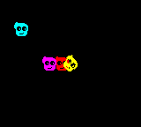</p>
</div>

The cyan and red faces will move up and right by `speedY` and `speedX` but `gravityY` and `gravityX` will keep push them back. When gravity will start moving the sprites to their opposite direction the `flipYtoSpeedY` and `flipXtoSpeedX` keys will flip the sprites vertically and horizontally. The purple and yellow faces have the same `aim` but only the last one is rotated since the key `rotateToAim` is set to `true`.

## Collisions

The Rewtro physics engine can let sprites interact with each other when colliding. The `touchDown`, `touchUp`, `touchLeft` and `touchRight` keys are designed to be read-only and contain the list of sprites the current sprite is colliding with. These collisions can be enabled and disabled setting the `collisionsEnabled` property to `true` (the default value) and `false`.

```
{
   "systemVersion":"0.2",
   "metadata":{
      "title":"My first game"
   },
   "data":[{
      "id":"A",
      "sprites":[
         {"id":"A","flags":"W","backgroundColor":5,"speedX":0.5,"speedY":0.5},
         {"id":"B","flags":"W","backgroundColor":13,"speedX":0.5,"speedY":0.5,"collisionsEnabled":false},
         {"id":"X","backgroundColor":8}         
      ],
      "tilemaps":[{
         "map":[
            "XXXXXXXXXX",
            "X        X",
            "X   AB   X",
            "X        X",
            "X        X",
            "XXXXXXXXXX"
         ]}
      ],
      "code":[
         {
            "when":[{
               "event":"hitWall","flags":"W","if":[{"is":"collidingWith","id":"X"}]
            }],
            "then":[{"bounce":[{"speedY":[{"_":-1}],"speedX":[{"_":-1}]}]}]
         },
         {
            "when":[{"id":"A","sublist":"touchDown"}],
            "then":[{"set":[{"backgroundColor":[{"smallNumber":2}]}]}]
         },
         {
            "when":[{"id":"A","sublist":"touchRight"}],
            "then":[{"set":[{"backgroundColor":[{"smallNumber":3}]}]}]
         },
         {
            "when":[{"id":"A","sublist":"touchUp"}],
            "then":[{"set":[{"backgroundColor":[{"smallNumber":4}]}]}]
         },
         {
            "when":[{"id":"A","sublist":"touchLeft"}],
            "then":[{"set":[{"backgroundColor":[{"smallNumber":5}]}]}]
         }         
      ]
   }]
}
```

This cartridge is a little more complex but its payload is quite interesting:

<div align="center" style="margin:60px 0">
    <p>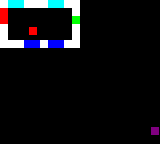</p>
</div>

The red `A` and purple `B` sprites will start moving in a cage of white `X` sprites. Both of them have the `W` flag set but the `B` sprite has its collisions disabled. The `code` block will `bounce` all the sprites with `W` flag set colliding with `X` sprites and then change the colliding sprites with different colors depending on the colliding side. While the `A` sprite will stay into the `X` cage, the `B` sprite will keep moving outside, eventually leaving the screen.

## Z-index

The `zIndex` is a number ranging from `0` to `255` that changes the drawing order of the sprites: the higher its `zIndex` is set the later the sprite is rendered, resulting _on top_ of sprites with lower `zIndex`. The default `zIndex` of a sprite is `0`.

```
{
   "systemVersion":"0.2",
   "metadata":{
      "title":"My first game"
   },
   "data":[{
      "id":"A",
      "images":[{"id":"graphics","image":{"data":{"_file":"sample.png"},"format":"monocolor"}}],
      "sprites":[
         {"id":"A","x":16,"y":16,"graphicsX":0,"graphicsY":64,"width":16,"height":16},
         {"id":"B","x":24,"y":16,"graphicsX":0,"graphicsY":80,"width":16,"height":16},
         {"id":"C","x":16,"y":40,"graphicsX":0,"graphicsY":64,"width":16,"height":16,"zIndex":10},
         {"id":"D","x":24,"y":40,"graphicsX":0,"graphicsY":80,"width":16,"height":16},
         {"id":"E","x":16,"y":64,"graphicsX":0,"graphicsY":64,"width":16,"height":16,"zIndex":10},
         {"id":"F","x":24,"y":64,"graphicsX":0,"graphicsY":80,"width":16,"height":16,"zIndex":20}
      ],
      "tilemaps":[{"y":64,"x":16,"map":["ABCDEF"]}]
   }]
}
```

<div align="center" style="margin:60px 0">
    <p>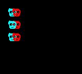</p>
</div>

The first two sprites are rendered following the spawn order so the cyan one is under the red one. The second two sprites have reverse order since the cyan one has a `zIndex` of `10` that's higher than the default `zIndex` `0`. Finally, in the third pair of sprites the red one is back to the top since the cyan one has a `zIndex` of 10 but the red one has a higher `zIndex` of 20.

## Camera

Every Rewtro scene features a [special object](specialobjects.md) called `scene` that has the same `sprite` properties but works in a very different way. `scene` keys `x` and `y` moves a virtual camera around: sprites that are moving outside the screen can be displayed again moving the camera origin near that sprite... as a normal camera does.

You can prevent a sprite to work with the camera setting its `noCamera` key to `true`. This way the sprite will be displayed at its screen `x` and `y` position even if the camera moves. This property is very useful to create HUDs with scores, lives, etc. on games with scrolling screens.

```
{
   "systemVersion":"0.2",
   "metadata":{
      "title":"My first game"
   },
   "data":[{
      "id":"A",
      "sprites":[
         {"id":"A","backgroundColor":4},
         {"id":"X","backgroundColor":10},
         {"id":"S","text":"SCORE: 1234","x":0,"y":0,"noCamera":true}
      ],
      "tilemaps":[{
         "y":120,
         "map":[
            "S         A         ",
            "XXXXXXXXXXXXXXXXXXXX"
         ],
         "set":[{
            "x":64
         }]
      }]
   }]
}
```

This cartridge displays a cyan block laying on a green platform and a score indicator on the top of the screen.

<div align="center" style="margin:60px 0">
    <p>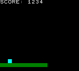</p>
</div>

The camera position `x` is moved to `64` so the whole green platform is not displayed and part of it will be outside the screen and the cyan block is a little on the left of the screen. Despite the camera movement, the score indicator is still at its top left corner, since its `noCamera` key is set to `true`.

Setting the `noCamera` key to `false` will result in this:

<div align="center" style="margin:60px 0">
    <p>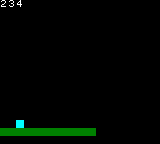</p>
</div>

The score label is now outside the screen and partially visible since it _scrolled_ with the tilemap due to the camera movement.

## Sprite timer

Every sprite has a `timer` key, which starts from `0` and is automatically increased every game frame.

```
{
   "systemVersion":"0.2",
   "metadata":{
      "title":"My first game"
   },
   "data":[{
      "id":"A",
      "sprites":[
         {"id":"A","flags":"T"},
         {"id":"B","flags":"T","x":0,"y":16,"timer":100}
      ],
      "tilemaps":[{"map":["AB"]}],
      "code":[{
         "then":[
            {"flags":"T","set":[{"text":[{"attribute":"timer"}]}]}
         ]
      }]
   }]
}
```

This cartridge the `A` and `B` sprites with the same `T` flag set. The `code` block copies their `timer` key to the `text` key, so the two sprites will display their `timer` value every frame resulting in two different counters.

<div align="center" style="margin:60px 0">
    <p>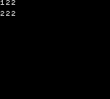</p>
</div>

While the `A` sprite `timer` starts from the default value of `0` the second one `timer` starts from `100`, so even if they are on the screen for the same amount of frames their `timer` values will be different.

## Local variables

Sprites have also a number of general-purpose keys with different allowed values. From `value0` to `value4` you can store any single decimal float number from `-25` to `26.1` and from `value5` to `value9` a text string.

```
{
   "systemVersion":"0.2",
   "metadata":{
      "title":"My first game"
   },
   "data":[{
      "id":"A",
      "sprites":[
         {"id":"A","value6":"I AM A SPRITE!","value7":"HELLO!"},
         {"id":"B","x":0,"y":16,"value1":3}
      ],
      "tilemaps":[{"map":["AB"]}],
      "code":[
         {
            "when":[{"as":"scene","if":[{"itsAttribute":"timer","is":"%%","smallNumber":25}]}],
            "then":[
               {"id":"A","set":[{"text":[{"attribute":"value6"}]}]},
               {"id":"B","sum":[{"value0":[{"attribute":"value1"}]}],"set":[{"text":[{"attribute":"value0"}]}]}
            ]
         },
         {
            "when":[{"as":"scene","if":[{"itsAttribute":"timer","is":"%%","smallNumber":50}]}],
            "then":[
               {"id":"A","set":[{"text":[{"attribute":"value7"}]}]}
            ]
         }
      ]
   }]
}
```

Every second the `A` sprite `text` is alternated to the `value6` and `value7` values and the `value0` of sprite `B` is increased by its `value1`, set to its `text` key and displayed.

<div align="center" style="margin:60px 0">
    <p>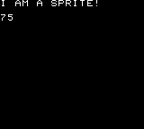</p>
</div>

This _type restriction_ is limited to the _sprite definition only_. Sprite local variables may be set to any value type by `code`.

```
{
   "systemVersion":"0.2",
   "metadata":{
      "title":"My first game"
   },
   "data":[{
      "id":"A",
      "sprites":[{"id":"A"}], 
      "tilemaps":[{"map":["A"]}],
      "code":[
         {
            "then":[
               {"id":"A","set":[{"value0":[{"string":"SETTING TEXT TO~VALUE 0? NO WAY!"}]}]},
               {"id":"A","set":[{"text":[{"attribute":"value0"}]}]}
            ]
         }
      ]
   }]
}
```

`value0` attributes must be initialized with float numbers but it's set to a string by `code` with any problem.

